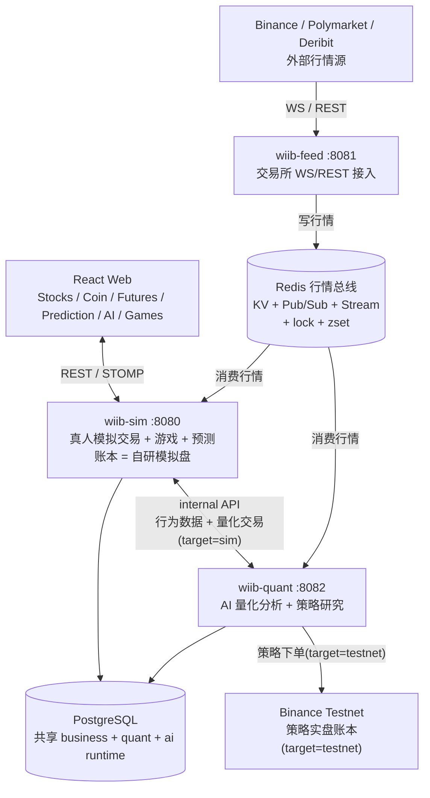
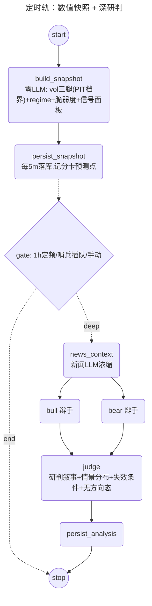

<div align="center">

# WhatIfIBought

**虚拟股票、加密货币、期权、永续合约、BTC 预测与 AI 量化交易实验平台**

[](https://openjdk.org/projects/jdk/21/)
[](https://spring.io/projects/spring-boot)
[](https://github.com/alibaba/spring-ai-alibaba)
[](https://react.dev/)
[](https://www.typescriptlang.org/)
[](https://vite.dev/)
[](https://www.postgresql.org/)
[](https://redis.io/)
[](LICENSE)

用户通过 LinuxDo OAuth 登录，使用虚拟资金体验股票、期权、现货、永续合约、BTC 5 分钟涨跌预测、小游戏和 AI 量化分析。

线上地址：https://linuxdo.stockgame.icu

</div>

---

## 当前定位

WhatIfIBought 是一个偏实验性质的模拟交易系统，后端按业务域拆成 **3 个独立进程**（feed 数据上游 / sim 真人模拟交易 / quant 量化研究）+ wiib-common 共享层，经 Redis 行情总线和共享 PostgreSQL 协作，故障隔离：

- 股票和期权使用系统生成的虚拟行情。
- 加密货币现货、永续合约、强平流、盘口和 BTC 预测接入 Binance / Polymarket 等真实外部数据，由 **wiib-feed** 统一接入并写入 Redis。
- **wiib-sim** 负责真人模拟交易（撮合 / 账本在自研模拟盘 DB）+ 游戏 + BTC 预测，对外提供 Web / WS。
- **wiib-quant** 的 AI Agent 负责结构化量化预测，只产出预测落库、不直接碰账本；FIBO / SQZMOM / LIQFADE 三策略由 5m K 线收盘驱动，执行目标二选一（`strategy.execution.target=testnet|sim`）：Binance Testnet，或经 internal API 在本平台模拟盘的独立量化账户交易。

主动 AI 量化/交易标的当前是：

| 清单 | 当前值 |
|---|---|
| 主动轮询 `WATCH_SYMBOLS` | `BTCUSDT`, `ETHUSDT` |
| API 白名单 `ALLOWED_SYMBOLS` | `BTCUSDT`, `ETHUSDT`, `PAXGUSDT` |
| 策略实盘篮子（按策略注册） | FIBO: `BTC/ETH` · SQZMOM: `SOL/DOGE/XRP` · LIQFADE: `BTC/ETH/DOGE` |

PAXG 仍允许查询历史和残留仓位，但不在主动重周期和轻周期清单里。

---

## 功能概览

### 交易系统

- 股票交易：市价单、限价单、T+1 资金结算、手续费和滑点保护。
- 杠杆交易：借款买入、每日计息、爆仓清算。
- 期权交易：CALL/PUT，Black-Scholes 定价，每日生成期权链，到期自动结算。
- 加密货币现货：BTC/USDT、ETH/USDT、PAXG/USDT，接入 Binance 实时行情，支持市价/限价单。
- 永续合约：逐仓保证金，多/空双向，用户侧最高 250x，分批止损/止盈单仓最多 4+4，真实资金费率（每 8h 结算按 Binance premiumIndex 双向收付，拉取失败回退 0.01%），自动强平。
- BTC 5 分钟涨跌预测：接入 Polymarket 盘口和 Chainlink BTC 价格，5 分钟窗口自动结算。
- 策略实盘：FIBO（5m 斐波回撤限价）、SQZMOM（4H 压缩释放仅做空）、LIQFADE（5m 强平瀑布 fade 仅做多，瀑布/premium 折价/taker 卖压三签名至少二，1h 时间出场）由 5m K 线收盘驱动；执行目标 Binance Testnet 或本平台模拟盘（每策略独立量化账户 `quant-<策略ID>`，与真人同规则、资金隔离；默认关闭，仅白名单 symbol）。

### AI 量化分析

- 30 分钟重周期：完整 8 节点 StateGraph。
- 5 分钟轻周期：复用最近 heavy 缓存，重新采集行情和纯 Java 因子，贴近边界时可调用轻量新闻模型。
- 价格波动哨兵：监听 mark price，5 分钟窗口波动超过动态阈值时触发 light refresh。
- 5 个 FactorAgent：microstructure、momentum、regime、volatility、news_event。
- 3 个 horizon：`0_10`、`10_20`、`20_30`。
- DebateJudge：代码存在，但 live/shadow 默认关闭。
- RiskGate：按 SHOCK、SQUEEZE、分歧、数据质量、极端情绪、高 IV 等裁剪杠杆和仓位。
- 历史验证和记忆：按真实行情验证 forecast，统计 agent 准确率，保守修正 `HorizonJudge` 权重。
- Graph 观测：8 个节点记录耗时和错误数，暴露 Prometheus 指标和 Admin API。

### 行情与实时数据

- 股票：每日生成 20 只虚拟股票行情。
- Binance WS：spot miniTicker、futures markPrice、futures miniTicker、forceOrder、aggTrade、depth20。
- Binance REST：K 线、ticker、funding、OI、long-short ratio、top trader、taker ratio、order book。
- Deribit：DVOL 和 option book summary。
- Polymarket：BTC 预测 live-data、UP/DOWN CLOB 盘口。
- WebSocket：SockJS + STOMP，前端订阅行情、预测、量化信号等 topic。

### 游戏与社交

- 每日 Buff 抽奖。
- 21 点。
- Mines。
- Video Poker。
- 总资产排行榜。
- 用户行为分析 Agent。

---

## 技术栈

| 层级 | 技术 | 当前版本 / 说明 |
|---|---|---|
| 后端 | Spring Boot | 3.4.1 |
| 语言 | Java | 21，启用 Virtual Threads |
| AI 框架 | Spring AI Alibaba | BOM / agent-framework 1.1.2.0 |
| OpenAI Compatible | Spring AI OpenAI Starter | 1.1.2 |
| ORM | MyBatis-Plus | 3.5.10 |
| 认证 | Sa-Token | 1.42.0 |
| 数据库 | PostgreSQL | 主业务库，`sql/init.sql` 当前 39 张表 |
| 缓存 | Redis + Caffeine | 分布式锁、ZSet 索引、行情缓存、本地热缓存 |
| 观测 | Actuator + Micrometer Prometheus | Graph 节点本地观测 |
| 前端 | React + TypeScript | React 19.2，TypeScript 5.9 |
| 构建 | Vite | 7.2 |
| UI | TailwindCSS + Ant Design + ECharts | 4.1 / 6.2 / 6.0 |
| 实时通信 | WebSocket | STOMP + SockJS |
| 容器 | Docker Compose | 后端模板部署 |

---

## 系统架构



---

## AI 量化链路（双轨研判工作台）

定位：**卖点不是"预测准"，是"工程可信"**——方向预测已被 walk-forward + 置换检验证伪（不做），vol 预测/vol-state 经统计验证有 skill（工具化 + 线上记分卡公开战绩）。

### 定时轨（StateGraph，图由 MermaidGenerator 自动生成）



- 快照段每 5m 零 LLM；Bull∥Bear 走框架原生并行边（fan-out/fan-in，内部 ParallelNode）。
- 深研判每轮 4 次 LLM 调用（新闻+Bull+Bear+Judge），1h 定频基线 + 哨兵插队（15min 冷却）——约 200 调用/天，较旧管线降一个量级。
- 验证闭环：每小时对账到期预测点（QLIKE vs naive 基准 + vol-state 命中，PIT 档界随快照入库），`/quant/scorecard` 出战绩。

### 对话轨（SupervisorAgent 多 agent 编排）

`POST /api/ai/workbench/chat`（SSE 流式，agent 调度过程可视化）：`workbench_supervisor`（深模型）动态调度 `market_agent` / `quant_agent` / `news_agent`（浅模型，深浅分层省成本），全部工具与定时轨共用一个工具层。横切：PostgresSaver 断点续聊、DatabaseStore 跨会话记忆、`run_deep_analysis` 贵操作 HITL 确认闸、ModelRetry/Fallback + CallLimit + Summarization。

同一工具层的第三个消费方：**MCP server**（SSE 端点）——Claude Desktop 等任意 MCP 客户端可直连调用只读量化工具六件。

---

## 运行时开关

AI 管理后台通过 `RuntimeFeatureToggleService` 持久化开关到 `ai_runtime_toggle`。

| key | 默认 |
|---|---:|
| `quant.debate_judge.enabled` | `false` |
| `quant.debate_judge.shadow_enabled` | `false` |
| `quant.factor_weight_override.enabled` | `false` |
说明：交易相关开关随 AI Trader 退出已移除，当前仅保留量化分析开关。

---

## 实时数据链路

### Binance

```text
wiib-feed（上游进程）  交易所 WS → Redis
  -> spot miniTicker        -> Redis 价格 KV + Pub/Sub(feed:price)
  -> futures markPrice@1s   -> Redis mark price/指数价 KV + Pub/Sub
  -> forceOrder             -> force_order 表(DB, 天然跨进程)
  -> aggTrade               -> Redis Stream(orderflow, quant 读侧聚合)
  -> depth20@100ms          -> Redis KV(DepthStreamCache)
  -> K 线收盘                -> Redis Stream(stream:kline:closed) + taker买量5m桶 KV

wiib-sim / wiib-quant（消费进程）  从 Redis 消费 feed 写入的行情
  sim:   MatchPriceConsumer(撮合/强平) · PredictionRoundConsumer
  quant: KlineStreamConsumer(驱动预测/策略) · SentinelPriceConsumer(波动哨兵)
         · RedisLiqSideData(LIQFADE 拉取 premium/taker KV)
```

价格更新同时触发现货限价单、永续强平、止损、止盈检查。

### Polymarket BTC 预测

```text
Polymarket live-data
  -> Chainlink BTC price
  -> /topic/prediction/price

Polymarket CLOB
  -> UP/DOWN bid/ask
  -> /topic/prediction/market

5min window rotation
  -> lock previous round
  -> poll open/close price
  -> settle bets
```

动态手续费：

```text
effectiveRate = 0.25 * (p * (1 - p))^2
clamp: 0.1% 到 2%
```

---

## 项目结构

后端按业务域拆成 **4 个 Maven module / 3 个独立进程**（+ 共享层），经 Redis 行情总线和共享 PostgreSQL 协作，故障隔离（一个进程崩不连累其他）。

```text
whatifibought/                        # Maven 多 module 聚合 reactor
├── pom.xml
├── README.md
├── docker-compose-example.yml
├── sql/                              # init.sql + init-data.sql
├── docs/                             # AI 架构 / 量化 / 数据信号深度文档
├── wiib-common/                      # 共享层：被 feed/quant/sim 共同依赖，让三者互不直接依赖
│   └── src/main/java/com/mawai/wiibcommon/
│       ├── market/                   # 行情通道 / Depth·OrderFlow 缓存 / BinanceRestClient / KlineBar / Stream channels
│       ├── broadcast/                # MarketBroadcaster 行情发布器
│       ├── cache/                    # CacheService
│       ├── config/                   # Redis / MyBatis / Binance 等基础设施配置
│       ├── mapper/                   # ForceOrder / KlineHistory 共享 mapper
│       └── entity/ dto/ enums/ constant/ util/ annotation/ aspect/ exception/ handler/
├── wiib-feed/                        # ① 数据流上游进程（:8081）
│   └── src/main/java/com/mawai/wiibfeed/
│       ├── BinanceWsClient.java      # 交易所 7 路 WS → Redis（KV / Pub-Sub / Stream）
│       ├── PolymarketWsClient.java   # Polymarket BTC 预测流
│       ├── WsConnection.java
│       └── KlineStreamCache.java     # K 线收盘 → Redis Stream
├── wiib-quant/                       # ② 量化 + 策略研究进程（:8082，只分析不碰模拟盘账本）
│   └── src/main/java/com/mawai/wiibquant/
│       ├── agent/
│       │   ├── quant/                # 重(30min)/轻(5min)周期 StateGraph + 因子 / 裁判 / 记忆
│       │   ├── research/             # 回测 / 因子 / 预测 / 样本外评估
│       │   ├── strategy/             # FIBO/SQZMOM/LIQFADE 三策略 + 回测引擎 + 执行层(testnet|sim 路由)
│       │   ├── binance/ behavior/ external/ tool/ config/
│       │   └── SimInternalClient.java # quant → sim internal API（读用户行为数据）
│       └── controller/ task/ mapper/ config/   # 5 quant controller / Scheduler / quant mapper / DeribitClient
├── wiib-sim/                         # ③ 真人模拟交易进程（:8080，账本=自研模拟盘 DB）
│   ├── Dockerfile-example
│   └── src/main/java/com/mawai/wiibsim/
│       └── controller/ service/ mapper/ config/ task/ dto/ util/
│                                     # 交易 / 游戏 / 预测 / 结算 + BehaviorDataController（internal API 供 quant 调）
└── wiib-web/                         # React 前端
    └── src/                          # App.tsx / pages/ components/ hooks/ stores/ api/
```

---

## 重要文档

| 文档 | 内容 |
|---|---|
| `docs/ai-architecture-overview.md` | AI 架构、重/轻周期、运行时开关总览 |
| `docs/data-and-signal-deep-dive.md` | 数据源、FeatureSnapshot、FactorAgent、HorizonJudge、RiskGate |
| `docs/Quantitative analysis.md` | 量化系统端到端主文档 |
| `docs/spring-ai-alibaba-capability-scan.md` | 当前 Spring AI Alibaba 使用现状和未接入能力边界 |

---

## 并发与一致性

| 机制 | 用途 |
|---|---|
| Virtual Threads | WS 消息处理、量化采集、调度任务、异步广播 |
| Redis 分布式锁 | 订单、仓位、用户、游戏操作互斥 |
| 数据库 CAS | 订单、预测回合、结算状态机 |
| Redis ZSet | 限价单、强平价、止损、止盈触发索引 |
| Redis Pub/Sub | 多实例 WebSocket 广播 |
| Caffeine + Redis | 本地热缓存 + L2 分布式缓存 |
| Token Bucket | `@RateLimiter` 限流 |
| Micrometer | Graph 节点耗时/错误指标 |

---

## 部署

### 环境要求

| 依赖 | 最低版本 | 说明 |
|---|---:|---|
| JDK | 21 | 需要 Virtual Threads |
| Maven | 3.9+ | 后端构建 |
| Node.js | 18+ | 前端构建 |
| PostgreSQL | 14+ | 主数据库 |
| Redis | 6+ | 缓存、锁、Pub/Sub |
| Docker | 20+ | 可选 |

### 1. 克隆项目

```bash
git clone https://github.com/mamawai/whatifibought.git
cd whatifibought
```

### 2. 初始化数据库

```bash
psql -U postgres -c "CREATE DATABASE wiib;"
psql -U postgres -d wiib -f sql/init.sql
psql -U postgres -d wiib -f sql/init-data.sql
```

### 3. 环境变量

```bash
cp example.env .env
```

`.env` 示例：

```env
PG_HOST=localhost
PG_PORT=5432
PG_DB=wiib
PG_USER=postgres
PG_PASSWORD=your_password

REDIS_HOST=localhost
REDIS_PORT=6379
REDIS_PASSWORD=
REDIS_DB=0

LINUXDO_REDIRECT_URI=https://your-domain.com/login
```

### 4. 后端配置

```bash
cp wiib-sim/src/main/resources/application.example.yml \
   wiib-sim/src/main/resources/application.yml
```

关键配置：

```yaml
spring:
  datasource:
    url: jdbc:postgresql://localhost:5432/wiib?reWriteBatchedInserts=true
    username: postgres
    password: your_password
  data:
    redis:
      host: localhost
      port: 6379
      database: 0

linuxdo:
  client-id: your-client-id
  client-secret: your-secret
  redirect-uri: https://your-domain.com/login
```

AI 配置不在 yml：唯一来源是 DB（`ai_runtime_config` + `ai_model_assignment`）。首次部署启动后，用管理员账号进 Admin 页添加 LLM 配置（API Key + Base URL + 模型名，Base URL 不含 `/v1` 后缀）并给各功能位下拉分配，即时生效、无需重启。

wiib-quant 的 `application.yml` 必须关闭 Spring AI 的 OpenAI 自动装配（6 类开关都要关，否则缺 api-key 会拒绝启动）：

```yaml
spring:
  ai:
    model:
      chat: none
      embedding: none
      image: none
      moderation: none
      audio:
        speech: none
        transcription: none
```

策略实盘执行（`wiib-quant` 的 `application.yml`，默认全关）：

```yaml
strategy:
  runtime:
    enabled: true                     # 策略信号运行时
    enabled-ids: FIBO,SQZMOM,LIQFADE  # 启用的策略
  execution:
    enabled: true                     # 下单执行
    target: sim                       # testnet | sim(本平台模拟盘)
    symbols: BTCUSDT,ETHUSDT,SOLUSDT,DOGEUSDT,XRPUSDT   # 执行白名单=各策略篮子并集
```

> 策略由 K 线收盘事件驱动：`wiib-feed` 的 `binance.symbols` 必须覆盖上面全部标的（缺谁谁永远不触发）。仓库默认值目前缺 `SOLUSDT` / `XRPUSDT`，启用 SQZMOM 前需补上。

### 5. 构建后端

```bash
mvn clean package -DskipTests
```

产物：

```text
wiib-feed/target/wiib-feed-0.0.1-SNAPSHOT.jar     # :8081 数据上游
wiib-quant/target/wiib-quant-0.0.1-SNAPSHOT.jar   # :8082 量化策略
wiib-sim/target/wiib-sim-0.0.1-SNAPSHOT.jar       # :8080 模拟交易（对外）
```

### 6. 构建前端

```bash
cd wiib-web
npm install
npm run build
```

开发模式：

```bash
npm run dev
```

Vite 默认端口 3000，代理 `/api` 和 `/ws` 到后端。

### 7. 启动

三个进程分别启动，共享同一 PostgreSQL + Redis（建议先起 feed，再起 sim/quant）：

```bash
java -jar wiib-feed/target/wiib-feed-0.0.1-SNAPSHOT.jar    # :8081 数据上游：交易所 WS → Redis
java -jar wiib-quant/target/wiib-quant-0.0.1-SNAPSHOT.jar  # :8082 量化分析 + 策略
java -jar wiib-sim/target/wiib-sim-0.0.1-SNAPSHOT.jar      # :8080 模拟交易（对外，前端连这个）
```

Docker Compose：

```bash
cp docker-compose-example.yml docker-compose.yml
cp wiib-sim/Dockerfile-example wiib-sim/Dockerfile
docker network create wiib-network
docker compose up -d --build
docker compose logs -f wiib-sim
```

> 注：当前 `docker-compose.yml` 仅编排 `wiib-sim`；`wiib-feed` / `wiib-quant` 的服务定义待补，目前需手动 `java -jar` 启动。对外只暴露 sim（:8080），建议经 Nginx / Caddy 反代。

---

## 维护原则

- README 只写当前代码已经落地的事实。
- AI 量化细节以 `docs/Quantitative analysis.md` 和 `docs/data-and-signal-deep-dive.md` 为准。
- 外部 Spring AI Alibaba 能力没有接入前，只能放在 capability scan 里，不能写成已使用。
- 改运行时开关、交易风控、Graph 节点、数据源时，需要同步 README 和对应 docs。
