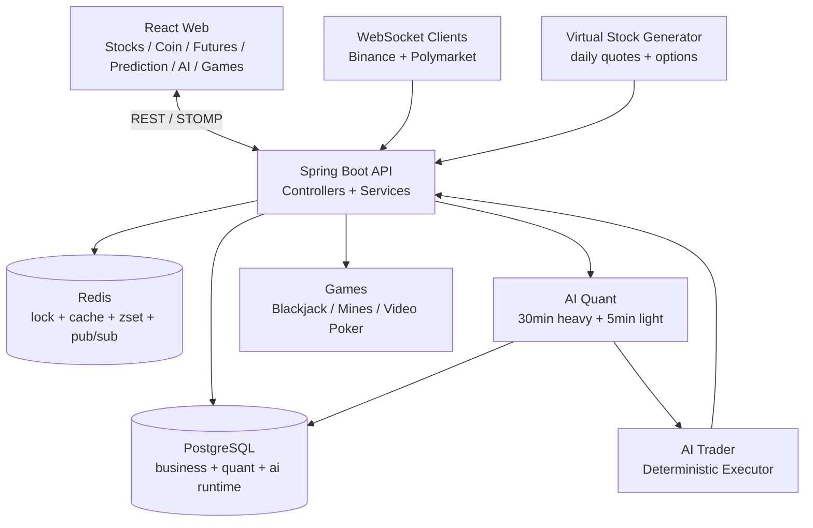
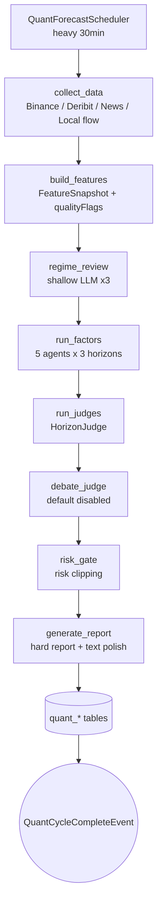
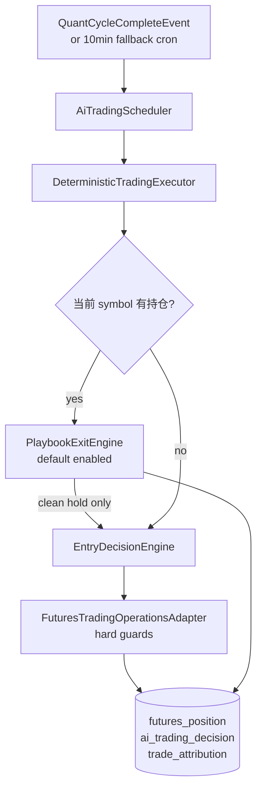

<div align="center">

# WhatIfIBought

**虚拟股票、加密货币、期权、永续合约、BTC 预测与 AI 量化交易实验平台**

[](https://openjdk.org/projects/jdk/21/)
[](https://spring.io/projects/spring-boot)
[](https://github.com/alibaba/spring-ai-alibaba)
[](https://react.dev/)
[](https://www.typescriptlang.org/)
[](https://vite.dev/)
[](https://www.postgresql.org/)
[](https://redis.io/)
[](LICENSE)

用户通过 LinuxDo OAuth 登录，使用虚拟资金体验股票、期权、现货、永续合约、BTC 5 分钟涨跌预测、小游戏和 AI 量化分析。

线上地址：https://linuxdo.stockgame.icu

</div>

---

## 当前定位

WhatIfIBought 是一个偏实验性质的模拟交易系统：

- 股票和期权使用系统生成的虚拟行情。
- 加密货币现货、永续合约、强平流、盘口和 BTC 预测接入 Binance / Polymarket 等真实外部数据。
- AI Agent 负责结构化量化预测，不直接下单。
- AI Trader 是确定性执行器，读取量化信号后用本地规则开仓和平仓。

主动 AI 量化/交易标的当前是：

| 清单 | 当前值 |
|---|---|
| 主动轮询 `WATCH_SYMBOLS` | `BTCUSDT`, `ETHUSDT` |
| API 白名单 `ALLOWED_SYMBOLS` | `BTCUSDT`, `ETHUSDT`, `PAXGUSDT` |

PAXG 仍允许查询历史和残留仓位，但不在主动重周期、轻周期和 AI-Trader 调度清单里。

---

## 功能概览

### 交易系统

- 股票交易：市价单、限价单、T+1 资金结算、手续费和滑点保护。
- 杠杆交易：借款买入、每日计息、爆仓清算。
- 期权交易：CALL/PUT，Black-Scholes 定价，每日生成期权链，到期自动结算。
- 加密货币现货：BTC/USDT、ETH/USDT、PAXG/USDT，接入 Binance 实时行情，支持市价/限价单。
- 永续合约：逐仓保证金，多/空双向，用户侧最高 250x，分批止损/止盈单仓最多 4+4，0.01%/8h 资金费率，自动强平。
- BTC 5 分钟涨跌预测：接入 Polymarket 盘口和 Chainlink BTC 价格，5 分钟窗口自动结算。
- AI Trader：测试阶段，AI 账户只允许确定性执行器交易；真实开仓适配器把 AI 杠杆限制在 5x 到 50x，并带熔断、仓位数、冷却和 SL/TP 距离硬拦截。

### AI 量化分析

- 30 分钟重周期：完整 8 节点 StateGraph。
- 5 分钟轻周期：复用最近 heavy 缓存，重新采集行情和纯 Java 因子，贴近边界时可调用轻量新闻模型。
- 价格波动哨兵：监听 mark price，5 分钟窗口波动超过动态阈值时触发 light refresh 和 AI-Trader。
- 5 个 FactorAgent：microstructure、momentum、regime、volatility、news_event。
- 3 个 horizon：`0_10`、`10_20`、`20_30`。
- DebateJudge：代码存在，但 live/shadow 默认关闭。
- RiskGate：按 SHOCK、SQUEEZE、分歧、数据质量、极端情绪、高 IV 等裁剪杠杆和仓位。
- 历史验证和记忆：按真实行情验证 forecast，统计 agent 准确率，保守修正 `HorizonJudge` 权重。
- Graph 观测：8 个节点记录耗时和错误数，暴露 Prometheus 指标和 Admin API。

### 行情与实时数据

- 股票：每日生成 20 只虚拟股票行情。
- Binance WS：spot miniTicker、futures markPrice、futures miniTicker、forceOrder、aggTrade、depth20。
- Binance REST：K 线、ticker、funding、OI、long-short ratio、top trader、taker ratio、order book。
- Deribit：DVOL 和 option book summary。
- Polymarket：BTC 预测 live-data、UP/DOWN CLOB 盘口。
- WebSocket：SockJS + STOMP，前端订阅行情、预测、量化信号等 topic。

### 游戏与社交

- 每日 Buff 抽奖。
- 21 点。
- Mines。
- Video Poker。
- 总资产排行榜。
- 用户行为分析 Agent。

---

## 技术栈

| 层级 | 技术 | 当前版本 / 说明 |
|---|---|---|
| 后端 | Spring Boot | 3.4.1 |
| 语言 | Java | 21，启用 Virtual Threads |
| AI 框架 | Spring AI Alibaba | BOM / agent-framework 1.1.2.0 |
| OpenAI Compatible | Spring AI OpenAI Starter | 1.1.2 |
| ORM | MyBatis-Plus | 3.5.10 |
| 认证 | Sa-Token | 1.42.0 |
| 数据库 | PostgreSQL | 主业务库，`sql/init.sql` 当前 39 张表 |
| 缓存 | Redis + Caffeine | 分布式锁、ZSet 索引、行情缓存、本地热缓存 |
| 观测 | Actuator + Micrometer Prometheus | Graph 节点本地观测 |
| 前端 | React + TypeScript | React 19.2，TypeScript 5.9 |
| 构建 | Vite | 7.2 |
| UI | TailwindCSS + Ant Design + ECharts | 4.1 / 6.2 / 6.0 |
| 实时通信 | WebSocket | STOMP + SockJS |
| 容器 | Docker Compose | 后端模板部署 |

---

## 系统架构



---

## AI 量化链路



常规 heavy 路径在 DebateJudge 关闭时包含 7 次 LLM 调用：

- `RegimeReviewNode`：3 次。
- `NewsEventAgent`：3 次。
- `GenerateReportNode`：1 次。

light cycle 不完整重跑 Graph。它会重新采集、重建特征、跑纯 Java 因子、复用或局部刷新新闻票，然后修正父 heavy。AI-Trader 读取 latest heavy，因此 light 通过回写父 heavy 的 forecast/signal 生效。

---

## AI Trader 链路



### 开仓路径

| 路径 | 实现 | 当前含义 |
|---|---|---|
| `BREAKOUT` | `BreakoutEntryStrategy` | 量能 + 布林边界突破 + 动能/微结构确认 |
| `MR` | `MeanReversionEntryStrategy` | BB%B 与 RSI 极值后的均值回归 |
| `LEGACY_TREND` | `TrendContinuationEntryStrategy` | 趋势延续兜底，择优权重低于突破 |

开仓关键过滤：

- 同 symbol 内存冷却 20 分钟。
- DB 层同 symbol 最近开仓冷却 20 分钟。
- `STALE_AGG_TRADE` 弃权。
- 只消费当前 active horizon，且每个 10 分钟段最后 1 分钟不新开仓。
- `ALL_NO_TRADE / NO_DATA` 禁开。
- 各策略二层共振门：BREAKOUT 3/5，MR 4/6，TREND 4/6。
- `overallDecision=FLAT` 只允许 MR 或强突破覆盖。
- 低波动扩 SL 小仓位、手续费后利润、最低 RR、强平缓冲、保证金上限和回撤保护。

### 平仓 Playbook

`trading.playbook_exit.enabled` 默认 `true`。

| Exit path | 实现 | 核心动作 |
|---|---|---|
| `BREAKOUT` | `BreakoutExitPlaybook` | 1R 锁盈、失败突破全平、2R 平 30%、吊灯止损 |
| `MR` | `MeanReversionExitPlaybook` | 更极端/反向闭合 K/新高周期反向全平，中轨平半，均值区全平 |
| `TREND` | `TrendExitPlaybook` | 1R 保本，3R 平 30%，2R 后 ATR trail，90 分钟无进展全平 |

Playbook 只有 `HoldKind.CLEAN` 才允许同一轮继续做开仓评估。预测过期、`STALE_AGG_TRADE` 或 `LOW_CONFIDENCE` 会触发指标护盾，阻止指标驱动退出和本轮加仓。

---

## 风控与归因

`FuturesTradingOperationsAdapter` 是 AI 真实开仓前最后硬闸：

| 拦截 | 当前规则 |
|---|---|
| AI 杠杆 | 5x 到 50x |
| 总 OPEN 仓位 | 最多 6 个 |
| 同 symbol 仓位 | 最多 3 个 |
| 同 symbol 反向仓 | 禁止 |
| 最低名义价值 | 5000 USDT |
| 最低保证金 | `max(100, balance * 1%)` |
| 工具层保证金上限 | balance 的 35% |
| 执行器保证金上限 | balance 的 15% |
| SL 距离 | 按 `SymbolProfile.slMinPct/slMaxPct` 校验 |
| 熔断 | `CircuitBreakerService#allowOpen` |

`CircuitBreakerService` 默认阈值：

| 层级 | 默认 | 触发 |
|---|---:|---|
| L1 | 10% | 当日已归因净亏损达到初始权益 100000 的 10% |
| L2 | 4 笔 | 最近 4 笔归因交易全亏，冷却 2 小时 |
| L3 | 30% | 当前权益低于 peak 的 70% |
| 路径禁用 | 5 笔 | 单策略路径连续亏损 5 笔后禁用 |

`TradeAttributionService` 在全平后写 `trade_attribution`，并刷新路径状态和熔断状态。路径禁用独立于账户级熔断开关。

---

## 运行时开关

AI 管理后台通过 `RuntimeFeatureToggleService` 持久化开关到 `ai_runtime_toggle`。

| key | 默认 |
|---|---:|
| `quant.debate_judge.enabled` | `false` |
| `quant.debate_judge.shadow_enabled` | `false` |
| `quant.factor_weight_override.enabled` | `false` |
| `trading.low_vol.enabled` | `true` |
| `trading.playbook_exit.enabled` | `true` |
| `trading.circuit_breaker.enabled` | `true` |
| `trading.circuit_breaker.l1_daily_net_loss_pct` | `10.0` |
| `trading.circuit_breaker.l2_loss_streak` | `4` |
| `trading.circuit_breaker.l2_cooldown_hours` | `2` |
| `trading.circuit_breaker.l3_drawdown_pct` | `30.0` |

交易退出由 Playbook 出场、固定止损止盈、熔断和路径归因共同控制。

---

## 实时数据链路

### Binance

```text
Binance WS
  -> spot miniTicker        -> Caffeine + Redis spot price -> /topic/crypto/{symbol}
  -> futures markPrice@1s   -> Caffeine + Redis mark price -> /topic/futures/{symbol}
  -> futures miniTicker     -> futures latest price
  -> forceOrder             -> force_order table
  -> aggTrade               -> OrderFlowAggregator
  -> depth20@100ms          -> DepthStreamCache
```

价格更新同时触发现货限价单、永续强平、止损、止盈检查。

### Polymarket BTC 预测

```text
Polymarket live-data
  -> Chainlink BTC price
  -> /topic/prediction/price

Polymarket CLOB
  -> UP/DOWN bid/ask
  -> /topic/prediction/market

5min window rotation
  -> lock previous round
  -> poll open/close price
  -> settle bets
```

动态手续费：

```text
effectiveRate = 0.25 * (p * (1 - p))^2
clamp: 0.1% 到 2%
```

---

## 项目结构

```text
whatifibought/
├── pom.xml
├── README.md
├── example.env
├── docker-compose-example.yml
├── sql/
│   ├── init.sql
│   └── init-data.sql
├── docs/
│   ├── ai-architecture-overview.md
│   ├── ai-trader-entry-exit-engine-flow.md
│   ├── data-and-signal-deep-dive.md
│   ├── Quantitative analysis.md
│   └── spring-ai-alibaba-capability-scan.md
├── wiib-common/
│   ├── pom.xml
│   └── src/main/java/com/mawai/wiibcommon/
│       ├── constant/
│       ├── dto/
│       ├── entity/
│       ├── handler/
│       └── util/
├── wiib-service/
│   ├── pom.xml
│   ├── Dockerfile-example
│   └── src/main/java/com/mawai/wiibservice/
│       ├── controller/
│       ├── service/
│       ├── mapper/
│       ├── config/
│       ├── task/
│       └── agent/
│           ├── quant/
│           ├── risk/
│           ├── tool/
│           ├── trading/
│           │   ├── backtest/
│           │   ├── entry/
│           │   ├── exit/
│           │   ├── ops/
│           │   ├── runtime/
│           │   └── submit/
│           ├── behavior/
│           ├── config/
│           └── external/
└── wiib-web/
    ├── package.json
    ├── vite.config.ts
    └── src/
        ├── App.tsx
        ├── pages/
        ├── components/
        ├── hooks/
        ├── stores/
        └── api/
```

---

## 重要文档

| 文档 | 内容 |
|---|---|
| `docs/ai-architecture-overview.md` | AI 架构、重/轻周期、Trader、运行时开关总览 |
| `docs/ai-trader-entry-exit-engine-flow.md` | 开仓、仓位计算、Playbook 退出完整流程 |
| `docs/data-and-signal-deep-dive.md` | 数据源、FeatureSnapshot、FactorAgent、HorizonJudge、RiskGate |
| `docs/Quantitative analysis.md` | 量化系统端到端主文档 |
| `docs/spring-ai-alibaba-capability-scan.md` | 当前 Spring AI Alibaba 使用现状和未接入能力边界 |

---

## 并发与一致性

| 机制 | 用途 |
|---|---|
| Virtual Threads | WS 消息处理、量化采集、调度任务、异步广播 |
| Redis 分布式锁 | 订单、仓位、用户、游戏操作互斥 |
| 数据库 CAS | 订单、预测回合、结算状态机 |
| Redis ZSet | 限价单、强平价、止损、止盈触发索引 |
| Redis Pub/Sub | 多实例 WebSocket 广播 |
| Caffeine + Redis | 本地热缓存 + L2 分布式缓存 |
| Token Bucket | `@RateLimiter` 限流 |
| Micrometer | Graph 节点耗时/错误指标 |

---

## 部署

### 环境要求

| 依赖 | 最低版本 | 说明 |
|---|---:|---|
| JDK | 21 | 需要 Virtual Threads |
| Maven | 3.9+ | 后端构建 |
| Node.js | 18+ | 前端构建 |
| PostgreSQL | 14+ | 主数据库 |
| Redis | 6+ | 缓存、锁、Pub/Sub |
| Docker | 20+ | 可选 |

### 1. 克隆项目

```bash
git clone https://github.com/mamawai/whatifibought.git
cd whatifibought
```

### 2. 初始化数据库

```bash
psql -U postgres -c "CREATE DATABASE wiib;"
psql -U postgres -d wiib -f sql/init.sql
psql -U postgres -d wiib -f sql/init-data.sql
```

### 3. 环境变量

```bash
cp example.env .env
```

`.env` 示例：

```env
PG_HOST=localhost
PG_PORT=5432
PG_DB=wiib
PG_USER=postgres
PG_PASSWORD=your_password

REDIS_HOST=localhost
REDIS_PORT=6379
REDIS_PASSWORD=
REDIS_DB=0

LINUXDO_REDIRECT_URI=https://your-domain.com/login
```

### 4. 后端配置

```bash
cp wiib-service/src/main/resources/application.example.yml \
   wiib-service/src/main/resources/application.yml
```

关键配置：

```yaml
spring:
  ai:
    openai:
      api-key: ${AI_API_KEY:sk-xxx}
      base-url: https://api.xxx.com
      chat:
        options:
          model: your-model
  datasource:
    url: jdbc:postgresql://localhost:5432/wiib?reWriteBatchedInserts=true
    username: postgres
    password: your_password
  data:
    redis:
      host: localhost
      port: 6379
      database: 0

linuxdo:
  client-id: your-client-id
  client-secret: your-secret
  redirect-uri: https://your-domain.com/login
```

AI 配置只在 `ai_runtime_config` 表为空时作为种子值写入数据库。之后可以通过 Admin 动态管理 API Key 和模型分配。

### 5. 构建后端

```bash
mvn clean package -DskipTests
```

产物：

```text
wiib-service/target/wiib-service-0.0.1-SNAPSHOT.jar
```

### 6. 构建前端

```bash
cd wiib-web
npm install
npm run build
```

开发模式：

```bash
npm run dev
```

Vite 默认端口 3000，代理 `/api` 和 `/ws` 到后端。

### 7. 启动

直接运行：

```bash
java -jar wiib-service/target/wiib-service-0.0.1-SNAPSHOT.jar
```

Docker Compose：

```bash
cp docker-compose-example.yml docker-compose.yml
cp wiib-service/Dockerfile-example wiib-service/Dockerfile
docker network create wiib-network
docker compose up -d --build
docker compose logs -f wiib-service
```

Docker 模板默认把后端绑定到 `127.0.0.1:8081`，建议通过 Nginx 或 Caddy 反代对外暴露。

---

## 维护原则

- README 只写当前代码已经落地的事实。
- AI 量化细节以 `docs/Quantitative analysis.md` 和 `docs/data-and-signal-deep-dive.md` 为准。
- AI Trader 细节以 `docs/ai-trader-entry-exit-engine-flow.md` 为准。
- 外部 Spring AI Alibaba 能力没有接入前，只能放在 capability scan 里，不能写成已使用。
- 改运行时开关、交易风控、Graph 节点、数据源时，需要同步 README 和对应 docs。
