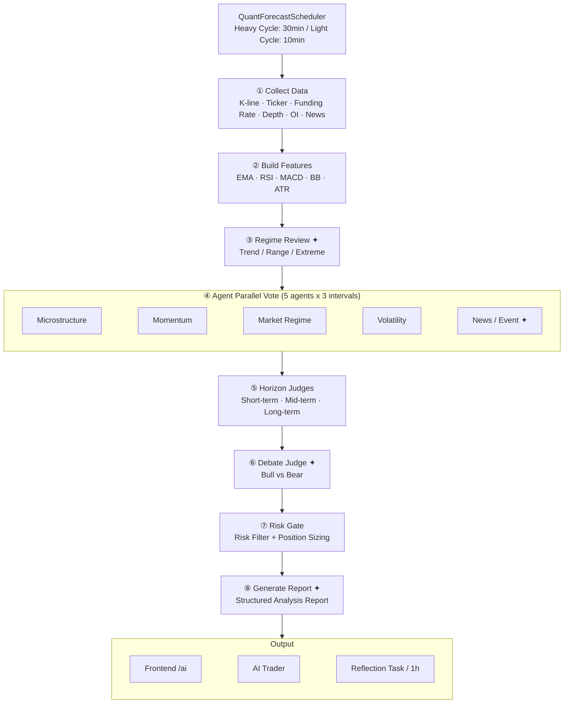

<div align="center">

# WhatIfIBought

**虚拟股票模拟交易平台 —— "如果当初买了会怎样"**

[](https://openjdk.org/projects/jdk/21/)
[](https://spring.io/projects/spring-boot)
[](https://react.dev/)
[](https://www.typescriptlang.org/)
[](https://www.postgresql.org/)
[](https://redis.io/)
[](https://vite.dev/)
[](https://tailwindcss.com/)
[](https://www.docker.com/)
[](LICENSE)

用户通过 [LinuxDo](https://linux.do) OAuth 登录，使用虚拟资金在 AI 生成的行情中进行模拟股票 / 期权 / 永续合约交易，附带小游戏与 AI 量化分析系统。

**线上地址：https://linuxdo.stockgame.icu**

</div>

---

## 功能概览

### 交易系统

- **股票交易** — 市价单即时成交（±2% 滑点保护）、限价单挂单触发，T+1 资金结算，0.05% 手续费
- **杠杆交易** — 借款买入、每日计息、爆仓清算（最高 50 倍）
- **期权交易** — CALL/PUT 期权，Black-Scholes 定价（手写实现），每日生成 5 档行权价期权链，自动到期结算
- **加密货币现货** — BTC/USDT、ETH/USDT、PAXG/USDT，接入 Binance 实时行情，支持市价/限价单
- **永续合约** — 最高 250 倍杠杆，逐仓保证金，多/空双向，分批止损/止盈（单仓最多 4+4），0.01%/8h 资金费率，自动强平
- **BTC 5 分钟涨跌预测** — 接入 Polymarket 真实盘口 + Chainlink 价格源，动态手续费，5 分钟窗口自动结算
- **AI 交易员**（测试阶段）— 确定性多策略引擎自动执行永续合约交易，含 EMA 趋势跟踪、BB 均值回归、BB 压缩突破三种策略

### 行情系统

- AI 每日生成 20 只股票的分时行情（1440 个价格点，GBM + Jump-Diffusion 模型）
- WebSocket (STOMP) 每 10 秒实时推送行情、资产变动、订单状态
- Binance 5 路 WebSocket：现货价格 / 永续标记价 / 强平事件 / 聚合成交 / 深度快照
- Polymarket 2 路 WebSocket：Chainlink BTC 价格 + CLOB 盘口
- TradingView 嵌入式 K 线图

### AI Agent 量化分析

- 多 Agent 加密货币量化预测系统（5 因子 Agent + 3 区间裁决 + Bull vs Bear 辩论）
- 双周期调度：重周期每 30 分钟全链路（含 LLM），轻周期每 10 分钟零 LLM 快速刷新
- 波动哨兵：监听 WS 实时价格，5 分钟波动超 1.3×ATR 时自动触发
- 历史预测自动验证 + 离线反思学习闭环（LLM 分析偏差 → 写入记忆 → 下次预测注入）
- 支持 BTCUSDT / ETHUSDT / PAXGUSDT 多币种
- DB 驱动的 API Key 动态管理 + LLM 异常自动降级

### 游戏与社交

- 每日 Buff 抽奖（4 种稀有度：交易折扣 / 现金红包 / 赠送股票）
- 21 点（Hit / Stand / Double / Split / Insurance / Forfeit，每日积分池 400,000）
- 翻翻爆金币 Mines（5×5 格子藏 5 颗雷，最高约 8,949 倍）
- 视频扑克 Video Poker
- 总资产排行榜


---

## 技术栈

| 层级 | 技术 | 版本 |
|------|------|------|
| **后端框架** | Spring Boot | 3.4.1 |
| **语言** | Java (Virtual Threads) | 21 |
| **ORM** | MyBatis-Plus | 3.5.10 |
| **AI 框架** | Spring AI Alibaba (StateGraph) | 1.1.2.0 |
| **认证** | Sa-Token | 1.42.0 |
| **数据库** | PostgreSQL + HikariCP | — |
| **缓存** | Redis + Caffeine 双层缓存 | — |
| **前端框架** | React + TypeScript | 19.2 / 5.9 |
| **构建工具** | Vite | 7.2 |
| **UI** | TailwindCSS + Ant Design + ECharts | 4.1 / 6.2 / 6.0 |
| **实时通信** | WebSocket (STOMP + SockJS) | — |
| **容器化** | Docker + Docker Compose | — |

---

## 系统架构

```mermaid
flowchart TD
subgraph CLIENT["Client - React 19"]
direction LR
C1[Stock] --- C2[Crypto]
C2 --- C3[Perpetual Contract]
C3 --- C4[BTC Prediction]
C4 --- C5[Blackjack / Mines]
end

NGINX["Nginx - SSL Reverse Proxy"]

subgraph BACKEND["Spring Boot 3.4.1 - Virtual Threads"]
direction TB

subgraph CTL["Controllers (21)"]
direction LR
CT1[Stock / Order] --- CT2[Crypto / Futures]
CT2 --- CT3[Prediction / Option]
CT3 --- CT4[Games]
CT4 --- CT5[AiAgent / Admin]
end

subgraph SVC["Services (30+)"]
direction LR
STE["Trading Engine\nMarket/Limit · T+1 · Redis ZSet"] --- SQG["Quote Generator\nGBM+Jump · 1440pts · BS Pricing"]
SQG --- SAI["AI Agent Quant\n5-Factor Vote · Bull/Bear · Reflection"]
SAI --- SPC["Perpetual Contract\n250x · Isolated Margin · 4SL+4TP"]
SPC --- SBP["BTC Prediction\nPolymarket · 5min · Chainlink"]
SBP --- SDT["AI Trader\nEMA/BB · 2%/trade · 35%/pos"]
end

subgraph SCH["Scheduled Tasks (6)"]
direction LR
SC1["09:25 Quote Push"] --- SC2["09:20 T+1 Settle"]
SC2 --- SC3["15:00 Option Settle"]
SC3 --- SC4["30min Quant Heavy"]
SC4 --- SC5["10min Quant Light"]
SC5 --- SC6["0/8/16h Funding Rate"]
end

subgraph WSC["WebSocket Clients (7)"]
direction LR
subgraph BNS["Binance (5)"]
direction LR
BW1[Spot miniTicker] --- BW2[Futures markPrice@1s]
BW2 --- BW3[ForceOrder]
BW3 --- BW4[AggTrade]
BW4 --- BW5[Depth20@100ms]
end
subgraph PLY["Polymarket (2)"]
direction LR
PW1[LiveData / Chainlink BTC] --- PW2[CLOB UP/DOWN bid/ask]
end
end

CTL --> SVC
SVC --> SCH
SVC --> WSC
end

subgraph DATALAYER["Data Layer"]
direction LR
subgraph PG["PostgreSQL (34 tables)"]
direction LR
PG1[Trade Records] --- PG2[AI Predictions]
PG2 --- PG3[Game Data]
PG3 --- PG4[Asset Snapshots]
end
subgraph RD["Redis"]
direction LR
RD1[Quote Cache] --- RD2[Limit Order ZSet]
RD2 --- RD3[Distributed Lock]
RD3 --- RD4[WS Broadcast]
RD4 --- RD5[Token Bucket]
RD5 --- RD6[Game Session]
end
end

CLIENT -->|REST / WebSocket| NGINX
NGINX --> BACKEND
BACKEND --> DATALAYER
```

---

## AI 量化分析流水线



> ✦ = LLM call involved

---
## 加密货币实时行情推送链路

独立于AI模拟行情，接入 Binance 真实市场数据（当前支持 BTCUSDT、PAXGUSDT、ETHUSDT）：

```
Binance WSS ─┬─ Spot流 (miniTicker ~1次/秒)     → 现货价格
              └─ Futures流 (markPrice @1s)        → 标记价格（永续合约强平基准）
        │
        ▼
BinanceWsClient.onSpotMessage() / onFuturesMessage()
        │  解析 symbol + price + event time
        ▼
writeRedisAndPush(symbol, price, ts) / writeFuturesMarkPrice(symbol, markPrice)
        │
        ├─① Caffeine L1 PUT spot/mark:{symbol}          ← 本地热缓存（限价单/强平读取）
        │   Redis SET "market:price:{symbol}"              ← 现货价 L2 缓存
        │   Redis SET "market:markprice:{symbol}"          ← 标记价 L2 缓存
        │
        ├─② Redis PUBLISH "ws:broadcast:crypto"          ← 集群广播
        │       payload: "{symbol}|{\"price\":\"...\",\"ts\":...}"
        │       │
        │       ▼
        │   RedisMessageBroadcastService.onMessage()
        │       │
        │       ▼
        │   SimpMessagingTemplate → /topic/crypto/{symbol}
        │       │
        │       ▼  SockJS + STOMP (端点 /ws/quotes, 心跳15s)
        │       │
        │   useCryptoStream hook (3秒节流)
        │       │
        │       ▼
        │   Coin.tsx  ← 价格显示 + 1D K线实时追加
        │
        ├─③ Virtual Thread → cryptoOrderService.onPriceUpdate()
        │       │  Redis ZSet rangeByScore 匹配现货限价单
        │       ▼
        │   triggerAndExecuteOrder()
        │
        └─④ Virtual Thread → futuresLiquidationService.checkOnPriceUpdate()
                │  Redis ZSet rangeByScore 匹配强平/止损/止盈
                ▼
            forceClose() / batchTriggerStopLoss() / batchTriggerTakeProfit()
```
---

## BTC 5分钟涨跌预测

接入 Polymarket 真实数据，复刻 BTC 5分钟涨跌预测市场。用户用余额买入 Up/Down 合约，5分钟窗口自动结算。

```
Polymarket WSS ─┬─ LiveData流 (wss://ws-live-data.polymarket.com)
                │   ├─ crypto_prices_chainlink    → BTC实时价格 (Chainlink)
                │   └─ activity (orders_matched)  → 真实交易动态
                │
                └─ CLOB流 (wss://ws-subscriptions-frontend-clob)
                    └─ price_change               → UP/DOWN 实时盘口 bid/ask
        │
        ▼
PolymarketWsClient (SmartLifecycle phase=1, 先于Redis关闭)
        │
        ├─ onChainlinkPrice()
        │   ├─ Caffeine L1 PUT chainlink:btcusd
        │   ├─ Redis SET "chainlink:price:btcusd"
        │   ├─ 追加到 BTC 价格历史点列表 (ConcurrentLinkedDeque, 5min窗口)
        │   └─ Redis PUBLISH "ws:broadcast:prediction" → price|{json}
        │       → /topic/prediction/price → 前端 ECharts 实时折线图
        │
        ├─ onActivity()
        │   ├─ 从 activity 消息发现 UP/DOWN assetId
        │   │   → 首次发现 upAssetId 时触发 CLOB WS 连接
        │   └─ Redis PUBLISH "ws:broadcast:prediction" → activity|{json}
        │       → /topic/prediction/activity → 前端实时交易动态滚动列表
        │
        ├─ onPriceChange() (CLOB WS)
        │   ├─ Caffeine L1 PUT prediction:{side}:bid / prediction:{side}:ask
        │   └─ Redis PUBLISH "ws:broadcast:prediction" → market|{json}
        │       → /topic/prediction/market → 前端买入价格实时更新
        │
        └─ checkRoundRotation() (每秒检测窗口切换)
            │
            ├─ 新窗口到达:
            │   ├─ lockRound(prevWindowStart)         ← OPEN→LOCKED (CAS)
            │   ├─ 取消订阅旧slug, 订阅新slug
            │   ├─ 关闭旧CLOB WS
            │   ├─ clearPredictionPrices() + 广播空盘口
            │   └─ createNewRound()                   ← INSERT IF NOT EXISTS
            │
            ├─ pollOpenPrice() — Virtual Thread
            │   每5s×12次, REST调 Polymarket crypto-price API
            │   拿到openPrice → putPolymarketOpenPrice() → syncOpenPrice()回填DB
            │   → Redis PUBLISH round|{json} → 前端展示 "Price to beat"
            │
            └─ pollClosePrice() — Virtual Thread
                60s后开始, 每10s×6次, REST调 Polymarket crypto-price API
                拿到closePrice (completed=true) → putPolymarketClosePrice()
                → settlePreviousRound()
                    ├─ outcome = endPrice vs startPrice → UP/DOWN/DRAW
                    ├─ WON:  payout = contracts (每张$1)
                    ├─ LOST: payout = 0
                    ├─ DRAW: payout = cost (退本金)
                    └─ 批量 updateBalance() 给赢家
```

**回合生命周期**
```
t=0s                                    t=300s        t=360s
 │◄──────────── 5分钟窗口 ─────────────►│              │
 │                                      │              │
 │  OPEN                                │  LOCKED      │  SETTLED
 │  可买入/卖出                          │  禁止交易     │  结算完成
 │  按Polymarket实时ask价成交            │              │
 │  卖出按实时bid价                      │  pollClosePrice
 │                                      │  60s后开始, 每10s×6次
 │  pollOpenPrice (每5s, 最多12次)       │  ──────────────►
 │  ──────►                             │  → settlePreviousRound()
 │  → syncOpenPrice()回填DB             │
```

**动态手续费** — 跟随 Polymarket 盘口价格动态调整：
```
effectiveRate = 0.25 × (p × (1-p))²，clamp [0.1%, 2%]

p=0.50 (50/50) → rate = 0.39%    ← 最不确定，费率最高
p=0.80 (80/20) → rate = 0.064%   ← 接近确定，费率降到下限0.1%
p=0.95 (95/5)  → rate = 0.014%   ← 极端价格，费率降到下限0.1%
```


---

## 项目结构

```
whatifibought/
├── pom.xml                          # Maven 父工程 (Java 21, Spring Boot 3.4.1)
├── docker-compose-example.yml       # Docker Compose 部署模板
├── example.env                      # 环境变量模板
├── LICENSE                          # MIT License
│
├── wiib-common/                     # 公共模块
│   ├── pom.xml
│   └── src/main/java/
│       └── com/mawai/wiibcommon/
│           ├── entity/              # 公共实体类
│           ├── annotation/          # @RateLimiter 等自定义注解
│           └── aspect/              # 限流切面 (Redis Token Bucket)
│
├── wiib-service/                    # 后端服务模块
│   ├── pom.xml
│   ├── Dockerfile-example           # Docker 构建模板
│   └── src/main/java/
│       └── com/mawai/wiibservice/
│           ├── controller/          # 21 个 REST 控制器
│           ├── service/impl/        # 30+ 业务服务实现
│           ├── mapper/              # 30+ MyBatis-Plus Mapper
│           ├── config/              # 配置类 (WS/Redis/OAuth/Binance/Trading)
│           ├── task/                # 6 个定时调度器
│           ├── agent/               # AI Agent 子系统
│           │   ├── quant/           # 量化分析 (8节点 StateGraph 流水线)
│           │   ├── trading/         # 确定性交易执行器 (3策略)
│           │   ├── behavior/        # 用户行为分析
│           │   └── config/          # AI 运行时动态配置
│           └── util/                # Redis 分布式锁 / 游戏锁
│
├── wiib-web/                        # 前端项目
│   ├── package.json                 # React 19 + Vite 7.2
│   ├── vite.config.ts               # 开发代理 + TailwindCSS
│   └── src/
│       ├── App.tsx                  # 路由定义 (22 个页面)
│       ├── pages/                   # 页面组件
│       ├── components/              # UI 组件 (shadcn/ui 风格)
│       ├── hooks/                   # WebSocket Hooks (STOMP)
│       ├── stores/                  # Zustand 状态管理
│       └── api/                     # Axios API 封装
│
└── docs/
    ├── init.sql                     # 数据库建表脚本 (34 张表)
    └── init-data.sql                # 初始数据 (20 家虚拟公司)
```


---

## 并发与数据一致性

| 机制 | 用途 |
|------|------|
| **Virtual Threads (Java 21)** | 全局异步执行：WS 消息处理、限价单撮合、强平检查、批量任务 |
| **Redis 分布式锁** | 订单级 / 仓位级 / 用户级互斥（TTL 30s），Lua 脚本安全释放 |
| **数据库 CAS 乐观锁** | 状态机转换：PENDING→TRIGGERED→FILLED、OPEN→LOCKED→SETTLED |
| **Redis ZSet 索引** | O(logN) rangeByScore 撮合限价单 / 强平价 / 止损止盈 |
| **Redis Token Bucket** | @RateLimiter 注解 + Lua 原子令牌桶限流 |
| **Semaphore** | 批量任务并发度控制（行情推送 5 并发、限价单处理可配置） |
| **Redis Pub/Sub** | 多实例 WebSocket 消息广播（支持集群部署） |
| **Caffeine L1 + Redis L2** | 双层缓存：热点价格数据、股票静态信息 |
| **GameLockExecutor** | 游戏操作串行化：Redis 锁 + 可选 @Transactional |


---

## 部署教程

### 环境要求

| 依赖 | 最低版本 | 说明 |
|------|---------|------|
| JDK | 21 | 需支持 Virtual Threads |
| Node.js | 18+ | 前端构建 |
| PostgreSQL | 14+ | 主数据库 |
| Redis | 6+ | 缓存 / 分布式锁 / 消息广播 |
| Maven | 3.9+ | 后端构建 |
| Docker (可选) | 20+ | 容器化部署 |

### 1. 克隆项目

```bash
git clone https://github.com/mamawai/whatifibought.git
cd whatifibought
```

### 2. 初始化数据库

```bash
# 创建数据库
psql -U postgres -c "CREATE DATABASE wiib;"

# 执行建表脚本（34 张表）
psql -U postgres -d wiib -f docs/init.sql

# 导入初始数据（20 家虚拟公司 + 20 只股票）
psql -U postgres -d wiib -f docs/init-data.sql
```

### 3. 配置环境变量

```bash
# 复制模板
cp example.env .env
```

编辑 `.env` 文件，填写必要配置：

```env
# PostgreSQL
PG_HOST=localhost
PG_PORT=5432
PG_DB=wiib
PG_USER=postgres
PG_PASSWORD=your_password

# Redis
REDIS_HOST=localhost
REDIS_PORT=6379
REDIS_PASSWORD=
REDIS_DB=0

# LinuxDo OAuth（https://connect.linux.do 申请）
LINUXDO_REDIRECT_URI=https://your-domain.com/login
```

### 4. 后端配置

```bash
# 复制配置模板
cp wiib-service/src/main/resources/application.example.yml \
   wiib-service/src/main/resources/application.yml
```

编辑 `application.yml`，填写以下关键配置：

```yaml
spring:
  ai:
    openai:
      api-key: your-api-key        # OpenAI Compatible API Key
      base-url: https://api.xxx.com # API 地址
      chat:
        options:
          model: your-model         # 模型名称
  datasource:
    url: jdbc:postgresql://localhost:5432/wiib?reWriteBatchedInserts=true
    username: postgres
    password: your_password
  data:
    redis:
      host: localhost
      port: 6379
      password:

linuxdo:
  client-id: your-client-id        # LinuxDo OAuth 应用 ID
  client-secret: your-secret        # LinuxDo OAuth 密钥
  redirect-uri: https://your-domain.com/login
```

> **注意：** AI 配置仅在数据库 `ai_runtime_config` 表为空时作为种子值写入 DB。后续可通过管理后台动态管理 API Key，无需修改 yml。


### 5. 构建后端

```bash
# 在项目根目录执行
mvn clean package -DskipTests
```

构建产物：`wiib-service/target/wiib-service-0.0.1-SNAPSHOT.jar`

### 6. 构建前端

```bash
cd wiib-web

# 安装依赖
npm install

# 构建生产版本
npm run build
```

构建产物：`wiib-web/dist/`

> 开发模式：`npm run dev`（端口 3000，自动代理 `/api` 和 `/ws` 到后端 8080）

### 7. 启动服务

#### 方式一：直接运行

```bash
# 启动后端（端口 8080）
java -jar wiib-service/target/wiib-service-0.0.1-SNAPSHOT.jar

# 前端 dist 目录通过 Nginx 托管静态文件
```

#### 方式二：Docker Compose

```bash
# 复制模板
cp docker-compose-example.yml docker-compose.yml
cp wiib-service/Dockerfile-example wiib-service/Dockerfile

# 创建外部网络（首次）
docker network create wiib-network

# 构建并启动
docker compose up -d --build

# 查看日志
docker compose logs -f wiib-service
```

> Docker 部署默认端口 8081，JVM 参数可通过 `.env` 覆盖（详见 `Dockerfile-example` 注释）。

### 8. Nginx 反向代理参考

```nginx
server {
    listen 443 ssl http2;
    server_name your-domain.com;

    ssl_certificate     /path/to/cert.pem;
    ssl_certificate_key /path/to/key.pem;

    # 前端静态文件
    location / {
        root /path/to/wiib-web/dist;
        try_files $uri $uri/ /index.html;
    }

    # 后端 API
    location /api/ {
        proxy_pass http://127.0.0.1:8081;
        proxy_set_header Host $host;
        proxy_set_header X-Real-IP $remote_addr;
        proxy_set_header X-Forwarded-For $proxy_add_x_forwarded_for;
        proxy_set_header X-Forwarded-Proto $scheme;
    }

    # WebSocket
    location /ws/ {
        proxy_pass http://127.0.0.1:8081;
        proxy_http_version 1.1;
        proxy_set_header Upgrade $http_upgrade;
        proxy_set_header Connection "upgrade";
        proxy_set_header Host $host;
        proxy_read_timeout 86400s;
    }
}
```
