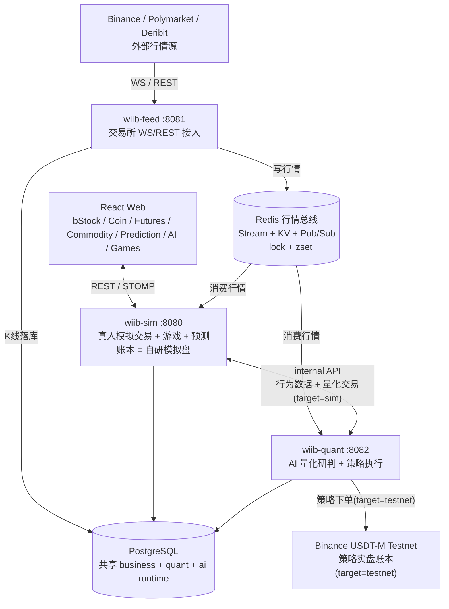
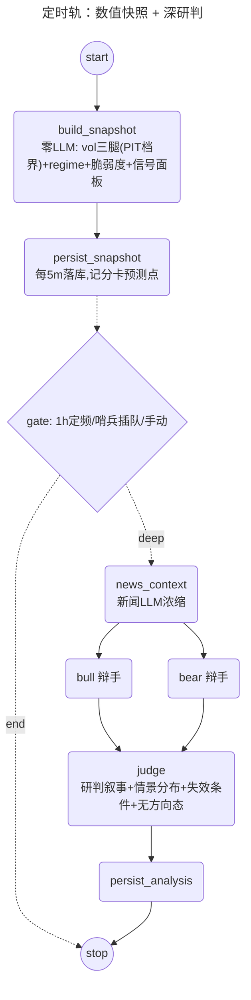

<div align="center">

# WhatIfIBought

**代币化美股、加密现货 / 永续、大宗商品、BTC 预测与 AI 量化的虚拟交易实验平台**

[](https://openjdk.org/projects/jdk/21/)
[](https://spring.io/projects/spring-boot)
[](https://github.com/alibaba/spring-ai-alibaba)
[](https://react.dev/)
[](https://www.typescriptlang.org/)
[](https://vite.dev/)
[](https://www.postgresql.org/)
[](https://redis.io/)
[](LICENSE)

用户通过 LinuxDo OAuth 登录，用虚拟资金体验代币化美股、加密货币现货 / 永续合约、大宗商品、BTC 5 分钟涨跌预测和小游戏，并观察一套"只预测不下单"的 AI 量化研判。

线上地址：https://linuxdo.stockgame.icu

</div>

---

## 当前定位

WhatIfIBought 是一个偏实验性质的模拟交易系统，后端按业务域拆成 **3 个独立进程**（feed 行情上游 / sim 真人模拟 / quant 量化研究）+ `wiib-common` 共享层，经 **Redis 行情总线**和**共享 PostgreSQL** 协作，进程级故障隔离（一个崩不连累其他）。

- **wiib-feed（:8081）**：统一接入 Binance（现货 + 永续 WS/REST）与 Polymarket，写入 Redis（Stream / KV / Pub-Sub），K 线落库 PostgreSQL。上游进程，不对外。
- **wiib-sim（:8080）**：真人模拟交易 + 游戏 + BTC 预测，账本 = 自研模拟盘 DB，对外提供 REST / WebSocket（**唯一对外进程**，前端连它）。
- **wiib-quant（:8082）**：AI 量化**只预测、不碰模拟盘账本**（结构化预测落库 + 记分卡）；FIBO / LIQFADE / SQZMOM 三策略由 5m K 线收盘驱动，执行目标二选一（`strategy.execution.target=sim|testnet`）：本平台模拟盘的独立量化账户 `quant-<策略ID>`，或 Binance USDT-M Testnet。

> **已下线**：老 GBM 虚拟股票、期权（后端全套已删）。现在的"股票"= **bStock 代币化美股**，走真实 Binance 现货行情。

当前标的：

| 品类 | 标的 |
|---|---|
| 加密现货 / 永续 | `BTC` `ETH` `DOGE` `SOL` `XRP` |
| bStock 代币化美股（10） | NVDA · TSLA · MU · SNDK · CRCL · MSTR · AMD · SPCX · QQQ · SOXL（Binance 现货，如 `NVDABUSDT`） |
| 大宗商品 | 黄金 `XAUUSDT` · 原油 `CLUSDT`（TradFi 永续，无现货） |
| 策略实盘篮子 | FIBO: `BTC/ETH` · LIQFADE: `BTC/ETH/DOGE` · SQZMOM: `SOL/DOGE/XRP` |

---

## 功能概览

### 交易系统

- **bStock 代币化美股**：真实 Binance 现货行情（价来自 feed→Redis，K 线代理 REST），含公司基本面；下单挂靠统一保证金账户。
- **加密货币现货**：BTC/ETH/DOGE/SOL/XRP，接入 Binance 实时行情，市价 / 限价单。
- **永续合约**：逐仓保证金，多 / 空双向，真实资金费率（每 8h 按 Binance premiumIndex 双向收付，拉取失败回退 0.01%），自动强平。
- **大宗商品**：黄金 / 原油 TradFi 永续。
- **保证金 / 计息 / 爆仓 / 破产恢复**：借款买入统一保证金账户，交易日 17:00 计息 + 爆仓检查，09:00 破产用户幂等恢复。
- **BTC 5 分钟涨跌预测**：接入 Polymarket 盘口 + Chainlink BTC 价格，5 分钟窗口自动结算，动态手续费。
- **策略实盘**：FIBO（5m 斐波回撤限价）、LIQFADE（5m 强平瀑布 fade 仅做多，瀑布 / premium 折价 / taker 卖压三签名至少二，1h 时间出场）、SQZMOM（4H 压缩释放仅做空），由 5m K 线收盘驱动；执行 sim（每策略独立账户，与真人同规则、资金隔离）或 Binance Testnet，默认全关、仅白名单 symbol。

### AI 量化研判（双轨研判工作台）

**卖点不是"预测准"，是"工程可信"**——方向预测已被 walk-forward + 置换检验证伪（不做），vol 预测 / vol-state 经统计验证有 skill（工具化 + 线上记分卡公开战绩）。

- **定时轨**：每 5m 零 LLM 数值快照（vol 三腿 + regime + 脆弱度 + 信号面板）落库，作记分卡预测点；1h 定频 + 波动哨兵插队触发深研判（新闻 → Bull∥Bear → Judge）。
- **对话轨**：`ChatWorkbenchController` SSE 流式，SupervisorAgent（深模型）动态调度 market / quant / news 子 agent（浅模型），PostgresSaver 续聊 + Store 记忆 + HITL 确认闸。
- **MCP Server**：同一工具层暴露为只读量化工具（SSE 端点），Claude Desktop 等任意 MCP 客户端可直连。
- 详见下方「AI 量化链路（双轨研判工作台）」。

### 行情与实时数据

- **Binance WS**：现货 miniTicker、永续 markPrice、永续 miniTicker、forceOrder（强平）、aggTrade、depth20。
- **Binance REST**：K 线、ticker、funding、OI、多空比、大户持仓、taker 买卖比、盘口。
- **Deribit**：DVOL 与期权 book summary（供 quant 做 IV / vol 上下文，非用户交易）。
- **Polymarket**：BTC 预测 live-data、UP/DOWN CLOB 盘口。
- **WebSocket**：SockJS + STOMP，前端订阅行情、预测、量化信号等 topic。

### 游戏与社交

- 每日 Buff 抽奖、21 点、Mines、Video Poker。
- 总资产排行榜、用户行为分析 Agent（quant 经 internal API 读 sim 行为数据）。

---

## 技术栈

| 层级 | 技术 | 版本 / 说明 |
|---|---|---|
| 后端 | Spring Boot | 3.4.1 |
| 语言 | Java | 21，启用 Virtual Threads |
| AI 框架 | Spring AI Alibaba | BOM / agent-framework 1.1.2.0（StateGraph + SupervisorAgent） |
| LLM 接入 | Spring AI OpenAI Starter | 1.1.2（OpenAI Compatible，配置在 DB） |
| MCP | Spring AI MCP Server (WebMVC/SSE) | 1.1.2 |
| ORM | MyBatis-Plus | 3.5.10 |
| 认证 | Sa-Token | 1.42.0（+ LinuxDo OAuth） |
| 数据库 | PostgreSQL | 共享主库，建表见 `sql/init.sql`（26 张）+ `sql/bstock.sql` |
| 缓存 | Redis + Caffeine | 行情总线、分布式锁、ZSet 索引 + 本地热缓存 |
| 观测 | Actuator + Micrometer Prometheus | Graph 节点本地观测 |
| 前端 | React + TypeScript | React 19.2 / TypeScript 5.9 |
| 构建 | Vite | 7.2 |
| UI | TailwindCSS 4 + ECharts 6 + lightweight-charts + styled-components | 拟物风自研组件，无 UI 框架依赖 |
| 状态 / 路由 | Zustand + React Router | 5.0 / 7.x |
| 实时通信 | WebSocket | STOMP + SockJS |

---

## 系统架构



---

## AI 量化链路（双轨研判工作台）

定位：**方向预测已证伪（不做），vol 预测 / vol-state 有真 skill**（工具化 + 线上记分卡）。深度使用 spring-ai-alibaba 1.1.2.0：确定性用图（StateGraph），认知用 Agent（Supervisor + ReactAgent）。

### 定时轨（StateGraph，图由 MermaidGenerator 自动生成）



- 快照段每 5m 零 LLM；Bull∥Bear 走框架原生并行边（fan-out/fan-in）。
- 深研判每轮 4 次 LLM 调用（新闻 + Bull + Bear + Judge），1h 定频基线 + 哨兵插队（冷却）——约 200 调用/天。
- 验证闭环：每小时对账到期预测点（QLIKE vs naive 基准 + vol-state 命中，PIT 档界随快照入库），`/quant/scorecard` 出战绩。

### 对话轨（SupervisorAgent 多 agent 编排）

`ChatWorkbenchController`（SSE 流式，调度过程可视化）：`workbench_supervisor`（深模型）动态调度 `market_agent` / `quant_agent` / `news_agent`（浅模型，深浅分层省成本），全部工具与定时轨**共用一个工具层**。横切：PostgresSaver 断点续聊、DatabaseStore 跨会话记忆、`run_deep_analysis` 贵操作 HITL 确认闸、ModelRetry/Fallback + CallLimit + Summarization。

同一工具层的第三个消费方：**MCP Server**（SSE 端点）——Claude Desktop 等任意 MCP 客户端可直连调用只读量化工具。

---

## 实时数据链路

### Binance

```text
wiib-feed（上游进程）  交易所 WS → Redis
  -> spot miniTicker        -> Redis 价格 KV + Pub/Sub
  -> futures markPrice@1s   -> Redis mark/指数价 KV + Pub/Sub
  -> forceOrder             -> force_order 表(DB, 天然跨进程)
  -> aggTrade               -> Redis Stream(orderflow, quant 读侧聚合)
  -> depth20@100ms          -> Redis KV(DepthStreamCache)
  -> K 线收盘                -> Redis Stream(kline:closed) + taker买量5m桶 KV + 落库

wiib-sim / wiib-quant（消费进程）  从 Redis 消费 feed 写入的行情
  sim:   撮合/强平 + 预测回合消费
  quant: K线驱动预测/策略 + 波动哨兵 + LIQFADE 拉 premium/taker KV
```

价格更新同时触发现货限价单、永续强平、止损、止盈检查。

### Polymarket BTC 预测

```text
Polymarket live-data -> Chainlink BTC price -> /topic/prediction/price
Polymarket CLOB      -> UP/DOWN bid/ask     -> /topic/prediction/market
5min window rotation -> 锁上轮 -> 拉开/收盘价 -> 结算下注
```

动态手续费：`effectiveRate = 0.25 * (p * (1 - p))^2`，clamp 0.1% ~ 2%。

---

## 项目结构

后端 **4 个 Maven module / 3 个独立进程**（+ 共享层），经 Redis 行情总线和共享 PostgreSQL 协作。

```text
whatifibought/                        # Maven 多 module 聚合 reactor
├── pom.xml
├── README.md
├── .env.example                      # 环境配置模板（唯一需手工填值的文件，复制为 .env.local / .env）
├── start-local.ps1                   # 本地一键启动三服务
├── docker-compose.yml                # 三进程编排（无私有值，配置全在 .env）
├── redis-compose.yml                 # Redis 主从 + 哨兵栈（可选）
├── sql/                              # init.sql（26 表）+ bstock.sql（bStock 静态表 + 种子）
├── docs/                             # 现役设计文档（见「重要文档」）
├── wiib-common/                      # 共享层：被 feed/quant/sim 共同依赖，三者互不直接依赖
│   └── market/ broadcast/ cache/ config/ mapper/ entity/ dto/ enums/ util/ ...
│                                     # 行情通道 / Depth·OrderFlow 缓存 / BinanceRestClient
│                                     # / KlineHistoryStore / ForceOrder mapper / InternalApiFilter
├── wiib-feed/                        # ① 数据流上游进程（:8081）
│   └── BinanceWsClient / PolymarketWsClient / KlineStreamCache / health(内部流健康+重试)
├── wiib-quant/                       # ② 量化 + 策略研究进程（:8082，只分析不碰模拟盘账本）
│   ├── agent/
│   │   ├── quant/                    # 定时轨 StateGraph（快照 + 深研判）+ 节点 / 记分卡
│   │   ├── research/                 # 回测 / 因子 / 预测 / 样本外评估（vol/regime/direction）
│   │   ├── toolkit/                  # 统一工具层（agent/定时轨/MCP 三处共用）
│   │   ├── chat/                     # 对话轨 SupervisorAgent 工作台
│   │   ├── strategy/                 # FIBO/LIQFADE/SQZMOM + 回测引擎 + 执行层(testnet|sim)
│   │   └── mcp/ behavior/ ...        # MCP server / 行为数据 agent / SimInternalClient
│   ├── controller/ task/ mapper/ config/   # ResearchEval/Strategy/Testnet... / 调度 / DeribitClient
│   └── AGENT_REFACTOR_PLAN.md        # 量化 Agent 双轨改造总纲
├── wiib-sim/                         # ③ 真人模拟交易进程（:8080，账本=自研模拟盘 DB，对外）
│   └── controller/ service/ mapper/ config/ task/
│                                     # 交易(bStock/crypto/futures) / 游戏 / 预测 / 结算 / WS 网关
│                                     # + BehaviorDataController（internal API 供 quant 调）
└── wiib-web/                         # React 前端（拟物风）
    └── src/                          # App.tsx / pages/ components/ hooks/ stores/ api/
```

---

## 重要文档

| 文档 | 内容 |
|---|---|
| `wiib-quant/AGENT_REFACTOR_PLAN.md` | 量化 Agent 双轨改造总纲（架构主文档） |
| `docs/superpowers/specs/2026-06-06-new-agent-principles.md` | Agent H6/H12/H24 三腿原则与边界 |
| `docs/superpowers/specs/2026-06-18-fibo-limit-retracement-redesign-design.md` | Fibo(M2) 限价回踩策略设计 |
| `docs/superpowers/specs/2026-07-09-feed-ws-stream-health-retry-design.md` | feed WS 流健康 + 手动重试（事件驱动） |
| `docs/frontend-p7-workbench-plan.md` | 前端研判工作台 + PC 布局标准 |

---

## 并发与一致性

| 机制 | 用途 |
|---|---|
| Virtual Threads | WS 消息处理、量化采集、调度任务、异步广播 |
| Redis 分布式锁 | 订单、仓位、用户、游戏操作互斥 |
| 数据库 CAS | 订单、预测回合、结算状态机 |
| Redis ZSet | 限价单、强平价、止损、止盈触发索引 |
| Redis Pub/Sub | 多实例 WebSocket 广播 |
| Caffeine + Redis | 本地热缓存 + L2 分布式缓存 |
| Micrometer | Graph 节点耗时 / 错误指标 |

---

## 部署

### 环境要求

| 依赖 | 最低版本 | 说明 |
|---|---:|---|
| JDK | 21 | 需要 Virtual Threads |
| Maven | 3.9+ | 后端构建 |
| Node.js | 18+ | 前端构建 |
| PostgreSQL | 14+ | 主数据库（三进程共享） |
| Redis | 6+ | 行情总线、锁、Pub/Sub、会话 |

### 1. 克隆项目

```bash
git clone https://github.com/mamawai/whatifibought.git
cd whatifibought
```

### 2. 初始化数据库

```bash
psql -U postgres -c "CREATE DATABASE wiib;"
psql -U postgres -d wiib -f sql/init.sql      # 业务 + 量化 + AI runtime（26 张表）
psql -U postgres -d wiib -f sql/bstock.sql    # bStock 代币化美股静态表 + 10 只种子
```

### 3. 后端配置

密钥与结构分离：`application.yml` 直接入库（只有 `${VAR}` 占位符），真实值只存在根目录 env 文件里。本地开发复制模板填值即可：

```bash
cp .env.example .env.local    # 填 PG_USER / PG_PASSWORD（必填），其余可选
```

启动时按 `本机环境变量 > .env.local > yml 默认值` 解析；线上 Docker 部署同一文件命名为 `.env`（见第 6 节）。

要点：

- **共享库 / 总线**：三进程指向同一 PostgreSQL `wiib` + 同一 Redis，读同一份 `.env.local`；`INTERNAL_API_TOKEN` 天然一致（进程间 `/internal/**` 鉴权），不填走统一默认值。
- **LLM 配置不在 yml**：唯一来源是 DB（`ai_runtime_config` + `ai_model_assignment`）。启动后用管理员账号进 Admin 页填 LLM（API Key + Base URL + 模型名，Base URL 不含 `/v1`）并给各功能位分配，即时生效、无需重启。
- **quant 必须关掉 Spring AI 的 OpenAI 自动装配**（6 类全关，否则缺 api-key 拒绝启动）：

  ```yaml
  spring:
    ai:
      model: { chat: none, embedding: none, image: none, moderation: none, audio: { speech: none, transcription: none } }
  ```

- **策略实盘执行**（`wiib-quant`，默认全关）：

  ```yaml
  strategy:
    runtime:   { enabled: true, enabled-ids: FIBO,LIQFADE,SQZMOM }
    execution: { enabled: true, target: sim, symbols: BTCUSDT,ETHUSDT,DOGEUSDT,SOLUSDT,XRPUSDT }
  ```

  > 策略由 K 线收盘驱动：`wiib-feed` 的 `binance.symbols` 必须覆盖上面全部标的（缺谁谁永不触发）。

### 4. 构建后端

```bash
mvn clean package -DskipTests
# 产物：
#   wiib-feed/target/wiib-feed-0.0.1-SNAPSHOT.jar     :8081 数据上游
#   wiib-quant/target/wiib-quant-0.0.1-SNAPSHOT.jar   :8082 量化策略
#   wiib-sim/target/wiib-sim-0.0.1-SNAPSHOT.jar       :8080 模拟交易（对外）
```

### 5. 构建前端

```bash
cd wiib-web
npm install
npm run build      # 开发：npm run dev（Vite 默认 3000，代理 /api、/ws 到后端）
```

### 6. 启动

本地一键（Windows，构建 + 依次拉起 feed → sim → quant）：

```powershell
.\start-local.ps1              # 加 -SkipBuild 跳过构建
```

或手动逐个起（须在仓库根目录执行，`.env.local` 按相对路径解析；IDEA 直接点各模块 Run 也可）：

```bash
java -jar wiib-feed/target/wiib-feed-0.0.1-SNAPSHOT.jar    # :8081 交易所 WS → Redis
java -jar wiib-quant/target/wiib-quant-0.0.1-SNAPSHOT.jar  # :8082 量化研判 + 策略
java -jar wiib-sim/target/wiib-sim-0.0.1-SNAPSHOT.jar      # :8080 模拟交易（对外，前端连它）
```

Docker Compose（三进程全编排；配置放服务器上的 `.env`，与 `.env.example` 同款变量）：

```bash
docker network create wiib-network
docker compose up -d --build
```

> 对外只暴露 sim（:8080，均绑 127.0.0.1），建议经 Nginx / Caddy 反代。Redis 主从 + 哨兵栈可选 `docker compose -f redis-compose.yml up -d`。

---

## 维护原则

- README 只写当前代码已经落地的事实；已下线的功能（老 GBM 股票 / 期权）不再出现。
- 量化架构以 `wiib-quant/AGENT_REFACTOR_PLAN.md` 为准。
- 改运行时配置、交易风控、Graph 节点、数据源、DB schema（`sql/`）时，需同步 README 与对应 docs。
