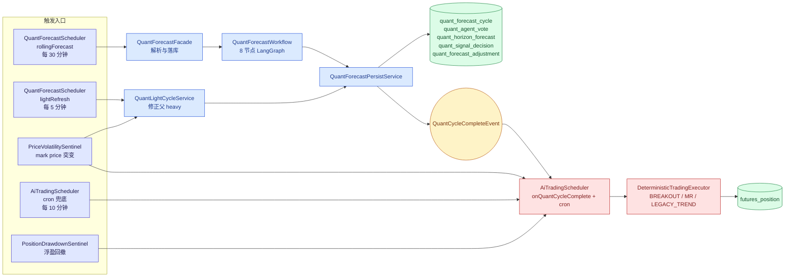
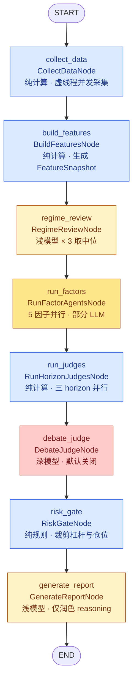
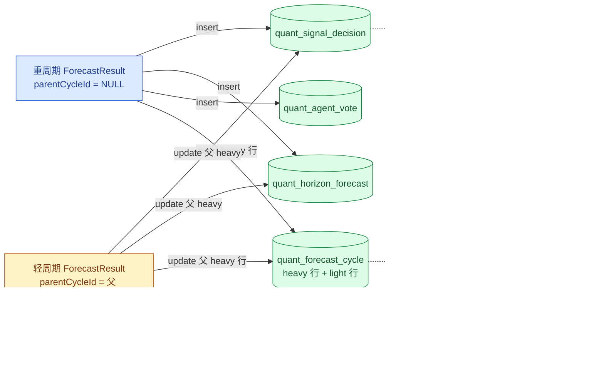
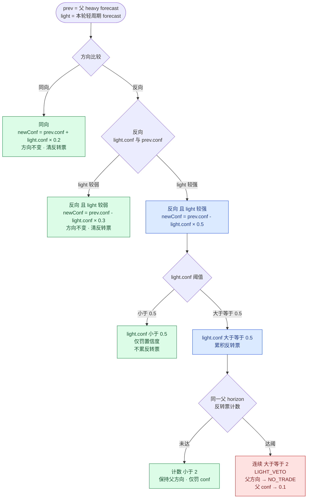

# Crypto 多 Agent 量化分析系统

> 本文按当前代码重写，目标是让读者能从调度入口一路读到数据采集、特征构建、因子投票、区间裁决、轻周期修正、落库和 AI-Trader 消费路径。
>
> 当前代码事实以 2026-04-27 的仓库为准。若代码变更，优先相信代码，不要反向让代码适配本文。

## 1. 当前定位

这套系统不是“让 LLM 直接交易”，而是一个 30 分钟重周期量化预测系统，外加 5 分钟轻周期修正和确定性交易执行器。

核心输出是三个交易区间的结构化预测：

- `0_10`：未来 0-10 分钟。
- `10_20`：未来 10-20 分钟。
- `20_30`：未来 20-30 分钟。

每个区间输出 `LONG / SHORT / NO_TRADE`、置信度、分歧度、入场区间、失效价、止盈目标、最大杠杆和最大仓位比例。AI-Trader 不直接读取 LLM 文本做交易，而是读取 `quant_forecast_cycle` 和 `quant_signal_decision` 中的结构化字段。

当前主动轮询标的是：

- `WATCH_SYMBOLS = BTCUSDT, ETHUSDT`
- `ALLOWED_SYMBOLS = BTCUSDT, ETHUSDT, PAXGUSDT`

`PAXGUSDT` 仍允许查询和处理历史/残留持仓，但不在主动重周期、轻周期、AI-Trader 轮询清单里。

## 2. 代码入口

主要文件：

| 模块 | 文件 | 作用 |
| --- | --- | --- |
| 标的常量 | `wiib-common/.../QuantConstants.java` | 定义主动轮询标的和 API 白名单 |
| 重周期调度 | `wiib-service/.../task/QuantForecastScheduler.java` | 每 30 分钟跑重周期，每 5 分钟跑轻周期 |
| Graph 门面 | `wiib-service/.../agent/quant/QuantForecastFacade.java` | 调用量化 Graph，解析并持久化结果 |
| Graph 定义 | `wiib-service/.../agent/quant/QuantForecastWorkflow.java` | 8 个节点的线性工作流 |
| 轻周期服务 | `wiib-service/.../agent/quant/QuantLightCycleService.java` | 复用重周期缓存，刷新局部信号并修正父重周期 |
| 波动哨兵 | `wiib-service/.../agent/quant/PriceVolatilitySentinel.java` | 价格突变时触发轻周期和交易周期 |
| 交易调度 | `wiib-service/.../task/AiTradingScheduler.java` | 监听量化完成事件，提交 AI-Trader 执行 |
| 交易执行 | `wiib-service/.../agent/trading/DeterministicTradingExecutor.java` | 确定性开仓/持仓管理逻辑 |
| 运行时开关 | `wiib-service/.../agent/config/RuntimeFeatureToggleService.java` | DB 持久化开关，并同步旧 static volatile 字段 |
| 权重覆盖 | `wiib-service/.../agent/quant/service/FactorWeightOverrideService.java` | 加载和应用因子权重覆盖 |

## 3. 端到端链路

下图为触发入口到交易落库的完整链路。重周期产出经事件驱动 AI-Trader，轻周期通过修正父 heavy 让交易链路看到调整后的信号。



### 3.1 重周期

`QuantForecastScheduler.rollingForecast()` 每 30 分钟触发：

1. 预取一次 Fear & Greed Index，避免每个 symbol 重复拉取。
2. 对 `QuantConstants.WATCH_SYMBOLS` 中的每个 symbol 启动虚线程。
3. 调用 `QuantForecastFacade.run(symbol, "scheduled-" + symbol, extraState)`。
4. Graph 返回后解析 `CryptoAnalysisReport`、`ForecastResult`、辩论摘要、原始 snapshot/report JSON。
5. `QuantForecastPersistService` 落库。
6. 缓存重周期结果给轻周期复用。
7. 广播前端量化信号。
8. 发布 `QuantCycleCompleteEvent(symbol, "heavy")`。

### 3.2 轻周期

`QuantForecastScheduler.lightRefresh()` 每 5 分钟触发：

1. 若重周期刚完成不到 120 秒，跳过。
2. 若该 symbol 没有重周期缓存，跳过。
3. 启动虚线程调用 `QuantLightCycleService.runLightRefresh()`。

轻周期不是完整重跑 Graph。它重新采集行情、重建特征、跑 4 个纯 Java 因子、复用或局部刷新新闻票、跑 `HorizonJudge` 和 `RiskGate`，然后把结果写成 light cycle。

重要细节：

- 轻周期通常不跑完整 LLM 链路。
- 但在贴近父重周期 10 分钟边界时，会用 `LightNewsAgent` 对 active horizons 做增量新闻刷新。
- 轻周期自己的 cycle 主要用于展示、验证和排查。
- AI-Trader 仍读取最新 heavy cycle；轻周期通过 UPDATE 父 heavy 的 forecast/signal/cycle 汇总，让交易链路看到修正后的 heavy。

### 3.3 交易消费

`AiTradingScheduler` 有两个入口：

- 监听 `QuantCycleCompleteEvent`，重周期或轻周期完成后提交该 symbol 的交易周期。
- 每 10 分钟 cron 兜底，保证量化失败时仍能盯盘管理已有持仓。

交易执行时读取：

- `cycleMapper.selectLatestHeavy(symbol)`
- `decisionMapper.selectLatestHeavyBySymbol(symbol)`

这也是轻周期必须修正父 heavy 的原因：交易链路只认 latest heavy，不直接按 latest light 开仓。

## 4. Graph 工作流

`QuantForecastWorkflow` 是 8 节点线性 Graph：



节点职责：

| 节点 | 类 | 是否 LLM | 输出重点 |
| --- | --- | --- | --- |
| collect_data | `CollectDataNode` | 否 | Binance/Deribit/本地订单流/新闻原始数据 |
| build_features | `BuildFeaturesNode` | 否 | `FeatureSnapshot`、技术指标、数据质量标记 |
| regime_review | `RegimeReviewNode` | 是，浅模型 | regime 置信度、转换预警、低置信度标记 |
| run_factors | `RunFactorAgentsNode` | 部分 | 5 个因子的 `AgentVote` |
| run_judges | `RunHorizonJudgesNode` | 否 | 三个 `HorizonForecast`、overall decision、risk status |
| debate_judge | `DebateJudgeNode` | 可选，深模型 | 辩论概率、辩论摘要、可选修正 forecasts |
| risk_gate | `RiskGateNode` | 否 | 杠杆、仓位、风险状态裁剪 |
| generate_report | `GenerateReportNode` | 是，浅模型 | 前端兼容报告、`ForecastResult` JSON |

编译时显式传空 `SaverConfig`，禁用框架默认 `MemorySaver`。原因是默认 saver 会把整份 state 深拷贝进无上限链表，固定 threadId 长期运行会导致内存膨胀。以后如果要做断点恢复，必须使用带 LRU/TTL 的自定义 saver。

## 5. 模型与 Runtime

`AiAgentRuntimeManager` 维护运行时模型配置：

- `behaviorChatModel`
- `quantChatModel`
- `chatChatModel`
- `reflectionChatModel`

旧的 `tradingChatModel` 已移除，AI-Trader 现在走确定性执行器，不再通过 Graph trading function 下单。

`QuantGraphFactory.create(ChatModel)` 当前用同一个 `quantChatModel` 构建 deep/shallow 两个 `ChatClient.Builder`。代码里保留了 deep/shallow 入口，但当前不是两个不同模型。文档或排查时不要误以为已经实现“深模型、浅模型独立配置”。

## 6. 数据采集

`CollectDataNode` 负责一次性并发采集原始数据。当前实现采用虚线程 executor，统一 10 秒 deadline，而不是每个 Future 各给 10 秒。

采集内容包括：

- futures klines：`1m / 5m / 15m / 1h / 4h / 1d`
- spot klines：`1m / 5m`
- futures ticker、spot ticker
- funding rate、funding history
- futures order book、spot order book
- open interest、open interest history
- global long-short ratio
- force orders，本地爆仓服务
- top trader position ratio
- taker long-short ratio
- Fear & Greed Index
- Binance news
- Deribit DVOL 和 option book summary

超时处理要点：

- 所有采集共享同一个 deadline，避免多个 `future.get(10s)` 串起来把总耗时放大。
- 单项超时会 `cancel(true)`。
- 线程中断会恢复 interrupt 状态。
- 采集失败只让对应字段为空，不直接让整轮失败。
- `data_available` 至少要求有 futures kline 和 ticker。

这条链路的设计重点是“宁可带质量标记降级，也不要用过期/缺失数据伪装完整数据”。

## 7. 特征构建

`BuildFeaturesNode` 把原始 JSON 转成 `FeatureSnapshot`。它是量化系统最重要的纯计算节点。

主要产物：

- 多周期指标：MA/EMA/RSI/MACD/KDJ/ADX/ATR/布林带/OBV。
- 多周期涨跌幅：`5m / 15m / 30m / 1h / 4h / 24h`。
- spot/perp 联动：现货盘口、现货涨跌、basis bps、相对强弱代理。
- 微结构：盘口失衡、主动成交差、成交强度、大单方向。
- 衍生品：OI、funding、long-short ratio、top trader、taker pressure。
- 爆仓压力：多空爆仓压力和 USDT 规模。
- 情绪：Fear & Greed Index。
- 期权波动率：DVOL、ATM IV、25d skew、term slope。
- 市场状态：`TREND_UP / TREND_DOWN / RANGE / SQUEEZE / SHOCK`。
- 数据质量标记：后续 Judge、RiskGate、AI-Trader 会继续使用。

Regime 粗判规则由程序完成：

- `SHOCK`：5m 近期 6 根平均 true range 明显高于之前 60 根。
- `SQUEEZE`：ADX 较低且布林带带宽很窄。
- `TREND_UP / TREND_DOWN`：ADX 强且 `+DI/-DI` 明确。
- `RANGE`：ADX 较低或处在趋势强度灰区。

常见质量标记包括：

- K 线问题：`MISSING_TF_*`、`INSUFFICIENT_BARS_*`、`PARTIAL_KLINE_DATA`
- 价格问题：`NO_PRICE`
- 盘口和订单流问题：`NO_ORDERBOOK`、`NO_SPOT_ORDERBOOK`、`NO_AGG_TRADE`、`STALE_AGG_TRADE`
- 衍生品问题：`NO_FUNDING`、`NO_LONG_SHORT_RATIO`、`NO_FORCE_ORDERS`、`NO_TOP_TRADER`、`NO_TAKER_LSR`
- 波动率问题：`NO_OPTION_IV`、`NO_ATR_5M`、`NO_BOLL_5M`
- 外部数据问题：`NO_FEAR_GREED`、`NO_NEWS`
- 置信度问题：`LOW_CONFIDENCE`

## 8. Regime Review

`RegimeReviewNode` 是浅模型节点，但它不是重新计算指标。它做的是对程序粗判 regime 的审核：

- 结合多周期指标、价格变化、质量标记和历史记忆。
- 默认跑 3 次 LLM 调用。
- 用多数/中位数合并结果。
- `stddev > 0.15` 或样本不足时标记低置信度。
- LLM 不能随意把市场升级为 `SHOCK`，`SHOCK` 只能由程序规则触发。

输出写入 state：

- `regime_confidence`
- `regime_confidence_stddev`
- `regime_transition`
- `regime_transition_detail`

这一步的价值是让 regime 从“技术指标标签”变成“带置信度和转换预警的市场状态”，但它仍受程序硬规则约束。

## 9. 因子 Agent

`RunFactorAgentsNode` 并行运行 5 个因子 Agent：

- `microstructure`
- `momentum`
- `regime`
- `volatility`
- `news_event`

统一输出 `AgentVote`：

```text
agent, horizon, direction, score, confidence, reasonCodes, riskFlags
```

`score` 表示方向强度，正数偏多，负数偏空，接近 0 表示无方向优势。`confidence` 表示该 agent 对自己判断的可靠程度。后续 `HorizonJudge` 主要按 `weight * abs(score)` 聚合方向，置信度另算。

### 9.1 MicrostructureAgent

微结构 Agent 处理短线交易最敏感的数据：

- futures 盘口失衡
- spot 盘口失衡
- trade delta
- trade intensity
- large trade bias
- OI 与价格组合
- 爆仓压力
- top trader bias
- taker pressure
- spot confirm / spot lead
- basis
- funding contrarian
- long-short ratio contrarian

不同 horizon 使用不同权重。越短的区间，微结构权重越高。

### 9.2 MomentumAgent

动量 Agent 读多周期 RSI、MACD、KDJ、均线排列、成交量和价格变化：

- `0_10` 重点看 `1m / 5m`
- `10_20` 重点看 `5m / 15m`
- `20_30` 重点看 `15m / 1h`

它会根据多周期方向一致性调整 confidence。缺少关键周期时会降置信度，而不是凭一个周期硬给方向。

### 9.3 RegimeAgent

市场状态 Agent 读取 `FeatureSnapshot` 中的 regime、regime confidence、transition，再结合趋势方向、IV skew 和高 IV 风险做偏置。

典型处理：

- `TREND_UP / TREND_DOWN` 倾向顺势。
- `RANGE` 更保守，避免把震荡误判成趋势。
- `SQUEEZE` 关注突破，但方向没确认时不强行给高置信度。
- `SHOCK` 主要是降风险，不鼓励扩仓。

### 9.4 VolatilityAgent

波动率 Agent 不直接给多空方向。它更多输出 `NO_TRADE`、预期波动和风险标记。

它基于 ATR、布林带、DVOL、IV 结构估算未来不同区间的可交易波动。如果预期波动覆盖不了成本，后续 `HorizonJudge` 和 `RiskGate` 会更容易降低置信度、杠杆或仓位；只有其他方向因子也没有有效投票时，才会走向 `NO_TRADE`。

### 9.5 NewsEventAgent

新闻事件 Agent 是浅模型节点。它先用 `NewsRelevance` 做关键词/相关性预过滤，再让 LLM 判断新闻对每个 horizon 的方向和影响。

当前实现默认做 3 次新闻判断，取中位数并计算离散度：

- 离散度高时写入 `news_low_confidence`。
- 风险标记会合并到 `FeatureSnapshot.qualityFlags`。
- 重要新闻会进入最终报告。

新闻只是一类因子，不是最终方向裁决者。

## 10. HorizonJudge

`HorizonJudge` 对每个 horizon 单独裁决。三个 horizon 并行运行。

默认基础权重：

| agent | `0_10` | `10_20` | `20_30` |
| --- | ---: | ---: | ---: |
| microstructure | 0.35 | 0.14 | 0.05 |
| momentum | 0.25 | 0.30 | 0.30 |
| regime | 0.15 | 0.20 | 0.25 |
| volatility | 0.15 | 0.16 | 0.15 |
| news_event | 0.10 | 0.20 | 0.25 |

裁决思路：

1. 对每个 vote 取 `weight * abs(score)` 作为方向贡献。
2. 正分进 long bucket，负分进 short bucket。
3. 波动率 vote 参与波动估计和风险，不直接主导方向。
4. 只有没有有效方向投票时才直接 `NO_TRADE`。
5. edge 不足、预期移动不足、分歧过高时，主要通过 confidence 惩罚表达不确定性。
6. 根据 confidence、disagreement、质量标记裁剪最大杠杆和最大仓位。

`FactorWeightOverrideService` 会在基础权重后应用运行时权重覆盖。之后还会叠加 `MemoryService.getAgentAccuracy(symbol)` 的历史准确率修正，避免长期低效的 agent 继续拿同等权重。

### 10.1 ConsensusBuilder

`ConsensusBuilder` 把三个 `HorizonForecast` 汇总成周期级结论：

- 选择非 `NO_TRADE` 且 confidence 最高的 horizon。
- 有可交易区间时输出 `PRIORITIZE_{horizon}_{direction}`。
- 三个区间全是 `NO_TRADE` 时输出 `FLAT`。
- 风险状态按 `ALL_NO_TRADE / HIGH_DISAGREEMENT / CAUTIOUS / NORMAL` 汇总。

当前 AI-Trader 不再把 `overallDecision=FLAT` 当硬性不开仓门槛。执行器会记录这个状态，但实际是否开仓主要看 active horizon 信号、本地 7 维共振、趋势过滤、R:R、手续费和仓位风控。

## 11. DebateJudge

`DebateJudgeNode` 是可选深模型节点。当前默认开关不是 live 开启：

- `quant.debate_judge.enabled` 默认 `false`
- `quant.debate_judge.shadow_enabled` 默认 `false`

如果 live 和 shadow 都关闭，它会返回中性概率，不改变官方 forecasts。

开启后流程是：

1. Bull 辩手和 Bear 辩手并行生成论据。
2. Judge 综合双方论据、当前 forecasts、snapshot、记忆摘要给出裁决。
3. 输出 bull/range/bear 概率和 reasoning。

安全约束：

- 置信度最多只能增加 0.10。
- `LONG / SHORT` 方向翻转时 confidence 被限制，不能因为一次辩论大幅反转。
- `NO_TRADE` 不会被轻易改成强方向。
- shadow 模式只写 `debate_shadow_*`，不改官方 forecasts。

这一步的定位是发现线性加权看不到的逻辑矛盾，不是替代前面的因子投票和风控。

## 12. RiskGate

`RiskGate` 是纯规则风控层。它不改变“市场事实”，只裁剪交易可执行性。

主要规则：

- `SHOCK`：杠杆封顶 5，仓位再打折。
- `SQUEEZE`：仓位轻微压缩。
- 高分歧：杠杆减半并设上限。
- 低置信度：降低仓位。
- Fear & Greed 极端：除非趋势兼容，否则降低 confidence。
- 波动过高：按 symbol 的正常/极端波动区间降低风险暴露。
- DVOL/IV 偏高：进一步降低环境因子。
- 数据质量差：仓位和风险状态降级。

最终 adjusted position 受 `maxPositionPct`、confidence、agreement factor、environment factor 共同约束。

## 13. 报告生成

`GenerateReportNode` 分两步：

1. 先用纯计算生成 hard report。
2. 再让浅模型润色 reasoning、summary、analysisBasis、indicators、riskWarnings。

LLM 不能修改以下结构化字段：

- 三个 horizon 的方向。
- 入场区间。
- 止损/止盈。
- 杠杆和仓位建议。
- `NO_TRADE` 结论。

LLM 失败时，最终报告回退 hard report。

`GenerateReportNode` 还会输出：

- `report`
- `hard_report`
- `forecast_result`
- `raw_snapshot_json`
- `raw_report_json`

其中 `forecast_result` 当前以 JSON 字符串返回，避免 Graph deep copy 把复杂 record 转成 Map。`raw_snapshot_json` 会补充 regime/news 方差等工作流指标，方便落库后跨页面查询。

需要注意：`raw_snapshot_json` 和 `raw_report_json` 当前由节点写出并被 `QuantForecastFacade` 读取，但它们没有在 `QuantForecastWorkflow.createKeyStrategyFactory()` 中注册。排查 Graph state 时要以实际返回为准，不要把它们当成显式声明的 key。

## 14. 持久化

`QuantForecastPersistService` 负责把 `ForecastResult` 写入多张表：

- `quant_forecast_cycle`：一次预测周期的摘要、snapshot、report、risk status。
- `quant_agent_vote`：每个 agent 在每个 horizon 的投票。
- `quant_horizon_forecast`：三个 horizon 的结构化 forecast。
- `quant_signal_decision`：供交易执行器读取的简化信号。
- `quant_forecast_adjustment`：轻周期修正父 heavy 的调整记录。

重周期的 `parentCycleId` 为空。轻周期的 `parentCycleId` 指向父 heavy cycle。

AI-Trader 读取的是 latest heavy，但 light 修正会回写父 heavy 的 horizon forecast、signal decision 和 cycle 汇总，因此交易链路能看到轻周期影响。



## 15. 轻周期修正算法

轻周期的核心不是“自己生成一个更短周期预测”，而是“在半小时窗口内修正父重周期”。

### 15.1 缓存内容

重周期完成后，轻周期缓存：

- `heavyCycleId`
- `newsVotes`
- `regime`
- `regimeConfidence`
- `regimeTransition`
- `reportJson`
- `heavyCycleTime`
- `heavyWindowStart`
- 父重周期三个 horizon 的 forecast 快照

新重周期到来时，会清掉上一个窗口的 reversal state，避免反转票跨周期累积。

### 15.2 边界映射

重周期按半小时墙钟窗口归属。例如 12:03 完成的重周期仍属于 12:00-12:30。

轻周期只在 horizon 起点贴近 0/10/20 分钟边界时修正父 heavy：

- 贴近 0 分钟边界，映射父 `0_10`。
- 贴近 10 分钟边界，映射父 `10_20`。
- 贴近 20 分钟边界，映射父 `20_30`。
- 05/15/25 这种跨段中点不修正父 heavy。

### 15.3 三分支规则

设 `prev` 为父重周期当前 forecast，`light` 为本轮轻周期对应 forecast。

- 同向：`newConf = prev.conf + light.conf * 0.2`，方向不变，清反转票。
- 反向但 light 更弱：`newConf = prev.conf - light.conf * 0.3`，方向不变，清反转票。
- 反向且 light 更强：`newConf = prev.conf - light.conf * 0.5`。

反向强信号还要看绝对置信度：

- `light.conf < 0.5`：只罚置信度，不累反转票。
- `light.conf >= 0.5`：累积反转票。
- 同一父 horizon 连续 2 次强反向票：`LIGHT_VETO`，把父方向置为 `NO_TRADE`，confidence 置为 0.1。

轻周期只否决旧方向，不直接翻成反方向。真正反向应交给下一轮重周期确认。



## 16. 事件与哨兵

### 16.1 PriceVolatilitySentinel

`PriceVolatilitySentinel` 监听 mark price：

- 每个 symbol 保留约 5 分钟价格窗口。
- 约 1 秒采样一次。
- 有 ATR5m 时使用 `ATR5m * 1.3 / currentPrice` 作为动态阈值。
- 没有 ATR 时使用 symbol fallback 阈值。
- 30 秒冷却。

触发后：

1. 如果有重周期缓存，先跑轻周期刷新。
2. 再调用 `AiTradingScheduler.submitTradingCycle(List.of(symbol))`。

### 16.2 PositionDrawdownSentinel

`PositionDrawdownSentinel` 定时扫描 AI 账户 OPEN 仓位，读取生产 `TradingExecutionState` 中记录的峰值浮盈。出现窗口内 PnL 回撤或浮盈回吐时，触发交易周期让执行器重新管理仓位。

这个哨兵已经读生产 Bean 的 state，不再读旧 static 全局状态。

## 17. AI-Trader 当前策略

当前 `strategy-specs` 里的五类策略不是 AI-Trader 的实际实现。AI-Trader 当前真实策略在 `DeterministicTradingExecutor` 中，只有三个执行路径：

- `BREAKOUT`
- `MR`
- `LEGACY_TREND`

策略路由优先级：

1. `BREAKOUT`：布林带 squeeze、成交量放大，并且 BB%B 方向与信号方向一致。
2. `MR`：BB%B 处在极端超买/超卖区间。
3. `LEGACY_TREND`：默认趋势跟踪。

开仓前的关键门槛：

- 同 symbol 开仓冷静期当前为 0；已有持仓会先盯盘，盯盘结果为 HOLD 时仍可继续评估新开仓。
- 日亏损限制。
- ATR 必须可用。
- `STALE_AGG_TRADE` 直接弃权。
- 只读取当前 active horizon，避免提前使用未来区间信号。
- `overallDecision=FLAT` 只记录，不再硬拦截。
- 1h MA 趋势过滤，MR 极值 setup 可豁免。
- 7 维共振评分默认需要 `>= 6`。
- 5/7 live 开关当前覆盖 `BREAKOUT / MR / LEGACY_TREND` 三条路径，旧 key 名仍叫 `legacy_threshold_5of7`。
- `SHOCK / SQUEEZE / LOW_CONFIDENCE` 会缩仓。
- 低波动小仓位模式默认开启。
- 总持仓上限和同向持仓上限当前都是 6，用于虚拟盘观察多仓触发频率。
- 手续费感知 R:R 和最小 R:R 都必须通过。

当前持仓管理更接近“低干预盯盘”：

- 开仓时先把 SL/TP 设置好，持仓后优先等 TP 或 SL。
- `SHOCK`、1h 逆风等情况主要写 reasoning，不直接砍仓。
- 盈利走到目标 50%–70% 只观察，不盲目平半。
- 盈利走到目标 70% 以上，并且出现反向高置信信号、市场确认、连续 2 次确认时，才保护性平 50%。
- 保护性平半后同步剩余仓位的 SL/TP 数量。
- 已移除执行器内的 MR 中轨全平、MR 超时、time stop、普通反转全平、固定 ATR 分批止盈、trailing / breakeven 改 SL。

因此当前交易策略更接近“量化信号过滤后的趋势/均值回归/突破三路径确定性执行器”，不是文档化的五策略组合。

## 18. Runtime Toggle

`RuntimeFeatureToggleService` 把运行时开关持久化到 `ai_runtime_toggle`，并在 service 内部同步旧的 static volatile 字段。Admin Controller 不直接双写旧字段。

当前重要开关：

- `quant.debate_judge.enabled`
- `quant.debate_judge.shadow_enabled`
- `quant.factor_weight_override.enabled`
- `trading.low_vol.enabled`
- `trading.legacy_threshold_5of7.enabled`
- `trading.legacy_5of7_shadow.enabled`
- drawdown sentinel enabled/window/drop/cooldown 等参数

注意：`trading.legacy_threshold_5of7.enabled` 保留旧名字，但当前代码语义已经从“只给 LEGACY_TREND 放宽”变成“三条策略路径都可用 5/7 live”。`trading.low_vol.enabled` 当前默认开启。

`FactorWeightOverrideService` 默认加载 classpath 下的 `factor_weight_override.json`，但实际是否应用由 runtime toggle 决定。当前默认保守，权重覆盖开关不开时不会影响线上裁决。

## 19. 记忆与验证

系统会验证历史预测并生成可复用记忆：

- `VerificationTask / ReflectionTask` 周期性验证历史 forecast。
- `MemoryService` 提供 agent accuracy 和历史表现摘要。
- `RegimeReviewNode`、`DebateJudgeNode`、`GenerateReportNode` 可注入记忆摘要。
- `HorizonJudge` 会读取 agent 历史准确率，修正 agent 权重。

这套记忆的定位是“慢变量校准”，不是让模型短线追涨杀跌。

## 20. 阅读代码时的边界

建议按这个顺序阅读代码：

1. `QuantForecastScheduler`：先看重周期和轻周期何时触发。
2. `QuantForecastFacade`：看 Graph 返回后怎么解析和落库。
3. `QuantForecastWorkflow`：看 8 个节点的真实顺序。
4. `CollectDataNode` 和 `BuildFeaturesNode`：看输入数据和特征来源。
5. `factor/*`：看每个 agent 如何生成 `AgentVote`。
6. `HorizonJudge`、`ConsensusBuilder`、`RiskGate`：看结构化预测如何定方向、定风险。
7. `GenerateReportNode`：看用户可读报告如何由 hard report 加 LLM 文本合成。
8. `QuantLightCycleService`：看 light 如何修正父 heavy。
9. `AiTradingScheduler` 和 `DeterministicTradingExecutor`：看预测如何变成交易动作。

需要特别避免的误解：

- 不要把 PAXG 当作当前主动交易标的。
- 不要把 light cycle 理解为“每 10 分钟零 LLM 全量刷新”，当前是每 5 分钟，且边界处可能有轻量新闻 LLM。
- 不要认为 deep/shallow 已经是两个独立模型配置，当前实际共用 `quantChatModel`。
- 不要认为 DebateJudge 默认参与 live 决策，当前默认关闭。
- 不要用 `strategy-specs` 推断当前 AI-Trader 行为，真实交易路径在 `DeterministicTradingExecutor`。
- 不要让 LLM 文本覆盖结构化方向，交易链路只消费结构化信号。

## 21. 设计评价

这套架构的核心优点是职责边界清楚：

- Java 负责可验证计算。
- Agent 负责结构化判断。
- Judge 负责多因子裁决。
- RiskGate 负责可执行性裁剪。
- ReportNode 负责解释，不负责改方向。
- AI-Trader 负责交易执行，不负责重新预测。

当前最需要保持的原则是：预测、解释、交易执行三件事不能混在一起。预测层可以复杂，但输出必须结构化；解释层可以使用 LLM，但不能改交易字段；交易层可以用量化信号，但必须由确定性规则决定是否开仓、减仓或平仓。

这样做的代价是代码链路较长，但换来的是可回测、可验证、可解释，也能在发现问题时定位到具体层：数据缺失、因子错误、权重问题、risk gate 过严、light 修正过强，或交易执行器过滤过多。
