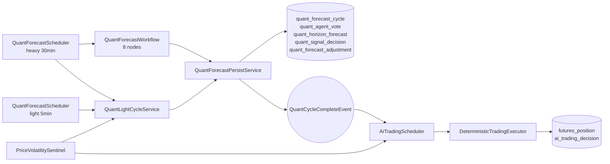
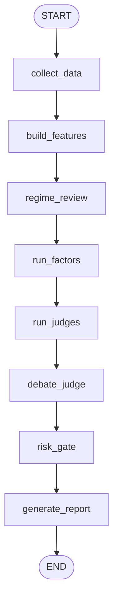

# Crypto 多 Agent 量化分析系统

更新时间：2026-05-11

本文是量化系统端到端主文档：从调度入口、数据采集、特征构建、因子投票、裁决、轻周期修正、落库，到 AI-Trader 如何消费信号。当前代码事实以仓库源码为准。

## 1. 系统定位

当前系统不是“LLM 直接交易”。它分成三层：

1. 量化预测层：重周期/轻周期生成结构化预测。
2. 解释层：LLM 只参与 regime/news/report/debate 这类判断或文本，不直接下单。
3. 交易执行层：AI-Trader 用确定性规则决定是否开仓和如何退出。

核心输出区间：

| horizon | 含义 |
|---|---|
| `0_10` | 未来 0-10 分钟 |
| `10_20` | 未来 10-20 分钟 |
| `20_30` | 未来 20-30 分钟 |

每个 horizon 输出方向、confidence、disagreement、entry、invalidation、tp1/tp2、最大杠杆、最大仓位比例和风险状态。

主动标的：

- `WATCH_SYMBOLS = BTCUSDT, ETHUSDT`
- `ALLOWED_SYMBOLS = BTCUSDT, ETHUSDT, PAXGUSDT`

PAXG 仍允许查询/处理历史和残留仓位，但不在主动调度清单里。

## 2. 关键入口

| 模块 | 文件 / 类 | 职责 |
|---|---|---|
| 标的常量 | `QuantConstants` | 主动标的和 API 白名单 |
| 重/轻周期调度 | `QuantForecastScheduler` | 30min heavy，5min light |
| Graph 门面 | `QuantForecastFacade` | 调用 Graph、解析 `ForecastResult`、持久化 |
| Graph 定义 | `QuantForecastWorkflow` | 8 节点 StateGraph |
| 特征工程 | `CollectDataNode`, `BuildFeaturesNode` | 采集和构建 `FeatureSnapshot` |
| 因子 | `factor/*Agent` | 5 个 agent 产出 15 张 vote |
| 裁决 | `HorizonJudge`, `ConsensusBuilder`, `RiskGate` | 定方向、合成周期结论、裁剪可执行性 |
| 轻周期 | `QuantLightCycleService` | 复用 heavy 缓存并修正父 heavy |
| 价格哨兵 | `PriceVolatilitySentinel` | 异常波动触发 light + trader |
| 交易调度 | `AiTradingScheduler` | 量化事件和 10min cron 触发交易 |
| 交易执行 | `DeterministicTradingExecutor` | 开仓和 Playbook 退出编排 |
| 运行时配置 | `RuntimeFeatureToggleService` | DB 持久化开关 |

## 3. 端到端链路



重要边界：

- heavy 跑完整 Graph。
- light 不完整重跑 Graph，主要刷新行情、纯 Java 因子、必要时轻量新闻，并修正父 heavy。
- AI-Trader 读取 latest heavy 和 latest heavy signal；light 通过回写父 heavy 间接影响交易。
- 当前没有 `PositionDrawdownSentinel`。

## 4. 重周期

`QuantForecastScheduler#rollingForecast` 每 30 分钟触发。

流程：

1. 预取一次 Fear & Greed Index。
2. 对 `WATCH_SYMBOLS` 启动虚线程。
3. 调 `QuantForecastFacade.run(symbol, "scheduled-" + symbol, extraState)`。
4. `AiAgentRuntimeManager#invokeQuantWithFallback` 调当前 quant Graph；LLM RestClient 异常时尝试 default 配置 fallback graph。
5. `QuantForecastFacade` 从 state 读取 `forecast_result`、`raw_snapshot_json`、`raw_report_json` 等。
6. `QuantForecastPersistService` 写 4 张主表。
7. `QuantLightCycleService#cacheFromHeavyCycle` 缓存 heavy 结果。
8. WebSocket 广播量化信号。
9. 发布 `QuantCycleCompleteEvent(symbol, "heavy")`。

`AiAgentRuntimeManager` 当前管理 4 个模型分配：`behavior`、`quant`、`chat`、`reflection`。旧 `trading` 模型分配启动时会被删除。

## 5. 轻周期

`QuantForecastScheduler#lightRefresh` 每 5 分钟触发。

跳过条件：

- 最近 heavy 完成不到 120 秒。
- 没有该 symbol 的 heavy 缓存。

light 的工作：

1. 重新采集行情。
2. 重新构建 `FeatureSnapshot`。
3. 运行 4 个纯 Java agent：microstructure、momentum、regime、volatility。
4. 复用 heavy news votes；在靠近 0/10/20 分钟边界时，用 `LightNewsAgent` 刷 active horizons 新闻。
5. 运行 `HorizonJudge` 和 `RiskGate`。
6. 持久化 light cycle，`parentCycleId` 指向父 heavy。
7. 尝试修正父 heavy 的 horizon forecast、signal decision 和 cycle 汇总。
8. 发布 `QuantCycleCompleteEvent(symbol, "light")`。

### 5.1 light 修正父 heavy

light 只在半小时窗口内修正父 heavy，不直接翻成新方向。

边界映射：

| light 贴近边界 | 修正父 horizon |
|---|---|
| 0 分钟 | `0_10` |
| 10 分钟 | `10_20` |
| 20 分钟 | `20_30` |

5/15/25 这类窗口中点通常只保存 light 自己，不修正父 heavy。

修正规则：

| 情况 | 处理 |
|---|---|
| light 与父方向同向 | 父 confidence 加 `light.conf * 0.2`，方向不变，清反转票 |
| 反向但 light 较弱 | 父 confidence 减 `light.conf * 0.3`，方向不变，清反转票 |
| 反向且 light 较强 | 父 confidence 减 `light.conf * 0.5` |
| 强反向且 `light.conf >= 0.5` | 累积该父 horizon 的 reversal vote |
| 同一父 horizon 连续 2 次强反向 | `LIGHT_VETO`，父方向置 `NO_TRADE`，confidence 置 0.1 |

light 只否决旧方向，不直接把父 heavy 翻成反方向。反方向需要下一轮 heavy 确认。

## 6. Graph 工作流

`QuantForecastWorkflow` 是固定 8 节点线性 Graph：



| 节点 | 类 | 是否 LLM | 输出重点 |
|---|---|---|---|
| `collect_data` | `CollectDataNode` | 否 | 原始行情、新闻、IV、数据可用性 |
| `build_features` | `BuildFeaturesNode` | 否 | `FeatureSnapshot`、指标、微结构、regime、quality flags |
| `regime_review` | `RegimeReviewNode` | 是 | regime confidence/stddev/transition |
| `run_factors` | `RunFactorAgentsNode` | 部分 | 5 agent 的 15 张 vote |
| `run_judges` | `RunHorizonJudgesNode` | 否 | 三个 `HorizonForecast`、overall、risk |
| `debate_judge` | `DebateJudgeNode` | 可选 | 默认关闭，不改正式 forecasts |
| `risk_gate` | `RiskGateNode` | 否 | 杠杆、仓位和风险状态裁剪 |
| `generate_report` | `GenerateReportNode` | 是 | hard report + LLM 润色文本 + `ForecastResult` |

编译时显式传 `SaverConfig.builder().build()`，禁用默认 `MemorySaver`。如果未来要做断点恢复，不能直接回默认 saver，必须使用带 LRU/TTL 的自定义 checkpoint saver。

## 7. 数据采集

`CollectDataNode` 使用虚线程并发，整轮 10 秒 deadline。采集失败只影响对应字段，不直接终止整轮。

主采集项：

- futures klines：`1m / 5m / 15m / 1h / 4h / 1d`
- spot klines：`1m / 5m`
- futures ticker、spot ticker
- funding rate、funding history
- futures order book、spot order book
- open interest、open interest history
- global long-short ratio
- local force orders
- top trader position ratio
- taker long-short ratio
- Fear & Greed Index
- CoinDesk news
- Deribit DVOL、option book summary

`DepthStreamCache` 新鲜度 2 秒内优先使用 WS depth，否则回 REST。

## 8. 特征构建

`BuildFeaturesNode` 的主要产物：

- 多周期指标：MA/EMA/RSI/MACD/KDJ/ADX/ATR/Boll/OBV/volume。
- 已闭合窗口：近 5 根已闭合 5m 量比、近 3 根已闭合 5m 收盘趋势。
- 价格变化：`5m / 15m / 30m / 1h / 4h / 24h`。
- spot/perp：现货盘口、现货涨跌、basis bps、lead-lag。
- 微结构：盘口失衡、主动成交差、成交强度、大单方向。
- 衍生品：OI、funding、long-short ratio、大户、taker pressure。
- 强平压力：方向和 USDT 规模。
- 情绪：Fear & Greed。
- 期权波动率：DVOL、ATM IV、25d skew、term slope。
- 市场状态：`TREND_UP / TREND_DOWN / RANGE / SQUEEZE / SHOCK`。
- 数据质量：`qualityFlags`。

常见 `qualityFlags`：

- `MISSING_TF_*`, `INSUFFICIENT_BARS_*`, `PARTIAL_KLINE_DATA`
- `NO_ORDERBOOK`, `NO_SPOT_TICKER`, `NO_SPOT_ORDERBOOK`
- `NO_FUNDING`, `NO_FUNDING_HIST`, `NO_LONG_SHORT_RATIO`, `NO_OI_HISTORY`
- `NO_FORCE_ORDERS`, `NO_TOP_TRADER`, `NO_TAKER_LSR`
- `NO_AGG_TRADE`, `STALE_AGG_TRADE`
- `NO_OPTION_IV`, `NO_ATR_5M`, `NO_BOLL_5M`
- `NO_FEAR_GREED`, `NO_NEWS`
- `LOW_CONFIDENCE`, `REGIME_REVIEW_FALLBACK`

`STALE_AGG_TRADE` 会让 AI-Trader 放弃本轮开仓。

## 9. Regime Review

`RegimeReviewNode` 用浅模型做 3 次审核：

- 合并方式：regime 多数票 + confidence 中位数。
- `confidenceStddev > 0.15` 或样本不足 -> `LOW_CONFIDENCE`。
- `SHOCK` 只能由规则触发后被保留，LLM 不能凭空升级为 `SHOCK`。
- 失败时保留程序规则结果并追加 `REGIME_REVIEW_FALLBACK`。

这一步让 regime 带上置信度和 transition，但不绕过程序硬约束。

## 10. 因子 Agent

`RunFactorAgentsNode` 当前并行 5 个 agent：

| Agent | 是否 LLM | 定位 |
|---|---|---|
| microstructure | 否 | 短线盘口、主动流、资金费率、OI、强平、现货联动 |
| momentum | 否 | 多周期技术指标和一致性 |
| regime | 否 | market regime、transition、IV skew/high IV |
| volatility | 否 | 只给波动和风险，默认 `NO_TRADE` |
| news_event | 是 | 相关新闻的方向和冲击，3 次取中位数 |

每个 agent 输出 3 个 horizon vote，总共 15 张。`score` 表示方向强度，`confidence` 表示可靠度。`HorizonJudge` 聚合方向时主要用 `weight * abs(score)`，confidence 另算。

## 11. HorizonJudge

默认权重：

| agent | `0_10` | `10_20` | `20_30` |
|---|---:|---:|---:|
| microstructure | 0.35 | 0.14 | 0.05 |
| momentum | 0.25 | 0.30 | 0.30 |
| regime | 0.15 | 0.20 | 0.25 |
| volatility | 0.15 | 0.16 | 0.15 |
| news_event | 0.10 | 0.20 | 0.25 |

权重修正顺序：

1. 默认权重。
2. 静态 override：`FactorWeightOverrideService`，默认关闭。
3. 统计记忆：`MemoryService#getAgentAccuracy(symbol, regime)`，样本不足不调权，live 倍率限制 0.8 到 1.2。

裁决输出：

- `direction`
- `confidence`
- `disagreement`
- `entryLow / entryHigh`
- `invalidationPrice`
- `tp1 / tp2`
- `maxLeverage`
- `maxPositionPct`
- `reasoning`
- `riskFlags`

## 12. Consensus 和 RiskGate

`ConsensusBuilder`：

- 选择非 `NO_TRADE` 且 confidence 最高的 horizon，输出 `PRIORITIZE_{horizon}_{direction}`。
- 三段全 `NO_TRADE` 输出 `FLAT`。
- 风险状态按 `ALL_NO_TRADE / HIGH_DISAGREEMENT / CAUTIOUS / NORMAL` 汇总。

`RiskGate`：

- SHOCK 杠杆封顶 5，仓位缩小。
- SQUEEZE 仓位缩小。
- 高分歧压杠杆。
- Fear & Greed 极端与方向不兼容时惩罚。
- 高波动、高 IV、数据缺失都会降低环境因子。
- 输出调整后的 position pct 和风险标签。

AI-Trader 不把 `overallDecision=FLAT` 当硬禁开。它只限制为 MR 或强突破覆盖。

## 13. DebateJudge

当前默认：

- `quant.debate_judge.enabled = false`
- `quant.debate_judge.shadow_enabled = false`

关闭时返回中性概率，不改变正式 forecast。开启 live 后才会做 Bull/Bear/Judge 深模型辩论，并受置信度增幅、方向翻转、NO_TRADE 转方向等保护约束。

## 14. 报告生成和落库

`GenerateReportNode`：

1. 先用 Java 生成 hard report。
2. 再让浅模型润色文本字段。
3. 结构化交易字段不允许被 LLM 改。

`QuantForecastPersistService` 写：

| 表 | 内容 |
|---|---|
| `quant_forecast_cycle` | 一次预测周期摘要，含 snapshot/report/risk |
| `quant_agent_vote` | 5 agent × 3 horizon vote |
| `quant_horizon_forecast` | 三个 horizon 结构化 forecast |
| `quant_signal_decision` | 供 AI-Trader 读取的简化信号 |
| `quant_forecast_adjustment` | light 修正父 heavy 的记录 |

heavy 的 `parentCycleId` 为空；light 的 `parentCycleId` 指向父 heavy。

## 15. AI-Trader 消费路径

`AiTradingScheduler#runTradingCycle` 每个 symbol 会读取：

- AI 用户。
- 全账户 OPEN position ids，用于清理全局状态。
- 当前 symbol OPEN positions。
- `selectLatestHeavy(symbol)`。
- `selectLatestHeavyBySymbol(symbol)`。
- 最近 trading decisions。
- futures price、mark price。
- 运行时开关 snapshot。

随后构造 `FuturesTradingOperationsAdapter`，调用：

```text
DeterministicTradingExecutor.execute(... allOpenPositionIds, tradingExecutionState, executorToggles)
```

执行器流程：

- 无持仓：`EntryDecisionEngine.evaluate`。
- 有持仓且 playbook 开启：`PlaybookExitEngine.evaluateDetailed`。
- 有持仓且 playbook 关闭：旧 `ExitDecisionEngine.evaluate`。
- Playbook 只有 `HoldKind.CLEAN` 才继续开仓评估。

## 16. AI-Trader 当前策略

开仓路径：

| path | 类 | 当前定位 |
|---|---|---|
| `BREAKOUT` | `BreakoutEntryStrategy` | 布林边界突破 + 量能 + 动能/微结构确认 |
| `MR` | `MeanReversionEntryStrategy` | BB%B 与 RSI 极值后的均值回归 |
| `LEGACY_TREND` | `TrendContinuationEntryStrategy` | 趋势延续兜底，当前择优权重被压到 0.7 |

开仓过滤：

- 10 分钟内存冷却 + 10 分钟 DB 冷却。
- `STALE_AGG_TRADE` 弃权。
- 只取 active horizon，最后 1 分钟停止新开仓。
- `ALL_NO_TRADE / NO_DATA` 禁开。
- 三策略候选 + 二层共振门。
- `overallDecision=FLAT` 仅 MR 或强突破可覆盖。
- 低波动扩 SL 小仓位。
- 手续费后利润、最低 RR、强平缓冲、保证金上限。
- 账户回撤保护。

Playbook 平仓路径：

| entry path | exit path | 剧本 |
|---|---|---|
| `BREAKOUT` | `BREAKOUT` | 1R 锁盈、失败突破全平、2R 平 30%、吊灯止损 |
| `MR` | `MR` | 更极端/反向闭合 K/新高周期反向全平，中轨平半，均值区全平 |
| `LEGACY_TREND` | `TREND` | 1R 保本，3R 平 30%，2R 后 ATR trail，90m 无进展全平 |

## 17. 运行时开关

`RuntimeFeatureToggleService` 持久化到 `ai_runtime_toggle`，并同步对应 static volatile 字段。

当前 key：

| key | 默认 |
|---|---:|
| `quant.debate_judge.enabled` | `false` |
| `quant.debate_judge.shadow_enabled` | `false` |
| `quant.factor_weight_override.enabled` | `false` |
| `trading.low_vol.enabled` | `true` |
| `trading.playbook_exit.enabled` | `true` |
| `trading.circuit_breaker.enabled` | `true` |
| `trading.circuit_breaker.l1_daily_net_loss_pct` | `10.0` |
| `trading.circuit_breaker.l2_loss_streak` | `4` |
| `trading.circuit_breaker.l2_cooldown_hours` | `2` |
| `trading.circuit_breaker.l3_drawdown_pct` | `30.0` |

当前没有 5/7 legacy 开关，也没有 drawdown sentinel 开关。

## 18. 归因、熔断、验证

`TradeAttributionService#recordExit` 在全平后写归因，随后：

- 刷新路径连续亏损，5 连亏禁用该 path。
- 调 `CircuitBreakerService#onTradeClosed` 刷 L1/L2/L3。

`CircuitBreakerService`：

- L1：当日归因净亏损达到初始权益 100000 的 10%，熔断到次日零点。
- L2：最近 4 笔全亏，冷却 2 小时。
- L3：当前权益低于 peak 70% 时熔断；权益恢复到阈值上方会清除。
- 路径禁用独立于账户级熔断开关。

`VerificationService`：

- 验证 pending forecast。
- 0_10 完整看方向和路径。
- 后两段按分段价格评估。
- `NO_TRADE` 用实际波动是否小于 10 bps 判断。
- 结果供 `AgentPerformanceMemoryService` 做 agent 准确率记忆。

## 19. Shadow 因子

5 个 shadow 服务当前只写 `factor_history`：

| Service | factor | 是否参与主决策 |
|---|---|---:|
| `IvPercentileService` | `IV_PERCENTILE` | 否 |
| `OiPercentileService` | `OI_PERCENTILE` | 否 |
| `StablecoinFlowService` | `STABLECOIN_SUPPLY_DELTA` | 否 |
| `EtfFlowScraper` | `BTC_ETF_FLOW` | 否 |
| `CrossMarketService` | `CROSS_MARKET_RISK` | 否 |

这些数据用于覆盖率、历史积累和离线回放，不应在文档里写成已影响线上因子投票。

## 20. 阅读代码顺序

建议按这个顺序读：

1. `QuantForecastScheduler`
2. `QuantForecastFacade`
3. `QuantForecastWorkflow`
4. `CollectDataNode`
5. `BuildFeaturesNode`
6. `factor/*Agent`
7. `HorizonJudge`
8. `ConsensusBuilder`
9. `RiskGate`
10. `GenerateReportNode`
11. `QuantLightCycleService`
12. `AiTradingScheduler`
13. `DeterministicTradingExecutor`
14. `EntryDecisionEngine`
15. `PlaybookExitEngine`

## 21. 容易误解的点

- 不要把 PAXG 当作主动交易标的。
- 不要把 light 理解成完整 Graph；它是轻量修正。
- 不要认为 deep/shallow 已经是两个独立模型配置；`QuantGraphFactory` 当前用同一个 `quantChatModel` 构造两个 `ChatClient.Builder`。
- 不要认为 DebateJudge 默认参与 live 决策。
- 不要让 LLM 文本覆盖结构化方向。
- 不要把 shadow 因子写成已接入交易判断。
- 不要再引用 `PositionDrawdownSentinel` 或 5/7 legacy 开关；当前代码没有。
