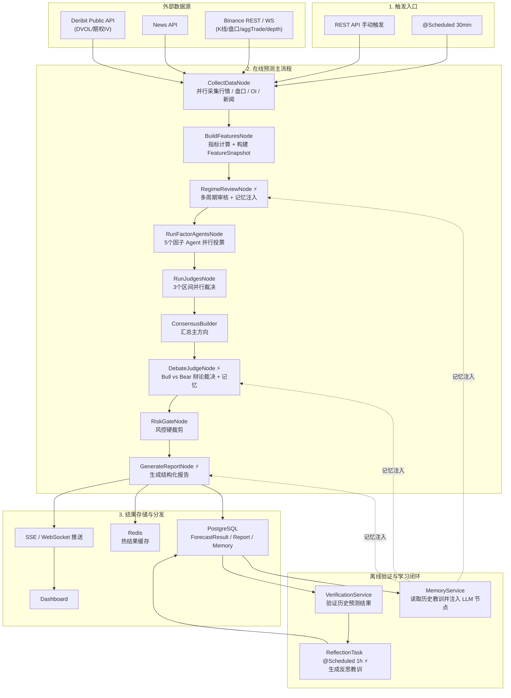
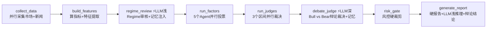
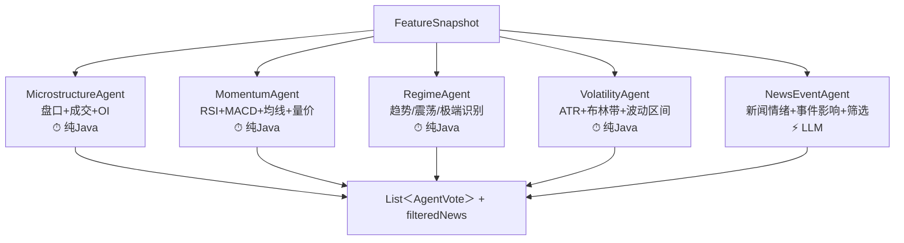
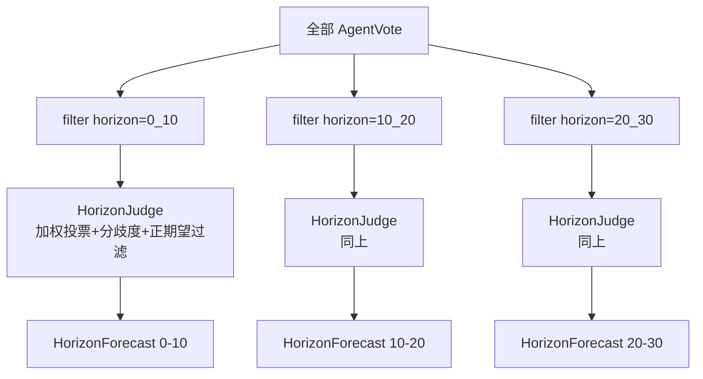
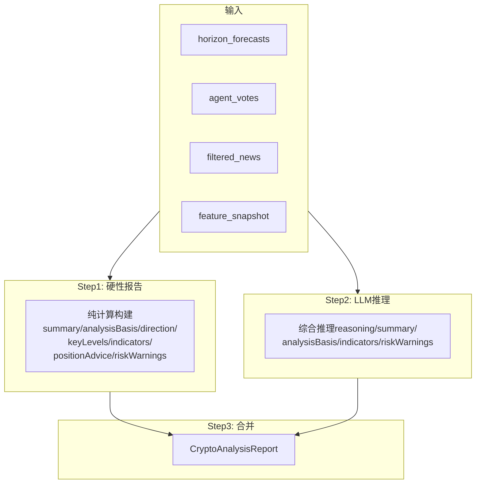
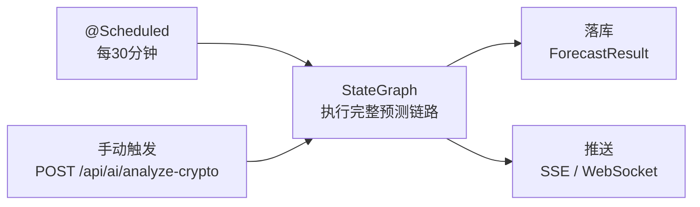

# Crypto 多 Agent 量化分析系统

## 1. 系统目标

面向 `BTCUSDT / ETHUSDT / PAXGUSDT` 等永续合约交易对，每 30 分钟自动生成三个时间区间的结构化交易信号：

- `0-10min` 超短线
- `10-20min` 短线
- `20-30min` 中短线

系统只输出策略信号与风险建议，不自动下单。

核心约束：

- 数值计算由 Java 程序完成，LLM 不负责指标计算
- LLM 承担新闻解读、Regime审核、辩论裁决和报告生成（主链路4处） + 离线反思（1处）
- 预测结果可验证、可统计、可校准
- 架构基于 `Spring Boot 3.4 + Spring AI Alibaba 1.1.2.0`
- 深模型用于辩论裁决和离线反思，浅模型用于Regime审核、新闻分析和报告生成

## 2. 设计原则

### 2.1 程序负责算，Agent 负责判断

以下内容必须由 Java 程序计算，不交给 LLM：

- K 线聚合与技术指标（MA/EMA/RSI/MACD/KDJ/ADX/ATR/布林带/OBV）
- 盘口失衡与主动买卖量
- OI / Funding / Long-Short Ratio 特征
- 爆仓压力（多空爆仓比）
- 大户持仓趋势
- 主动买卖量比趋势
- 恐惧贪婪指数
- 现货-合约联动（基差、现货领先/滞后代理、现货盘口）
- aggTrade 实时订单流（tradeDelta / tradeIntensity / largeTradeBias）
- 期权隐含波动率（DVOL / ATM IV / 25d skew / term structure）
- 波动率与区间估计
- 止损止盈参数
- 因子投票评分
- 区间裁决与加权汇总
- 风控裁剪

LLM 负责（主链路4处 + 离线1处）：

- Regime多周期审核与转换预警（`RegimeReviewNode`，浅模型 + 记忆注入）
- 新闻情绪与事件影响判断（`NewsEventAgent`，浅模型）
- Bull vs Bear辩论裁决（`DebateJudgeNode`，深模型 + 记忆注入）
- 最终用户可读报告生成（`GenerateReportNode`，浅模型 + 辩论结论 + 记忆注入）
- 离线反思学习（`ReflectionTask`，每小时批量验证+生成教训）

设计原则：**计算在前，LLM做判断层面增强**——不替代任何数学计算，只在"需要综合研判"的节点介入。所有LLM节点失败时fallback到纯计算结果，不阻塞流程。

**辩论机制（借鉴TradingAgents）**：DebateJudgeNode在单次LLM调用中要求模型依次扮演Bull辩手（做多论证）、Bear辩手（做空论证）和Judge裁判（综合裁决），通过对抗论证暴露线性投票无法发现的逻辑矛盾。

**记忆系统**：系统会自动验证历史预测的正确性，通过离线LLM反思提取教训（如"RANGE regime下偏多倾向明显"），并将教训注入后续预测的LLM prompt，使系统从历史错误中学习。

### 2.2 多 Agent 不是多次问同一个模型

真正的多 Agent 必须满足：

- 角色边界明确，输入输出独立
- 结果可追踪，可以分开统计表现
- 可以按历史表现动态调权

5 个因子 Agent 各自独立评估，输出统一结构的 `AgentVote`，由 `HorizonJudge` 加权汇总裁决——这是真正的多 Agent 协作，不是让多个 LLM 轮流润色同一段文字。

### 2.3 允许输出 NO_TRADE

每个预测区间都可以输出 `LONG / SHORT / NO_TRADE`。

当出现以下情况时优先 `NO_TRADE`：

- 信号分歧大（disagreement > 0.35 或动态阈值）
- 预期收益覆盖不了手续费和滑点
- 市场处于极高噪声状态
- 数据缺失（质量标志触发动态阈值上调）
- 最近校准显著恶化

## 3. 业务输出定义

每次运行输出 3 个区间的结构化预测，封装在 `CryptoAnalysisReport` 中：

```json
{
  "symbol": "BTCUSDT",
  "cycleId": "qf-20260401-120000-BTCUSDT",
  "summary": "BTC当前优先关注0-10min做多信号，但仍需等待确认。",
  "analysisBasis": "结构化裁决结果为PRIORITIZE_0_10_LONG，优先区间=0-10min做多，置信度=68%，分歧度=0.18，当前市场状态=TREND_UP。",
  "reasoning": "综合推理分析...",
  "direction": {
    "ultraShort": "做多",
    "shortTerm": "观望",
    "mid": "观望",
    "longTerm": "观望"
  },
  "keyLevels": {
    "support": ["84100", "83950", "83800"],
    "resistance": ["84500", "84650", "84800"]
  },
  "indicators": "市场状态=TREND_UP，代表当前价格更偏向顺势做多或回踩接多；5m[RSI=55.2（偏强）]；1h[RSI=62.1（偏强，买盘略占优）]",
  "importantNews": [
    {
      "title": "Bitcoin ETF sees continued inflows",
      "sentiment": "偏多",
      "summary": "偏多解读：代表情绪或资金面改善，短线更容易支撑价格。"
    }
  ],
  "positionAdvice": [
    {
      "period": "0-10min",
      "type": "LONG",
      "entry": "84200 - 84350",
      "stopLoss": "83900",
      "takeProfit": "84600 / 84850",
      "riskReward": "1:2.5"
    },
    { "period": "10-20min", "type": "NO_TRADE", "entry": "-", "stopLoss": "-", "takeProfit": "-", "riskReward": "-" },
    { "period": "20-30min", "type": "NO_TRADE", "entry": "-", "stopLoss": "-", "takeProfit": "-", "riskReward": "-" }
  ],
  "riskWarnings": [
    "市场处于波动收缩阶段，只有在突破或跌破被确认后才适合跟随。",
    "仓位和杠杆应随置信度同步收缩，避免把低 edge 信号硬做成重仓交易。"
  ],
  "confidence": 68
}
```

同时保存完整 `ForecastResult`（包含 `FeatureSnapshot`、`AgentVote[]`、`HorizonForecast[]`），用于事后验证。

## 4. 架构总览

### 4.1 分层架构



### 4.2 单次预测主链路

8节点线性串联，每30分钟执行一次：



离线：`ReflectionTask`（⚡LLM）每小时自动验证历史预测+生成反思教训→写入记忆表

### 4.3 因子 Agent 并行视图

5 个因子 Agent 封装在 `RunFactorAgentsNode` 内部，通过 Java 虚拟线程并行执行：



### 4.4 区间裁决并行视图

3 个 `HorizonJudge` 封装在 `RunHorizonJudgesNode` 内部并行执行，每个 Judge 只消费属于自己区间的投票：



### 4.5 GenerateReportNode 两阶段视图



## 5. 并行实现方案

### 5.1 技术约束

Spring AI Alibaba `StateGraph 1.1.2.0` 不支持原生并行分支：

- `addEdge()` 只能串行
- `addConditionalEdges()` 是互斥分支（选一条走），不是并行

### 5.2 解决方案：Node 内部虚拟线程并行

StateGraph 负责串行骨架（8 个 Node 线性串联），每个需要并行的阶段用一个聚合 Node 包起来，内部用 `Executors.newVirtualThreadPerTaskExecutor()` 并行执行子任务。

```
StateGraph 串行链路（8 个 Node）：
START → collect_data → build_features → regime_review → run_factors → run_judges → debate_judge → risk_gate → generate_report → END
             ↑                             ↑LLM浅+记忆        ↑              ↑          ↑LLM深+记忆                    ↑LLM浅+辩论+记忆
       内部并行采集                    Regime审核     内部5 Agent并行   内部3 Judge并行  辩论裁决                      报告生成
```

### 5.3 StateGraph 定义

```java
// LlmCallMode: BLOCKING直接返回, STREAMING流式收集(部分API需stream=true)
List<FactorAgent> agents = List.of(
    new MicrostructureAgent(), new MomentumAgent(),
    new RegimeAgent(), new VolatilityAgent(),
    new NewsEventAgent(shallowChatClient, shallowCallMode));

StateGraph workflow = new StateGraph(createKeyStrategyFactory())
    .addNode("collect_data",       node_async(new CollectDataNode(binanceRestClient, forceOrderService, depthStreamCache, deribitClient)))
    .addNode("build_features",     node_async(new BuildFeaturesNode(orderFlowAggregator)))
    .addNode("regime_review",      node_async(new RegimeReviewNode(shallowChatClient, shallowCallMode, memoryService)))
    .addNode("run_factors",        node_async(new RunFactorAgentsNode(agents)))
    .addNode("run_judges",         node_async(new RunHorizonJudgesNode(memoryService)))
    .addNode("debate_judge",       node_async(new DebateJudgeNode(deepChatClient, deepCallMode, memoryService)))
    .addNode("risk_gate",          node_async(new RiskGateNode()))
    .addNode("generate_report",    node_async(new GenerateReportNode(shallowChatClient, shallowCallMode, memoryService)));

workflow.addEdge(START, "collect_data");
workflow.addEdge("collect_data", "build_features");
workflow.addEdge("build_features", "regime_review");
workflow.addEdge("regime_review", "run_factors");
workflow.addEdge("run_factors", "run_judges");
workflow.addEdge("run_judges", "debate_judge");
workflow.addEdge("debate_judge", "risk_gate");
workflow.addEdge("risk_gate", "generate_report");
workflow.addEdge("generate_report", END);
```

### 5.4 State Key 完整列表

所有 key 均使用 `ReplaceStrategy`（后写覆盖前写）。

| Key | 类型 | 产出节点 | 说明 |
|-----|------|----------|------|
| `target_symbol` | `String` | 外部输入 | 交易对，如 `BTCUSDT` |
| `kline_map` | `Map<String,String>` | CollectDataNode | 6 周期合约 K 线 JSON |
| `spot_kline_map` | `Map<String,String>` | CollectDataNode | 现货 K 线 JSON（1m/5m） |
| `ticker_map` | `Map<String,String>` | CollectDataNode | 合约 24h Ticker JSON |
| `spot_ticker_map` | `Map<String,String>` | CollectDataNode | 现货 24h Ticker JSON |
| `funding_rate_map` | `Map<String,String>` | CollectDataNode | 资金费率 JSON |
| `funding_rate_hist_map` | `Map<String,String>` | CollectDataNode | 历史资金费率 JSON |
| `orderbook_map` | `Map<String,String>` | CollectDataNode | 合约深度盘口 JSON（WS优先，REST兜底） |
| `spot_orderbook_map` | `Map<String,String>` | CollectDataNode | 现货深度盘口 JSON |
| `open_interest_map` | `Map<String,String>` | CollectDataNode | 持仓量 JSON |
| `oi_hist_map` | `Map<String,String>` | CollectDataNode | 持仓量历史 JSON |
| `long_short_ratio_map` | `Map<String,String>` | CollectDataNode | 多空比 JSON |
| `force_orders_map` | `Map<String,String>` | CollectDataNode | 强平订单 JSON |
| `top_trader_position_map` | `Map<String,String>` | CollectDataNode | 大户持仓 JSON |
| `taker_long_short_map` | `Map<String,String>` | CollectDataNode | 主动买卖比 JSON |
| `fear_greed_data` | `String` | CollectDataNode | 恐惧贪婪指数 JSON |
| `news_data` | `String` | CollectDataNode | 新闻数据 JSON |
| `data_available` | `Boolean` | CollectDataNode | 数据是否可用 |
| `dvol_data` | `String` | CollectDataNode | Deribit DVOL 波动率指数 JSON |
| `option_book_summary` | `String` | CollectDataNode | Deribit 期权 book summary JSON |
| `feature_snapshot` | `FeatureSnapshot` | BuildFeaturesNode | 特征快照 |
| `indicator_map` | `Map` | BuildFeaturesNode | 多周期技术指标 |
| `price_change_map` | `Map` | BuildFeaturesNode | 价格变化率 |
| `regime_confidence` | `Double` | RegimeReviewNode | regime 置信度 |
| `regime_transition` | `String` | RegimeReviewNode | 转换预警 |
| `regime_transition_detail` | `String` | RegimeReviewNode | 转换详情 |
| `agent_votes` | `List<AgentVote>` | RunFactorAgentsNode | 全部因子投票 |
| `filtered_news` | `List<FilteredNewsItem>` | RunFactorAgentsNode | LLM 筛选后新闻 |
| `horizon_forecasts` | `List<HorizonForecast>` | RunHorizonJudgesNode | 3 区间裁决 |
| `overall_decision` | `String` | RunHorizonJudgesNode | 综合决策 |
| `risk_status` | `String` | RunHorizonJudgesNode | 风险状态 |
| `cycle_id` | `String` | RunHorizonJudgesNode | 本轮预测 ID |
| `debate_summary` | `String` | DebateJudgeNode | 辩论摘要 |
| `debate_probs` | `Map<String, Integer[]>` | DebateJudgeNode | 辩论概率 `[bull%, range%, bear%]` |
| `report` | `CryptoAnalysisReport` | GenerateReportNode | 最终报告 |
| `hard_report` | `CryptoAnalysisReport` | GenerateReportNode | 纯计算硬性报告 |
| `forecast_result` | `ForecastResult` | GenerateReportNode | 落库用结构化结果 |

### 5.5 Node 内部并行模式

以 `RunFactorAgentsNode` 为例：

```java
public class RunFactorAgentsNode implements NodeAction {
    @Override
    public Map<String, Object> apply(OverAllState state) {
        FeatureSnapshot features = extractFeatures(state);

        try (var executor = Executors.newVirtualThreadPerTaskExecutor()) {
            var f1 = executor.submit(() -> microstructureAgent.evaluate(features));
            var f2 = executor.submit(() -> momentumAgent.evaluate(features));
            var f3 = executor.submit(() -> regimeAgent.evaluate(features));
            var f4 = executor.submit(() -> volatilityAgent.evaluate(features));
            var f5 = executor.submit(() -> newsEventAgent.evaluate(features));

            List<AgentVote> allVotes = new ArrayList<>();
            allVotes.addAll(f1.get(30, SECONDS));  // 纯Java，快
            allVotes.addAll(f2.get(30, SECONDS));
            allVotes.addAll(f3.get(30, SECONDS));
            allVotes.addAll(f4.get(30, SECONDS));
            allVotes.addAll(f5.get(60, SECONDS));  // LLM，慢

            // 提取LLM筛选后的新闻
            List<FilteredNewsItem> filteredNews = newsAgent.getLastFilteredNews();

            return Map.of("agent_votes", allVotes, "filtered_news", filteredNews);
        }
    }
}
```

## 6. 节点职责详解

### 6.1 节点总览

| 节点 | LLM | 模型 | 输入 | 输出 | 耗时预估 |
|------|-----|------|------|------|----------|
| `CollectDataNode` | 否 | - | symbol | 原始市场数据JSON + 新闻JSON | 2-5s |
| `BuildFeaturesNode` | 否 | - | 原始数据 | `FeatureSnapshot` | <100ms |
| `RegimeReviewNode` | 是 | 浅 | `FeatureSnapshot` + 多周期指标 + 历史记忆 | 审核后的regime + 置信度 + 转换预警 | 2-4s |
| `RunFactorAgentsNode` | 1/5 | 浅 | `FeatureSnapshot` | `List<AgentVote>` + `filteredNews` | 3-8s |
| `RunHorizonJudgesNode` | 否 | - | `List<AgentVote>` + 权重 | 3 个 `HorizonForecast` + decision + riskStatus | <50ms |
| `DebateJudgeNode` | 是 | **深** | `HorizonForecast[]` + `AgentVote[]` + `FeatureSnapshot` + 历史记忆 | 辩论裁决后的forecast + debate_summary | 3-6s |
| `RiskGateNode` | 否 | - | `HorizonForecast[]` + regime | 裁剪后的 forecast + 合并后的 riskStatus | <10ms |
| `GenerateReportNode` | 是 | 浅 | 结构化数据 + 辩论结论 + 命中率摘要 | `CryptoAnalysisReport` + `ForecastResult` | 3-6s |
| `ReflectionTask`（离线） | 是 | 默认模型 | 历史验证结果批量 | 反思记忆写入DB + agentAccuracy | 每1h执行 |

**单次完整链路总耗时：12-30s**（减少1次LLM调用，瓶颈在 Binance API 和 4次LLM 调用）。

### 6.2 CollectDataNode

并行采集全部数据（虚拟线程）：

```
并行任务：
├─ 合约 K线 6 个周期（1m/5m/15m/1h/4h/1d）各自独立请求
├─ 现货 K线 2 个周期（1m/5m）
├─ 合约 24h ticker
├─ 现货 24h ticker
├─ funding rate（当前）
├─ funding rate history（48条）
├─ 合约 orderbook depth 20（WS缓存优先，REST兜底）
├─ 现货 orderbook depth 20
├─ open interest（当前）
├─ open interest history（5m周期，48条）
├─ long-short ratio
├─ force orders（近30条强平单）
├─ top trader position ratio（5m周期，24条）
├─ taker long-short ratio（5m周期，24条）
├─ Fear & Greed Index（最近2条，alternative.me API）
├─ News（通过BinanceRestClient.getCryptoNews）
├─ Deribit DVOL 波动率指数（最近6h，resolution=3600）
└─ Deribit 期权 book summary（全量BTC期权合约 mark_iv）
```

全部通过虚拟线程并行，整体超时 10s。

### 6.3 BuildFeaturesNode

复用 `CryptoIndicatorCalculator.calcAll()` 计算技术指标，额外计算：

| 新增特征 | 计算方式 | 用途 |
|---------|---------|------|
| `bidAskImbalance` | (bidVol - askVol) / (bidVol + askVol)，盘口前5档 | 盘口偏向 |
| `tradeDelta` | aggTrade实时优先（OrderFlowAggregator 3min窗口），fallback K线近似 | 资金流向 |
| `tradeIntensity` | aggTrade 60s内笔数/秒，除以10归一化，clamp [0,3] | 成交活跃度 |
| `largeTradeBias` | aggTrade 大单(>均值3倍)买卖方向偏差 [-1,1] | 大单方向 |
| `spotBidAskImbalance` | 现货盘口前5档失衡 [-1,1] | 现货盘口 |
| `spotPriceChange5m` | 现货近5根1m收益率 | 现货动量 |
| `spotPerpBasisBps` | (合约价-现货价)/现货价 × 10000 | 期现基差 |
| `spotLeadLagScore` | 现货vs合约近3根1m收益差/scalePct，clamp [-1,1] | 现货领先/滞后 |
| `oiChangeRate` | (当前OI - 前次OI) / 前次OI | 新增仓方向 |
| `fundingDeviation` | 当前费率 vs 标准费率0.0001偏离度 | 情绪过热/过冷 |
| `fundingRateTrend` | 近期均值 vs 远期均值的变化方向 | 资金费率趋势 |
| `fundingRateExtreme` | 最新值偏离历史均值的程度 | 资金费率极端度 |
| `lsrExtreme` | 多空比是否处于历史极值（>2.0或<0.5） | 反向信号 |
| `liquidationPressure` | (多头爆仓额-空头爆仓额)/总额，归一化[-1,1] | 爆仓压力方向 |
| `liquidationVolumeUsdt` | 近期爆仓总额(USDT) | 爆仓规模 |
| `topTraderBias` | 大户持仓比前半段vs后半段均值变化，归一化[-1,1] | 聪明钱方向 |
| `takerBuySellPressure` | 主动买卖量比前半段vs后半段均值变化，归一化[-1,1] | 即时资金流 |
| `fearGreedIndex` | 恐惧贪婪指数 0-100（alternative.me API） | 市场情绪 |
| `fearGreedLabel` | EXTREME_FEAR / FEAR / NEUTRAL / GREED / EXTREME_GREED | 情绪分类 |
| `dvolIndex` | Deribit DVOL 最新 close（类VIX），0=无数据 | 隐含波动率水平 |
| `atmIv` | 最近到期日 ATM call 的 mark_iv | 近月隐含波动率 |
| `ivSkew25d` | OTM 5-8% call IV - OTM 5-8% put IV（正=call贵=看涨偏好） | 方向性押注 |
| `ivTermSlope` | 次近到期ATM IV - 最近到期ATM IV（正=contango） | 期限结构 |
| `bollSqueeze` | 布林带宽度 < 1.5 判定为收缩 | 即将变盘 |
| `regimeLabel` | ADX + 布林带宽 + ATR突增综合判定 | TREND/RANGE/SQUEEZE/SHOCK |

输出统一的 `FeatureSnapshot` 对象。

### 6.4 RegimeReviewNode（LLM）

在 `BuildFeaturesNode` 之后、因子Agent之前审核规则检测的市场状态。

**为什么需要LLM审核Regime：**
- 规则检测只看15m/5m的ADX/DI，但1h/4h可能讲不同的故事
- ADX在20-25之间是灰色地带，规则无法表达"弱趋势"
- 无法识别regime转换信号（趋势即将衰竭、挤压即将突破）

**输入：** 多周期指标快照(RSI/ADX/DI/MACD/Boll各周期) + 涨跌幅 + 微结构 + 规则regime

**输出：**
- `confirmedRegime`：确认或修正后的regime（5种之一）
- `confidence`：regime判断的灰度置信度 [0, 1]
- `transitionSignal`：转换预警（NONE/WEAKENING/STRENGTHENING/BREAKING_OUT/BREAKING_DOWN）

**安全约束：**
- SHOCK只能由规则触发（ATR突增是客观事实），LLM不能凭空升级
- 修正regime时重建FeatureSnapshot（record不可变），下游Agent自动消费新regime
- LLM失败时保留原始regime，不阻塞流程

### 6.5 因子 Agent 详解

#### MicrostructureAgent（纯 Java）

主要服务 `0-10min`，对更长区间信号衰减。

| 信号 | 权重(0-10) | 权重(10-20) | 权重(20-30) | 逻辑 |
|------|-----------|-------------|-------------|------|
| 盘口失衡(合约) | 0.17 | 0.05 | 0.03 | bidAskImbalance > 0 偏多 |
| 主动买卖delta | 0.11 | 0.03 | 0.02 | tradeDelta > 0 主动买强，高intensity加权 |
| 大单偏差 | 0.03 | 0.02 | 0.02 | largeTradeBias方向 |
| OI-价格共振 | 0.10 | 0.13 | 0.15 | OI增+价涨=新多入场 |
| 爆仓压力 | 0.10 | 0.12 | 0.16 | 多头爆仓多取反为利空 |
| 大户持仓 | 0.07 | 0.12 | 0.12 | 大户加多=利多 |
| 主动买卖量比 | 0.11 | 0.13 | 0.14 | 主动买入增强=利多 |
| 现货盘口 | 0.08 | 0.06 | 0.04 | 现货bidAskImbalance |
| 现货确认 | 0.06 | 0.07 | 0.05 | 现货vs合约价格方向一致性 |
| 现货领先 | 0.04 | 0.05 | 0.03 | spotLeadLagScore |
| 资金费率 | 0.03 | 0.08 | 0.10 | 高费率=多头拥挤→空头信号 |
| 多空比 | 0.05 | 0.04 | 0.07 | 极端多头→空头信号 |
| 基差 | 0.05 | 0.10 | 0.07 | 正溢价过高→空头信号 |

0-10min 盘口+taker+现货主导（即时信号），10-20min OI+大户+资金费率升权（中期信号），20-30min 衍生品情绪+OI主导。

```java
// 0-10min: 盘口+taker+现货主导，衍生品情绪权重低
double raw0 = 0.17 * bidAskScore + 0.11 * deltaScore + 0.03 * largeBiasScore + 0.10 * oiScore
             + 0.10 * liqScore + 0.07 * topTraderScore + 0.11 * takerScore
             + 0.08 * spotBookScore + 0.06 * spotConfirmScore + 0.04 * leadLagScore
             + 0.03 * fundingScore + 0.05 * lsrScore + 0.05 * basisScore;
// 10-20min: OI+大户+资金费率升权
double raw1 = 0.05 * bidAskScore + 0.03 * deltaScore + 0.02 * largeBiasScore + 0.13 * oiScore
             + 0.12 * liqScore + 0.12 * topTraderScore + 0.13 * takerScore
             + 0.06 * spotBookScore + 0.07 * spotConfirmScore + 0.05 * leadLagScore
             + 0.08 * fundingScore + 0.04 * lsrScore + 0.10 * basisScore;
// 20-30min: 衍生品情绪+OI/大户主导，盘口信号衰减
double raw2 = 0.03 * bidAskScore + 0.02 * deltaScore + 0.02 * largeBiasScore + 0.15 * oiScore
             + 0.16 * liqScore + 0.12 * topTraderScore + 0.14 * takerScore
             + 0.04 * spotBookScore + 0.05 * spotConfirmScore + 0.03 * leadLagScore
             + 0.10 * fundingScore + 0.07 * lsrScore + 0.07 * basisScore;
// score ∈ [-1, 1]，正=偏多，负=偏空
```

#### MomentumAgent（纯 Java）

全区间有效，是最核心的因子。不同区间使用不同时间周期：

| 区间 | 主周期 | 副周期 |
|------|-------|-------|
| 0-10min | 1m | 5m |
| 10-20min | 5m | 15m |
| 20-30min | 15m | 1h |

| 信号 | 逻辑 |
|------|------|
| 均线排列 | ma7>ma25>ma99 多头=+1，空头=-1，纠缠=0 |
| RSI 位置 | >70 超买偏空，<30 超卖偏多，40-60 中性 |
| MACD 交叉 | 金叉=+0.3，死叉=-0.3，HIST连续放大加分 |
| KDJ 交叉 | K>D 偏多，K<D 偏空，J>80 超买，J<20 超卖 |
| 量价验证 | 涨时放量=健康涨势加分，涨时缩量=虚涨减分 |
| 多周期一致性 | 1m/5m/15m/1h 方向一致=强信号，分歧=减分 |

#### RegimeAgent（纯 Java）

识别当前市场状态，影响其他 Agent 的可信度。结合期权 IV 信号增强判断。

| Regime | 判定条件 | 影响 |
|--------|---------|------|
| `TREND_UP` | ADX>25 且 +DI>-DI | 顺势 Agent 加权 |
| `TREND_DOWN` | ADX>25 且 -DI>+DI | 顺势 Agent 加权 |
| `RANGE` | ADX<20 | 微结构/动量权重降低 |
| `SQUEEZE` | 布林带宽<1.5 + ADX<15 | 全部降权，等突破 |
| `SHOCK` | 近期ATR > 2倍历史ATR | 禁开仓或极低杠杆 |

**期权 IV 增强（Deribit 数据可用时）：**

| IV 信号 | 条件 | 影响 |
|---------|------|------|
| skew 方向性押注 | \|ivSkew25d\| > 2.0 | 按 skew/10 加偏移（短线0.3权重，中线0.6权重），标记 IV_SKEW_CALL_RICH/PUT_RICH |
| 聪明钱布局 | IV > 60 且 SQUEEZE | conf 提升15-20%，标记 HIGH_IV_SQUEEZE |
| 隐含波动率预警 | IV > 80 且非 SHOCK | risk flag ELEVATED_IMPLIED_VOL |

#### VolatilityAgent（纯 Java）

不输出方向（score=0, direction=NO_TRADE），核心职责是输出各区间的波动率估计和风险标志。

| 输出 | 计算方式 |
|------|---------|
| `volatilityBps` | ATR14 × √periods 换算为基点。0-10: 1m ATR × √10，10-20: 5m ATR × √4，20-30: 5m ATR × √6 |
| `expectedMoveBps` | volatilityBps × moveRatio（0.45/0.60/0.75） |
| `reasonCodes` | BOLL_SQUEEZE_5M, BOLL_EXPANSION_5M, ATR_ACCELERATING, ATR_DECELERATING 等 |
| `riskFlags` | PRICE_AT_UPPER_BAND, PRICE_AT_LOWER_BAND, VOLATILITY_COMPRESSED, VOLATILITY_EXPANDED, BOLL_SQUEEZE_15M |

波动率分析维度：布林带 %B 极值检测（>90或<10）、带宽压缩/扩张判定、多周期 ATR 加速/减速趋势。

#### NewsEventAgent（LLM）

唯一的 LLM 因子 Agent，主要影响 `10-30min` 区间。

**两步流程：**
1. **筛选**：从新闻列表中挑出真正影响短期价格的消息（最多5条）
2. **分析**：综合判断整体情绪和对三个时间区间的影响

**输出：**
- `List<AgentVote>`（三个区间各一个）
- `List<FilteredNewsItem>`（筛选后的新闻列表，传递给 `GenerateReportNode`）

```java
// FilteredNewsItem 结构
public record FilteredNewsItem(
    String title,
    String sentiment,   // bullish/bearish/neutral
    String impact,     // high/medium/low
    String reason      // 影响逻辑说明
) {}
```

### 6.6 HorizonJudge 裁决逻辑

每个区间独立裁决，输入该区间全部 `AgentVote`：

```
// 方向聚合：weight × |score|（不乘confidence，避免三重衰减）
longScore  = Σ(weight_i × |vote_i.score|)    // score > 0 的部分
shortScore = Σ(weight_i × |vote_i.score|)    // score < 0 的部分
edge       = |longScore - shortScore|
disagreement = 1 - edge / (longScore + shortScore + ε)

// confidence独立聚合（作为参考，不参与方向裁决）
avgAgentConf = Σ(directionalWeighted_i × confidence_i) / Σ(directionalWeighted_i)

// 波动聚合：所有agent（含score==0的volatility agent）都参与
volatilityBps = 加权聚合全部agent的volatilityBps

// 最终confidence = 方向占比 × agent信心 × disagreement衰减
rawConf = dominantRatio × avgAgentConf × (1 - disagreement × 0.4)
```

**弱信号处理（不直接拦截，只衰减confidence）**：
- `edge < minEdge` → confidence × 0.6
- `dominantMoveBps < minMoveBps` → confidence × 0.7
- `disagreement > 0.35` → confidence × 0.5
- confidence最终clamp到 [0.15, 1.0]

**NO_TRADE 判断**：仅在全部agent无有效投票（longScore和shortScore均 < ε）时判NO_TRADE。

**动态阈值**：
- `minEdge`：根据 horizon 和数据质量标志动态调整（0.05-0.12）
- `minMoveBps`：根据 horizon 调整（4-6）

**数据质量影响阈值**：

| 质量标志 | 影响 |
|---------|------|
| `PARTIAL_KLINE_DATA` | `minEdge` 降低到 60%-90% |
| `MISSING_TF_5M` | 0-10min 的 minEdge 进一步降低 |
| `MISSING_TF_15M` | 10-20/20-30min 的 minEdge 进一步降低 |

**权重动态修正（准确率反馈）**：当 `MemoryService` 有 agent 准确率数据时，基础权重会乘以修正因子：`multiplier = clamp(0.2 + accuracy × 1.6, 0.5, 1.4)`。accuracy=0.5→1.0×，accuracy=0.8→1.24×，accuracy=0.3→0.68×。

### 6.7 DebateJudgeNode（LLM深模型）

替代原有的 `MetaJudgeNode` + `ConsistencyCheckNode`，在单次LLM调用中完成Bull vs Bear辩论裁决。

**设计动机（借鉴 TradingAgents）：**
- 原MetaJudge和ConsistencyCheck功能重叠（都在审核"裁决是否合理"），串联导致置信度被过度压缩
- 线性投票+加权汇总无法暴露Agent之间的逻辑矛盾
- TradingAgents通过Bull vs Bear对抗论证产生更鲁棒的结论

**辩论流程（单次LLM调用，三角色合并prompt）：**

1. **Bull辩手**：站做多立场，从投票数据+微结构信号中找支持做多的证据，反驳看空理由
2. **Bear辩手**：站做空立场，从投票数据+微结构信号中找支持做空的证据，反驳看多理由
3. **Judge裁判**：综合辩论+历史记忆教训，审核系统裁决的9个维度：
   - 方向矛盾：裁决方向是否与多数Agent投票一致
   - 跨区间逻辑：0-10看多但10-20看空是否合理
   - Regime适应：SQUEEZE/SHOCK下仓位和杠杆是否足够保守
   - 微结构背离：做多但盘口卖压？做空但盘口买压？
   - 转换风险：regime转换信号下是否需要更保守
   - 历史教训：记忆中的偏差提示是否适用于当前场景
   - 情绪极端：fearGreed≤20(极度恐惧)时做空要警惕反弹，≥80(极度贪婪)时做多要警惕回调
   - 爆仓信号：大量多头爆仓(liquidationPressure>0.5)可能是下跌末端，大量空头爆仓(<-0.5)可能是上涨末端
   - 聪明钱方向：topTraderBias与系统方向背离时需降低confidence
   - 期权IV信号：DVOL/ATM IV抬升但价格平静→方向选择临近；skew极端→方向性押注集中

**关键原则**（来自TradingAgents Research Manager）：
> 不要因为双方都有道理就默认NO_TRADE，要做出明确判断。

**输入：** 15票AgentVote + 3个HorizonForecast + FeatureSnapshot + overallDecision + riskStatus + regimeTransition + 历史记忆

**输出：**
- `bullArgument`：Bull辩手论据摘要
- `bearArgument`：Bear辩手论据摘要
- `judgeReasoning`：裁判推理过程
- 每个区间的 `approved` / `newDirection` / `newConfidence`
- `debate_summary`：辩论记录JSON（传递给GenerateReportNode + 落库）

**安全约束：**
- confidence只能下调不能上调（保守原则）
- 方向翻转时额外cap到原始置信度的50%以下
- NO_TRADE翻转为有方向时：允许LLM设置confidence（cap 0.5），仓位用HorizonJudge基准值的一半
- LLM失败时透传原始裁决
- 不修改entry/tp/sl价位

### 6.8 RiskGateNode

纯程序化硬规则裁剪，同时合并上游 `risk_status`：

```java
// 合并逻辑：保留所有非NORMAL/UNKNOWN的标志
String mergeRiskStatus(String upstream, String current) {
    // 例如：upstream="NORMAL,HIGH_DISAGREEMENT", current="PARTIAL_DATA"
    // 合并结果："HIGH_DISAGREEMENT,PARTIAL_DATA"
}
```

裁剪规则：

| 条件 | 动作 |
|------|------|
| `direction = NO_TRADE` | 跳过裁剪（保持NO_TRADE） |
| `disagreement > 0.35` | 仓位×0.5 + 杠杆cap 3x + confidence×0.7（**不直接降级NO_TRADE**） |
| `regime = SHOCK` | 杠杆 cap 到 2x，仓位×0.5 |
| `regime = SQUEEZE` | 仓位×0.7 |
| `fearGreed ≥ 80 且 LONG` | confidence×0.8（极度贪婪追多惩罚） |
| `fearGreed ≤ 20 且 SHORT` | confidence×0.8（极度恐惧追空惩罚） |
| 数据质量降级 | dataPenalty 0.80-0.95（影响仓位） |
| `DVOL > 50` | ivPenalty：50-80线性衰减到0.7，>80为0.5（极端恐慌） |

**波动率惩罚**：根据 5m ATR 占价格的百分比计算。atrPct < 0.3% → 1.0（正常），0.3%-1.0% → 线性衰减到 0.5，> 1.0% → 0.3（极端波动）。

仓位建议公式：

```
positionPct = basePositionPct
            × confidence × confMultiplier
            × max(0.60, 1.0 - disagreement)   // agreementFactor
            × volatilityPenalty
            × dataPenalty
            × ivPenalty
// clamp到 [0.01, maxPos]
```

| 区间 | 最大仓位 | 默认杠杆上限 |
|------|---------|-------------|
| 0-10min | 8% | 5x |
| 10-20min | 10% | 5x |
| 20-30min | 12% | 5x |
| SHOCK 状态 | 原值 ×0.5 | 2x |

### 6.9 记忆与反思系统

#### 预测验证（VerificationService）

预测落库35分钟后（确保最长区间30min+5min容差均已结束），自动从 Binance 拉取区间内全部1m K线，做路径分析：

**分段验证策略：** 每个区间按实际时段独立验证：
- `0_10`：用预测时价格作为入场价，完整 TP/SL 路径评级
- `10_20`：用T+10min实际价格作为入场价，仅方向+BPS评级（TP/SL基于T+0生成，对后段无效）
- `20_30`：用T+20min实际价格作为入场价，仅方向+BPS评级
- `NO_TRADE`：同样验证，|实际变化| < 10bps 为正确

**路径分析：** 遍历 K 线序列，逐根计算最大有利偏移（maxFavorableBps）、最大不利偏移（maxAdverseBps）、TP1/SL 谁先触达（tp1HitFirst，仅0_10区间）。

**reversalSeverity（段内反转严重度）：** `maxAdverseBps / (maxAdverseBps + maxFavorableBps)`，范围 [0,1]。>0.40 时标记"段内反转风险显著"。NO_TRADE 为 null。

**质量评级：**

| 评级 | 条件 |
|------|------|
| `GOOD` | TP1先于SL触达，或方向正确且最大有利偏移 > 5bps |
| `LUCKY` | 终点方向对但路径中SL先触达（结果正确但过程惊险） |
| `BAD` | 方向错误或SL先触达且终点也错 |
| `FLAT`（NO_TRADE用） | \|实际变化\| < 10bps 为GOOD，否则BAD |

**判定阈值：**

| 预测方向 | 正确条件 |
|---------|---------|
| LONG | 实际价格上涨 > 2bps |
| SHORT | 实际价格下跌 > 2bps |
| NO_TRADE | \|实际变化\| < 10bps |

验证结果写入 `quant_forecast_verification` 表，含 `result_summary` 中文摘要（如"预测看涨，实际上涨0.12%，方向正确，止盈先触达，评级优"）。

#### 离线反思（ReflectionTask）

每小时整点后5分执行（`@Scheduled(cron = "0 5 * * * *")`）：
1. 批量验证最近未验证的预测周期（最多24个，约12小时的量）
2. 收集最近36条验证结果
3. 构建反思prompt给LLM分析系统性偏差（如"RANGE下总是偏多"）
4. LLM输出结构化JSON：`overallAccuracy` + `biases` + `agentAccuracy`（按agent×horizon维度） + `lessons`
5. 教训+agentAccuracy写入 `quant_reflection_memory` 表（存入`reflectionText`中带`[AGENT_ACCURACY]`标记）
6. 清理30天前的旧记忆
7. `agentAccuracy` 会被 `MemoryService` 解析，反馈给 `HorizonJudge` 调整 agent 权重

**存储策略：** 每次 INSERT 新记录（非覆盖），30天累计约720条。读取时只用最新1-5条：`getAgentAccuracy()` 取最近1条含 `[AGENT_ACCURACY]` 的记录，`buildMemoryContext()` 取最近2-3条。agentAccuracy 由 LLM 估算（非精确计算），对权重的实际调整幅度约 ±10-15%。

#### 记忆注入（MemoryService）

三个LLM节点（RegimeReview、DebateJudge、GenerateReport）在构建prompt时注入历史记忆：

```
【历史记忆】
最近3次 TREND_UP 下的预测:
- 2h前: LONG conf=0.68 → 实际+12bps ✓
- 5h前: SHORT conf=0.55 → 实际+50bps ✗
反思教训: TREND_UP下过早翻空倾向明显，保持趋势方向除非强转换信号
最近命中率: 62% (8/13)
```

记忆查询方式：SQL按symbol+regime精确查询，无需向量数据库。

### 6.10 GenerateReportNode（LLM）

**两阶段生成**：

**Step1 - 硬性报告（零LLM）**：
- `summary`：一句话总结（根据最优forecast生成）
- `analysisBasis`：核心预测依据
- `direction`：各周期方向（做多/做空/观望）
- `keyLevels`：支撑阻力位（基于ATR计算）
- `indicators`：技术指标摘要
- `importantNews`：LLM筛选后的新闻 + 关键词fallback
- `positionAdvice`：入场/止损/止盈建议
- `riskWarnings`：风险提示列表
- `confidence`：最高非NO_TRADE置信度

**Step2 - LLM综合推理**：
输入：硬性报告 + agent投票详情 + 技术指标快照 + 多周期涨跌幅 + filteredNews

Prompt要求返回：
```json
{
  "reasoning": "综合推理分析",
  "summary": "一句话总结（用📈📉↔️标注方向）",
  "analysisBasis": "预测依据（2-3句话）",
  "indicators": "通俗语言解读关键指标",
  "riskWarnings": ["风险1", "风险2"]
}
```

**Step3 - 合并**：
- 结构化字段（direction、keyLevels、positionAdvice等）：来自硬性报告
- 文本字段（reasoning、summary、analysisBasis等）：优先LLM输出，fallback硬性报告

## 7. 核心数据模型

### 7.1 FeatureSnapshot

```java
public record FeatureSnapshot(
    String symbol,
    LocalDateTime snapshotTime,
    BigDecimal lastPrice,
    BigDecimal spotLastPrice,

    // 技术指标（多周期）
    Map<String, Map<String, Object>> indicatorsByTimeframe,
    // 价格变化（多周期）
    Map<String, BigDecimal> priceChanges,

    // 现货-合约联动
    double spotBidAskImbalance,      // 现货盘口失衡 [-1, 1]
    BigDecimal spotPriceChange5m,    // 现货近5根1m收益率
    double spotPerpBasisBps,         // 期现基差(基点)
    double spotLeadLagScore,         // 现货领先/滞后代理 [-1, 1]

    // 微结构特征
    double bidAskImbalance,       // 盘口失衡 [-1, 1]
    double tradeDelta,            // 主动买卖差 [-1, 1]（aggTrade优先，fallback K线）
    double tradeIntensity,        // 成交强度 [0, 3]（aggTrade WS，否则0）
    double largeTradeBias,        // 大单偏差 [-1, 1]（aggTrade WS，否则0）
    double oiChangeRate,          // OI变化率
    double fundingDeviation,      // 资金费率偏离
    double fundingRateTrend,      // 资金费率趋势 [-1, 1]
    double fundingRateExtreme,    // 资金费率极端度 [-1, 1]
    double lsrExtreme,            // 多空比极值度

    // 爆仓与大户信号
    double liquidationPressure,   // 爆仓压力 [-1,1]，正=多头爆仓多(利空)
    double liquidationVolumeUsdt, // 近期爆仓总额(USDT)
    double topTraderBias,         // 大户持仓趋势 [-1,1]，正=大户加多
    double takerBuySellPressure,  // 主动买卖量比趋势 [-1,1]，正=主动买入增强
    int fearGreedIndex,           // 恐惧贪婪指数 0-100
    String fearGreedLabel,        // EXTREME_FEAR/FEAR/NEUTRAL/GREED/EXTREME_GREED

    // 波动率特征
    BigDecimal atr1m,
    BigDecimal atr5m,
    BigDecimal bollBandwidth,
    boolean bollSqueeze,

    // 期权隐含波动率（Deribit，0=无数据）
    double dvolIndex,             // DVOL波动率指数（类VIX）
    double atmIv,                 // 近月ATM隐含波动率
    double ivSkew25d,             // 25d skew（正=call贵=看涨偏好）
    double ivTermSlope,           // 期限结构斜率（正=contango）

    // Regime
    MarketRegime regime,          // TREND_UP/TREND_DOWN/RANGE/SQUEEZE/SHOCK

    // 新闻（给 NewsEventAgent 用）
    List<NewsItem> newsItems,

    // 数据质量标志
    List<String> qualityFlags,

    // Regime审核结果（RegimeReviewNode产出，写入更新后的snapshot）
    double regimeConfidence,      // regime判断置信度 [0, 1]
    String regimeTransition       // 转换预警: NONE/WEAKENING/STRENGTHENING/BREAKING_OUT/BREAKING_DOWN
) {
    // 工厂方法：仅替换regime审核相关字段，避免38字段手动重建
    public FeatureSnapshot withRegimeReview(MarketRegime newRegime, List<String> newFlags,
                                            double confidence, String transition) { ... }
    // IV摘要（供LLM prompt使用）
    public String toIvSummary() { ... }
}
```

### 7.2 AgentVote

```java
public record AgentVote(
    String agent,            // "microstructure" / "momentum" / "regime" / "volatility" / "news_event"
    String horizon,         // "0_10" / "10_20" / "20_30"
    Direction direction,    // LONG / SHORT / NO_TRADE
    double score,            // 方向强度 [-1, 1]
    double confidence,       // 置信度 [0, 1]
    int expectedMoveBps,     // 预期波动(基点)
    int volatilityBps,       // 风险估计(基点)
    List<String> reasonCodes,
    List<String> riskFlags
) {}
```

### 7.3 HorizonForecast

```java
public record HorizonForecast(
    String horizon,
    Direction direction,
    double confidence,
    double weightedScore,
    double disagreement,
    BigDecimal entryLow,
    BigDecimal entryHigh,
    BigDecimal invalidationPrice,
    BigDecimal tp1,
    BigDecimal tp2,
    int maxLeverage,
    double maxPositionPct
) {}
```

### 7.4 ForecastResult

```java
public record ForecastResult(
    String symbol,
    String cycleId,
    LocalDateTime forecastTime,
    List<HorizonForecast> horizons,
    String overallDecision,
    String riskStatus,
    List<AgentVote> allVotes,
    FeatureSnapshot snapshot,    // 快照，用于事后验证
    Object report               // 实际类型 CryptoAnalysisReport，声明为 Object 避免循环依赖
) {}
```

### 7.5 NewsItem

```java
public record NewsItem(
    String title,       // 新闻标题
    String summary,     // 摘要
    String sourceKey,   // 来源标识
    String guid         // 唯一ID（去重用）
) {}
```

### 7.6 CryptoAnalysisReport（前端兼容输出格式）

```java
@Data
public class CryptoAnalysisReport {
    private String summary;                  // 一句话总结
    private String analysisBasis;            // 预测依据
    private String reasoning;                // 综合推理
    private DirectionInfo direction;         // 各周期方向
    private KeyLevels keyLevels;             // 支撑阻力位
    private String indicators;              // 指标摘要
    private List<ImportantNews> importantNews; // 重要新闻
    private List<PositionAdvice> positionAdvice; // 仓位建议
    private List<String> riskWarnings;       // 风险提示
    private int confidence;                  // 置信度(0-100)
    private DebateSummary debateSummary;      // 辩论摘要

    @Data static class DirectionInfo { String ultraShort, shortTerm, mid, longTerm; }
    @Data static class KeyLevels { List<String> support, resistance; }
    @Data static class PositionAdvice { String period, type, entry, stopLoss, takeProfit, riskReward; }
    @Data static class ImportantNews { String title, sentiment, summary; }
    @Data static class DebateSummary { String bullArgument, bearArgument, judgeReasoning; }
}
```

### 7.7 枚举

```java
public enum Direction { LONG, SHORT, NO_TRADE }

public enum MarketRegime { TREND_UP, TREND_DOWN, RANGE, SQUEEZE, SHOCK }
```

### 7.8 LlmCallMode

```java
public enum LlmCallMode {
    BLOCKING {   // chatClient.prompt().user(prompt).call().content()
        public String call(ChatClient chatClient, String prompt) { ... }
    },
    STREAMING {  // chatClient.prompt().user(prompt).stream().content().collectList().block()
        public String call(ChatClient chatClient, String prompt) { ... }
    };
    public abstract String call(ChatClient chatClient, String prompt);
}
```

部分 API 提供商要求 `stream=true`，用 STREAMING 即可。所有 LLM Node（RegimeReview / NewsEvent / DebateJudge / GenerateReport）通过构造器注入 `LlmCallMode`，统一调用 `callMode.call(chatClient, prompt)`。

## 8. 运行模式

### 8.1 第一阶段：固定 30 分钟预测循环



```java
@Scheduled(cron = "0 */30 * * * *")
public void rollingForecast() {
    for (String symbol : WATCH_LIST) {  // WATCH_LIST = List.of("BTCUSDT")
        Thread.startVirtualThread(() -> runForecast(symbol));
    }
}

public void runForecast(String symbol) {
    // invokeQuantWithFallback: LLM异常时自动降级到default API Key重试
    Optional<OverAllState> result = aiAgentRuntimeManager.invokeQuantWithFallback(
            symbol, "scheduled-" + symbol);
    // 落库 + WebSocket推送
    persistService.persist(forecastResult, debateSummary);
    broadcastService.broadcastQuantSignal(symbol, JSONUtil.toJsonStr(report));
}
```

手动触发的 `POST /api/ai/analyze-crypto` 也调用 `invokeQuantWithFallback`，自动获得降级能力。

### 8.2 预测验证与反思（已实现）

验证和反思由 `ReflectionTask` 统一处理，每小时整点后5分执行：

```java
@Scheduled(cron = "0 5 * * * *")
public void reflectAndLearn() {
    // 1. 批量验证未验证的预测周期（最多24个，VerificationService）
    // 2. 从Binance获取T+10/20/30min实际价格
    // 3. 写入quant_forecast_verification
    // 4. 收集最近36条验证结果，LLM反思：分析偏差+agentAccuracy+教训
    // 5. 写入quant_reflection_memory（含[AGENT_ACCURACY]标记）
    // 6. 清理30天前旧记忆
}
```

记忆在下次预测时通过 `MemoryService` 查询并注入到 RegimeReview / DebateJudge / GenerateReport 的 prompt 中。

### 8.3 运行时配置管理

#### AiAgentRuntimeManager

DB 驱动的动态 API Key 管理，无需重启即可切换模型/Key：

```
ai_runtime_config 表          ai_model_assignment 表
┌──────────────────────┐      ┌──────────────────────────────┐
│ id=1, name="default" │◀─────│ function="behavior" configId=1│
│ apiKey="sk-xxx"      │      │ function="quant"    configId=2│
│ baseUrl="https://..." │      │ function="chat"     configId=1│
│ model="gpt-4o-mini"  │      │ function="reflection"configId=1│
├──────────────────────┤      └──────────────────────────────┘
│ id=2, name="deepseek"│
│ apiKey="sk-yyy"      │
│ baseUrl="https://..." │
│ model="deepseek-chat"│
└──────────────────────┘
```

- 4个功能（behavior/quant/chat/reflection）各自独立分配 API Key + Model
- 修改分配后调用 `refresh()` 重建 ChatModel，热生效
- 启动时自动从 yml 迁移初始配置

#### LLM 降级机制

`invokeQuantWithFallback(symbol, threadId)` 统一入口：

```
正常调用 quant 分配的 ChatModel
          │
          ▼ 异常
查 DB: quant 当前 configId == default configId ?
          │                    │
         是                   否
          │                    │
     直接抛出             用 default 配置重建 ChatModel 重试
                               │
                          成功 → 正常返回
                          失败 → 抛出
```

- 定时任务和手动触发两个入口都经过此方法，自动获得降级能力
- quant 已经在用 default 时不做无意义重试

### 8.4 第二阶段：在线校准（待实现）

每累计 100 条验证结果，或每 30 分钟，触发一次权重更新：

```
newWeight = 0.7 × oldWeight + 0.3 × normalizedRecentScore
```

按 `Agent × Horizon × Regime` 三维度维护权重。

## 9. Agent 权重体系

### 9.1 初始权重

| Agent | 0-10 | 10-20 | 20-30 |
|-------|------|-------|-------|
| MicrostructureAgent | 0.35 | 0.15 | 0.05 |
| MomentumAgent | 0.25 | 0.30 | 0.30 |
| RegimeAgent | 0.15 | 0.20 | 0.25 |
| VolatilityAgent | 0.15 | 0.15 | 0.15 |
| NewsEventAgent | 0.10 | 0.20 | 0.25 |

微结构在超短线权重最高（盘口/成交在秒级最有效），随时间衰减。动量和Regime在较长区间更重要。新闻影响滞后，对 10-30min 更有效。

### 9.2 权重更新（第二阶段）

```java
public record AgentWeightProfile(
    String agent,
    String horizon,
    MarketRegime regime,
    double weight,
    double recentHitRate,
    double calibrationError,
    LocalDateTime updatedAt
) {}
```

## 10. 存储设计

### 10.1 数据库表

| 表名 | 用途 |
|------|------|
| `quant_forecast_cycle` | 一次完整预测周期（含debate_json） |
| `quant_agent_vote` | 各 Agent 票据 |
| `quant_horizon_forecast` | 各区间裁决结果 |
| `quant_signal_decision` | 风控后最终信号 |
| `quant_forecast_verification` | 预测验证结果（实际价格对比） |
| `quant_reflection_memory` | 反思记忆（LLM生成的教训） |

### 10.2 Redis

- 最新快照（给 Dashboard 用）
- 最新信号（给推送用）
- 近期统计缓存

## 11. API 设计

### 11.1 手动触发预测

```http
POST /api/ai/analyze-crypto
{ "symbol": "BTCUSDT" }
```

响应：`CryptoAnalysisReport` JSON（前端兼容格式），同时落库 `ForecastResult`

### 11.2 获取最新报告（不触发分析）

```http
GET /api/ai/analyze-crypto/latest?symbol=BTCUSDT
```

35分钟内的报告视为有效，过期返回 `status=pending`。

### 11.3 查最近信号

```http
GET /api/ai/quant/signals/latest?symbol=BTCUSDT
```

### 11.4 查历史预测

```http
GET /api/ai/quant/forecasts?symbol=BTCUSDT&limit=20
```

### 11.5 查预测验证

```http
GET /api/ai/quant/verifications?symbol=BTCUSDT&limit=10
```

返回 `VerificationSummary`：总条数、命中数、准确率、各周期验证详情（含 resultSummary 中文摘要）。

### 11.6 追问对话（SSE）

```http
POST /api/ai/chat  (produces: text/event-stream)
{ "message": "为什么0-10min建议做多?", "context": "报告摘要...", "history": [...] }
```

流式返回 `chunk` 事件 + `done` 事件。使用 `chatChatModel`（独立于 quant 的模型分配）。

### 11.7 Admin管理接口

```http
GET    /api/admin/ai-agent/keys              获取所有API Key配置
POST   /api/admin/ai-agent/keys              新增/修改API Key
DELETE /api/admin/ai-agent/keys/{id}          删除API Key（被引用时禁止）

GET    /api/admin/ai-agent/assignments        获取模型分配
POST   /api/admin/ai-agent/assignments        保存分配并刷新运行时

POST   /api/admin/ai-agent/quant/trigger      手动触发量化分析
POST   /api/admin/ai-agent/quant/verify/trigger 手动触发预测验证
```

### 11.8 WebSocket 推送

前端订阅 STOMP topic `/topic/quant/BTCUSDT`，定时预测完成后自动推送 `CryptoAnalysisReport`。

## 12. 包结构

```
wiib-service/src/main/java/com/mawai/wiibservice/agent/
├── AiAgentController.java                     ← 用户API（量化分析/行为分析/追问对话）
├── config/
│   ├── AiAgentConfig.java                     ← 工作流/Agent工厂
│   ├── AiAgentRuntimeManager.java            ← 运行时管理（动态Key/模型分配/LLM降级）
│   └── AiAgentRuntime.java                   ← 4个ChatModel的record
├── quant/
├── QuantForecastWorkflow.java              ← StateGraph 定义（8节点）
├── CryptoAnalysisReport.java               ← 前端兼容输出格式
├── QuantForecastPersistService.java        ← 落库服务（含debate_json）
├── domain/
│   ├── Direction.java
│   ├── MarketRegime.java
│   ├── LlmCallMode.java                   ← 调用策略枚举
│   ├── FeatureSnapshot.java
│   ├── AgentVote.java
│   ├── HorizonForecast.java
│   ├── ForecastResult.java
│   └── NewsItem.java
├── factor/
│   ├── FactorAgent.java                    ← 接口
│   ├── MicrostructureAgent.java           ← 纯 Java
│   ├── MomentumAgent.java                  ← 纯 Java
│   ├── RegimeAgent.java                    ← 纯 Java
│   ├── VolatilityAgent.java               ← 纯 Java
│   └── NewsEventAgent.java                ← LLM浅（额外输出filteredNews）
├── judge/
│   ├── HorizonJudge.java                   ← 加权裁决（动态阈值）
│   └── ConsensusBuilder.java             ← 汇总decision和riskStatus
├── risk/
│   └── RiskGate.java                      ← 风控硬裁剪
├── memory/
│   ├── MemoryService.java                 ← 记忆查询+组装prompt上下文
│   └── VerificationService.java           ← 预测验证（获取实际价格+对比）
├── node/
│   ├── CollectDataNode.java               ← 并行数据采集
│   ├── BuildFeaturesNode.java             ← 特征工程
│   ├── RegimeReviewNode.java              ← LLM浅 Regime审核 + 记忆注入
│   ├── RunFactorAgentsNode.java           ← 5 Agent 并行
│   ├── RunHorizonJudgesNode.java          ← 3 Judge 并行
│   ├── DebateJudgeNode.java               ← LLM深 Bull vs Bear辩论裁决 + 记忆
│   ├── RiskGateNode.java                  ← 风控（riskStatus合并）
│   ├── GenerateReportNode.java            ← LLM浅 报告生成 + 辩论结论 + 记忆
│   └── StateHelper.java                   ← 状态序列化工具
├── util/
│   └── NewsRelevance.java                 ← 新闻关键词过滤
└── tool/
    └── CryptoNewsTool.java                ← Spring AI Tool（读取新闻全文）

wiib-service/src/main/java/com/mawai/wiibservice/controller/
└── AiAgentAdminController.java                ← Admin管理（Key/分配/手动触发）

wiib-service/src/main/java/com/mawai/wiibservice/agent/tool/
└── CryptoIndicatorCalculator.java         ← 指标计算（复用，在 quant 包外）

wiib-service/src/main/java/com/mawai/wiibservice/task/
├── QuantForecastScheduler.java            ← 定时预测（每30分钟）
└── ReflectionTask.java                    ← 验证+反思（每小时整点后5分）
```

## 13. 与现有代码的迁移关系

| 现有文件 | 处理 |
|---------|------|
| `CollectMarketNode` | 合并进 `CollectDataNode` |
| `CollectNewsNode` | 合并进 `CollectDataNode` |
| `CalcIndicatorsNode` | 重构为 `BuildFeaturesNode` |
| `AiAnalysisNode` | **删除** → 职责分散到 5 个因子 Agent |
| `EvaluateConfidenceNode` | **删除** → 置信度由 Judge 计算 |
| `RefineAnalysisNode` | **删除** → 不再需要 LLM 自我修正循环 |
| `GenerateReportNode` | **重写** → 两阶段生成（硬报告+LLM推理） |
| `CryptoAnalysisWorkflow` | **替换** → `QuantForecastWorkflow` |
| `CryptoAnalysisReport` | **保留** → 作为前端兼容输出格式 |
| `CryptoIndicatorCalculator` | **保留**，扩展微结构特征 |
| `BinanceRestClient` | **保留** |

新增文件：

| 新文件 | 用途 |
|--------|------|
| `config/DeribitClient.java` | Deribit 公开 API 客户端（DVOL + 期权 book summary） |
| `service/OrderFlowAggregator.java` | aggTrade 流式聚合（5min滑动窗口，输出 tradeDelta/tradeIntensity/largeTradeBias） |
| `service/DepthStreamCache.java` | depth20@100ms WS 快照缓存，比 REST 更新鲜 |

## 14. 分阶段落地

### 第一阶段（核心闭环）✅ 已完成

- 每 30 分钟滚动预测
- 单币种 BTCUSDT
- 4 个纯 Java 因子 Agent + 1 个 LLM 新闻 Agent
- LLM Regime审核（多周期交叉验证 + 转换预警 + 历史记忆注入 + 期权IV信号）
- 3 个 HorizonJudge（动态阈值）
- **Bull vs Bear辩论裁决**（替代原MetaJudge+ConsistencyCheck，深模型 + 历史记忆注入 + NO_TRADE翻转）
- RiskGate + ConsensusBuilder（含 DVOL 仓位惩罚）
- 两阶段 GenerateReport（+ 辩论结论 + 命中率摘要）
- 落库 + API 查询 + SSE 推送
- **预测验证系统**（分段独立验证 + K线路径分析 + TP/SL触达检测 + GOOD/LUCKY/BAD质量评级 + reversalSeverity + NO_TRADE验证）
- **离线反思系统**（ReflectionTask，每1h验证+LLM反思+写入记忆+agentAccuracy反馈）
- **记忆注入**（RegimeReview/DebateJudge/GenerateReport三处注入历史教训）
- **深/浅模型分工**（辩论用深模型，Regime审核/新闻/报告用浅模型，反思用默认模型）
- **运行时配置管理**（DB驱动的API Key + 模型分配，Admin界面热切换）
- **LLM降级机制**（quant的LLM异常时自动降级到default API Key重试）
- **追问对话**（SSE流式，基于报告上下文的多轮追问）
- **实时行情WS**（aggTrade订单流聚合 + depth20快照缓存 + REST自动兜底）
- **现货-合约联动分析**（基差/现货领先代理/现货盘口 纳入因子评分）
- **期权IV定价增强**（Deribit DVOL/ATM IV/25d skew/term structure → RegimeAgent信号 + RiskGate惩罚）

### 第二阶段（权重进化）

- Agent 权重在线更新（基于验证结果按Agent×Horizon×Regime三维度调权）
- 熔断机制（连续止损暂停对应区间）
- 多币种扩展（ETHUSDT, PAXGUSDT）
- 自适应阈值（从历史胜率统计学习edge/disagreement阈值）

### 第三阶段（增强）

- 事件驱动重算（波动率突增、盘口异常等立即触发）
- 滚动频率提升到每 5 分钟
- 多模型路由（deepChatClient和shallowChatClient配置不同模型）
- Dashboard 展示命中率和权重变化
- 回测框架（基于历史数据+前视偏差防护）
