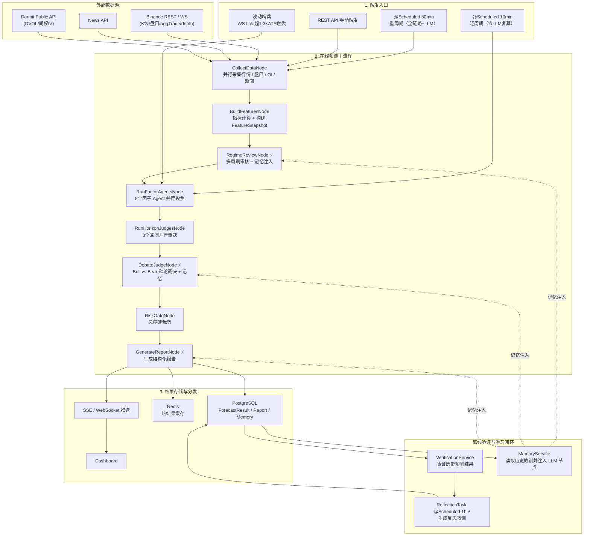
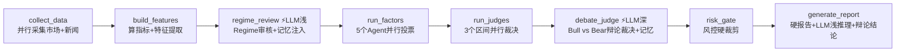
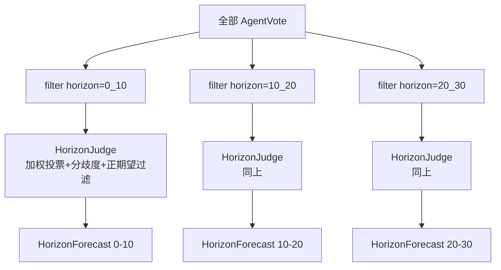
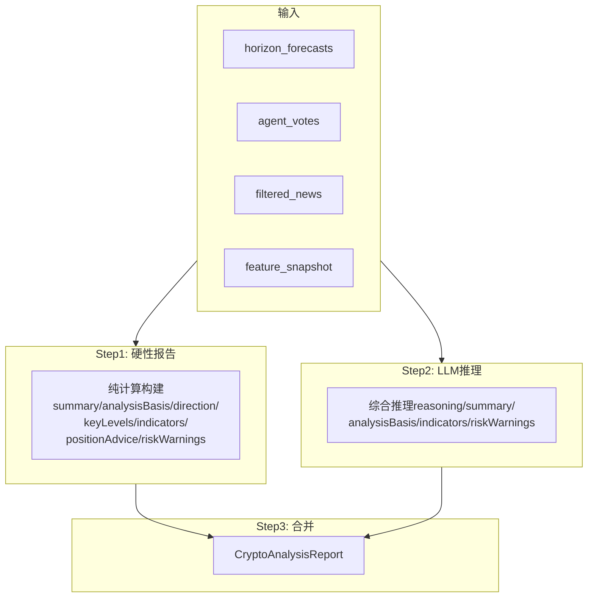
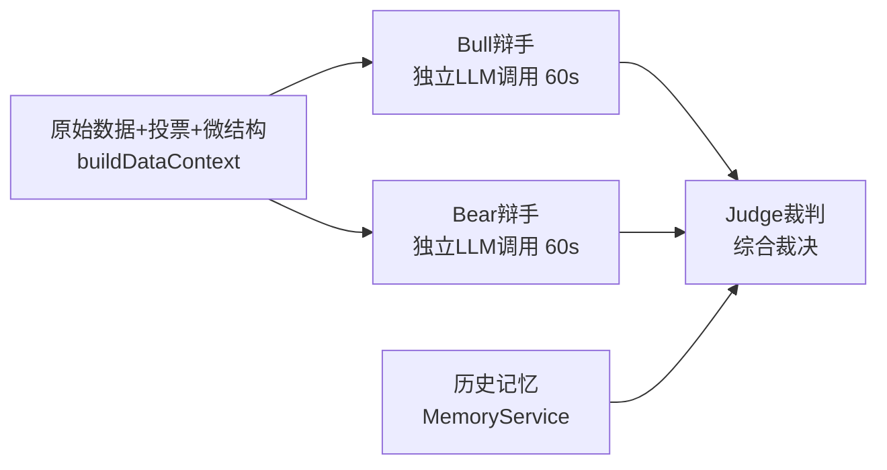

# Crypto 多 Agent 量化分析系统

## 1. 系统目标

面向 `BTCUSDT / ETHUSDT / PAXGUSDT` 等永续合约交易对，每 30 分钟自动生成三个时间区间的结构化交易信号：

- `0-10min` 超短线
- `10-20min` 短线
- `20-30min` 中短线

系统核心输出策略信号与风险建议，同时提供**轻周期快速刷新**（每10分钟零LLM复算）和**回测验证**能力。AI自动交易处于**测试阶段**，基于量化信号的确定性策略引擎独立运行。

核心约束：

- 数值计算由 Java 程序完成，LLM 不负责指标计算
- LLM 承担新闻解读、Regime审核、辩论裁决和报告生成（主链路4处） + 离线反思（1处）
- 预测结果可验证、可统计、可校准
- 架构基于 `Spring Boot 3.4.1 + Spring AI Alibaba 1.1.2.0`
- 深模型用于辩论裁决和离线反思，浅模型用于Regime审核、新闻分析和报告生成

## 2. 设计原则

### 2.1 程序负责算，Agent 负责判断

以下内容必须由 Java 程序计算，不交给 LLM：

- K 线聚合与技术指标（MA/EMA/RSI/MACD/KDJ/ADX/ATR/布林带/OBV）
- 盘口失衡与主动买卖量
- OI / Funding / Long-Short Ratio 特征
- 爆仓压力（多空爆仓比）
- 大户持仓趋势
- 主动买卖量比趋势
- 恐惧贪婪指数
- 现货-合约联动（基差、现货领先/滞后代理、现货盘口）
- aggTrade 实时订单流（tradeDelta / tradeIntensity / largeTradeBias）
- 期权隐含波动率（DVOL / ATM IV / 25d skew / term structure）
- 波动率与区间估计
- 止损止盈参数
- 因子投票评分
- 区间裁决与加权汇总
- 风控裁剪

LLM 负责（主链路4处 + 离线1处）：

- Regime多周期审核与转换预警（`RegimeReviewNode`，浅模型 + 记忆注入）
- 新闻情绪与事件影响判断（`NewsEventAgent`，浅模型）
- Bull vs Bear辩论裁决（`DebateJudgeNode`，深模型 + 记忆注入）
- 最终用户可读报告生成（`GenerateReportNode`，浅模型 + 辩论结论 + 记忆注入）
- 离线反思学习（`ReflectionTask`，每小时批量验证+生成教训）

设计原则：**计算在前，LLM做判断层面增强**——不替代任何数学计算，只在"需要综合研判"的节点介入。所有LLM节点失败时fallback到纯计算结果，不阻塞流程。

**辩论机制（借鉴TradingAgents）**：DebateJudgeNode采用3-call并行架构——Bull辩手与Bear辩手各自独立LLM调用并行执行（互不影响），Judge裁判综合双方论据+历史记忆做最终裁决。通过对抗论证暴露线性投票无法发现的逻辑矛盾，支持运行时开关做A/B测试。

**记忆系统**：系统会自动验证历史预测的正确性，通过离线LLM反思提取教训（如"RANGE regime下偏多倾向明显"），并将教训注入后续预测的LLM prompt，使系统从历史错误中学习。

### 2.2 多 Agent 不是多次问同一个模型

真正的多 Agent 必须满足：

- 角色边界明确，输入输出独立
- 结果可追踪，可以分开统计表现
- 可以按历史表现动态调权

5 个因子 Agent 各自独立评估，输出统一结构的 `AgentVote`，由 `HorizonJudge` 加权汇总裁决——这是真正的多 Agent 协作，不是让多个 LLM 轮流润色同一段文字。

### 2.3 允许输出 NO_TRADE

每个预测区间都可以输出 `LONG / SHORT / NO_TRADE`。

当出现以下情况时优先 `NO_TRADE`：

- 全部agent无有效投票（longScore和shortScore均 < ε）
- 预期收益覆盖不了手续费和滑点
- 市场处于极高噪声状态
- 数据缺失（质量标志触发动态阈值上调）
- 最近校准显著恶化

## 3. 业务输出定义

每次运行输出 3 个区间的结构化预测，封装在 `CryptoAnalysisReport` 中：

```json
{
  "symbol": "BTCUSDT",
  "cycleId": "qf-20260401-120000-a1b2-BTCUSDT",
  "summary": "BTC当前优先关注0-10min做多信号，但仍需等待确认。",
  "analysisBasis": "结构化裁决结果为PRIORITIZE_0_10_LONG，优先区间=0-10min做多，置信度=68%，分歧度=0.18，当前市场状态=TREND_UP。",
  "reasoning": "综合推理分析...",
  "direction": {
    "ultraShort": "做多",
    "shortTerm": "观望",
    "mid": "观望",
    "longTerm": "观望"
  },
  "keyLevels": {
    "support": ["84100", "83950", "83800"],
    "resistance": ["84500", "84650", "84800"]
  },
  "indicators": "市场状态=TREND_UP；5m[RSI=55.2（偏强）]；1h[RSI=62.1（偏强）]",
  "importantNews": [
    {
      "title": "Bitcoin ETF sees continued inflows",
      "sentiment": "偏多",
      "summary": "偏多解读：代表情绪或资金面改善，短线更容易支撑价格。"
    }
  ],
  "positionAdvice": [
    {
      "period": "0-10min",
      "type": "LONG",
      "entry": "84200 - 84350",
      "stopLoss": "83900",
      "takeProfit": "84600 / 84850",
      "riskReward": "1:2.5"
    },
    { "period": "10-20min", "type": "NO_TRADE", "entry": "-", "stopLoss": "-", "takeProfit": "-", "riskReward": "-" },
    { "period": "20-30min", "type": "NO_TRADE", "entry": "-", "stopLoss": "-", "takeProfit": "-", "riskReward": "-" }
  ],
  "riskWarnings": [
    "市场处于波动收缩阶段，只有在突破或跌破被确认后才适合跟随。",
    "仓位和杠杆应随置信度同步收缩，避免把低 edge 信号硬做成重仓交易。"
  ],
  "confidence": 68,
  "debateSummary": {
    "bullArgument": "Bull辩手论据...",
    "bearArgument": "Bear辩手论据...",
    "judgeReasoning": "裁判推理..."
  }
}
```

同时保存完整 `ForecastResult`（包含 `FeatureSnapshot`、`AgentVote[]`、`HorizonForecast[]`），用于事后验证。


## 4. 架构总览

### 4.1 分层架构



### 4.2 单次预测主链路

8节点线性串联，每30分钟执行一次：



离线：`ReflectionTask`（⚡LLM）每小时自动验证历史预测+生成反思教训→写入记忆表

### 4.3 轻周期与波动哨兵

**重周期 vs 轻周期**

| 维度 | 重周期（30min） | 轻周期（10min） |
|------|----------------|----------------|
| LLM调用 | 4次（Regime审核+新闻+辩论+报告） | 0次 |
| 新闻Agent | NewsEventAgent实时分析 | 复用重周期缓存的news_votes |
| Regime | LLM多周期交叉审核 | 纯ADX/ATR规则计算，保留重周期的regimeConfidence/regimeTransition |
| 耗时 | 12-30s | ~5-10s |
| 触发 | `@Scheduled 30min` + 手动 | `@Scheduled 10min` + 波动哨兵 |

**轻周期流程**：采集市场数据 → 重算特征 → 纯规则regime → 4个纯Java Agent并行投票 + 缓存news votes → 3 Judge并行裁决 → RiskGate → 落库 + 推送

**波动哨兵（`PriceVolatilitySentinel`）**

监听 Binance WS `markPrice@1s`，维护5分钟滚动价格窗口：
- 当窗口内最高-最低价 / 中价 > 1.3 × ATR-5m 时触发
- ATR由量化管道（重/轻周期）完成后更新；启动时从DB最近一次snapshot加载
- 冷却期30秒，防止高波动市场过度触发
- 触发后：先执行轻周期刷新信号 → 再驱动AI交易决策

**持仓回撤哨兵（`PositionDrawdownSentinel`）**

独立组件，`@Scheduled(fixedDelay = 60_000)` 每分钟扫描AI账户OPEN持仓：
- 维护各持仓的滚动PnL窗口（默认5分钟）
- **双条件OR触发**：PnL% 下降≥2.0个百分点 **或** 盈利回撤≥50%（基线>50USDT）
- 唤醒 `AiTradingScheduler` 重新决策
- 与波动哨兵共享30s跨入口冷却（`CROSS_SOURCE_GUARD_SECONDS=30`）

### 4.4 因子 Agent 并行视图

5 个因子 Agent 封装在 `RunFactorAgentsNode` 内部，通过 Java 虚拟线程并行执行：


### 4.5 区间裁决并行视图

3 个 `HorizonJudge` 封装在 `RunHorizonJudgesNode` 内部并行执行（5s超时），每个 Judge 只消费属于自己区间的投票：



### 4.6 GenerateReportNode 两阶段视图




## 5. 并行实现方案

### 5.1 技术约束

Spring AI Alibaba `StateGraph 1.1.2.0` 不支持原生并行分支：

- `addEdge()` 只能串行
- `addConditionalEdges()` 是互斥分支（选一条走），不是并行

### 5.2 解决方案：Node 内部虚拟线程并行

StateGraph 负责串行骨架（8 个 Node 线性串联），每个需要并行的阶段用一个聚合 Node 包起来，内部用 `Executors.newVirtualThreadPerTaskExecutor()` 并行执行子任务。

### 5.3 StateGraph 定义

```java
List<FactorAgent> agents = List.of(
    new MicrostructureAgent(), new MomentumAgent(),
    new RegimeAgent(), new VolatilityAgent(),
    new NewsEventAgent(shallowChatClient, shallowCallMode));

StateGraph workflow = new StateGraph(createKeyStrategyFactory())
    .addNode("collect_data",       node_async(new CollectDataNode(binanceRestClient, forceOrderService, depthStreamCache, deribitClient)))
    .addNode("build_features",     node_async(new BuildFeaturesNode(orderFlowAggregator)))
    .addNode("regime_review",      node_async(new RegimeReviewNode(shallowChatClient, shallowCallMode, memoryService)))
    .addNode("run_factors",        node_async(new RunFactorAgentsNode(agents)))
    .addNode("run_judges",         node_async(new RunHorizonJudgesNode(memoryService)))
    .addNode("debate_judge",       node_async(new DebateJudgeNode(deepChatClient, deepCallMode, memoryService)))
    .addNode("risk_gate",          node_async(new RiskGateNode()))
    .addNode("generate_report",    node_async(new GenerateReportNode(shallowChatClient, shallowCallMode, memoryService)));

workflow.addEdge(START, "collect_data");
workflow.addEdge("collect_data", "build_features");
workflow.addEdge("build_features", "regime_review");
workflow.addEdge("regime_review", "run_factors");
workflow.addEdge("run_factors", "run_judges");
workflow.addEdge("run_judges", "debate_judge");
workflow.addEdge("debate_judge", "risk_gate");
workflow.addEdge("risk_gate", "generate_report");
workflow.addEdge("generate_report", END);
```

### 5.4 State Key 完整列表

所有 key 均使用 `ReplaceStrategy`（后写覆盖前写）。

| Key | 类型 | 产出节点 | 说明 |
|-----|------|----------|------|
| `target_symbol` | `String` | 外部输入 | 交易对，如 `BTCUSDT` |
| `kline_map` | `Map<String,String>` | CollectDataNode | 6 周期合约 K 线 JSON |
| `spot_kline_map` | `Map<String,String>` | CollectDataNode | 现货 K 线 JSON（1m/5m） |
| `ticker_map` | `Map<String,String>` | CollectDataNode | 合约 24h Ticker JSON |
| `spot_ticker_map` | `Map<String,String>` | CollectDataNode | 现货 24h Ticker JSON |
| `funding_rate_map` | `Map<String,String>` | CollectDataNode | 资金费率 JSON |
| `funding_rate_hist_map` | `Map<String,String>` | CollectDataNode | 历史资金费率 JSON |
| `orderbook_map` | `Map<String,String>` | CollectDataNode | 合约深度盘口 JSON（WS优先，REST兜底） |
| `spot_orderbook_map` | `Map<String,String>` | CollectDataNode | 现货深度盘口 JSON |
| `open_interest_map` | `Map<String,String>` | CollectDataNode | 持仓量 JSON |
| `oi_hist_map` | `Map<String,String>` | CollectDataNode | 持仓量历史 JSON |
| `long_short_ratio_map` | `Map<String,String>` | CollectDataNode | 多空比 JSON |
| `force_orders_map` | `Map<String,String>` | CollectDataNode | 强平订单 JSON |
| `top_trader_position_map` | `Map<String,String>` | CollectDataNode | 大户持仓 JSON |
| `taker_long_short_map` | `Map<String,String>` | CollectDataNode | 主动买卖比 JSON |
| `fear_greed_data` | `String` | CollectDataNode | 恐惧贪婪指数 JSON |
| `news_data` | `String` | CollectDataNode | 新闻数据 JSON |
| `data_available` | `Boolean` | CollectDataNode | 数据是否可用 |
| `dvol_data` | `String` | CollectDataNode | Deribit DVOL 波动率指数 JSON |
| `option_book_summary` | `String` | CollectDataNode | Deribit 期权 book summary JSON |
| `feature_snapshot` | `FeatureSnapshot` | BuildFeaturesNode | 特征快照 |
| `indicator_map` | `Map` | BuildFeaturesNode | 多周期技术指标 |
| `price_change_map` | `Map` | BuildFeaturesNode | 价格变化率 |
| `regime_confidence` | `Double` | RegimeReviewNode | regime 置信度 |
| `regime_transition` | `String` | RegimeReviewNode | 转换预警 |
| `regime_transition_detail` | `String` | RegimeReviewNode | 转换详情 |
| `agent_votes` | `List<AgentVote>` | RunFactorAgentsNode | 全部因子投票 |
| `filtered_news` | `List<FilteredNewsItem>` | RunFactorAgentsNode | LLM 筛选后新闻 |
| `horizon_forecasts` | `List<HorizonForecast>` | RunHorizonJudgesNode | 3 区间裁决 |
| `overall_decision` | `String` | RunHorizonJudgesNode | 综合决策 |
| `risk_status` | `String` | RunHorizonJudgesNode | 风险状态 |
| `cycle_id` | `String` | RunHorizonJudgesNode | 本轮预测 ID |
| `debate_summary` | `String` | DebateJudgeNode | 辩论摘要 |
| `debate_probs` | `Map<String, Integer[]>` | DebateJudgeNode | 辩论概率 `[bull%, range%, bear%]` |
| `report` | `CryptoAnalysisReport` | GenerateReportNode | 最终报告 |
| `hard_report` | `CryptoAnalysisReport` | GenerateReportNode | 纯计算硬性报告 |
| `forecast_result` | `ForecastResult` | GenerateReportNode | 落库用结构化结果 |
| `raw_snapshot_json` | `String` | GenerateReportNode | FeatureSnapshot 的 JSON 序列化（供 QuantForecastScheduler 缓存） |
| `raw_report_json` | `String` | GenerateReportNode | CryptoAnalysisReport 的 JSON 序列化（供推送和缓存） |

### 5.5 Node 内部并行模式

以 `RunFactorAgentsNode` 为例：

```java
public class RunFactorAgentsNode implements NodeAction {
    @Override
    public Map<String, Object> apply(OverAllState state) {
        FeatureSnapshot features = extractFeatures(state);

        try (var executor = Executors.newVirtualThreadPerTaskExecutor()) {
            // 纯Java Agent: 30s超时
            var f1 = executor.submit(() -> microstructureAgent.evaluate(features));
            var f2 = executor.submit(() -> momentumAgent.evaluate(features));
            var f3 = executor.submit(() -> regimeAgent.evaluate(features));
            var f4 = executor.submit(() -> volatilityAgent.evaluate(features));
            // LLM Agent: 200s超时
            var f5 = executor.submit(() -> newsEventAgent.evaluateWithNews(features));

            List<AgentVote> allVotes = new ArrayList<>();
            allVotes.addAll(f1.get(30, SECONDS));
            allVotes.addAll(f2.get(30, SECONDS));
            allVotes.addAll(f3.get(30, SECONDS));
            allVotes.addAll(f4.get(30, SECONDS));
            allVotes.addAll(f5.get(200, SECONDS));

            // 超时/失败时生成3个NO_TRADE投票（每个horizon一个），reason="TIMEOUT"
            List<FilteredNewsItem> filteredNews = newsAgent.getLastFilteredNews();
            return Map.of("agent_votes", allVotes, "filtered_news", filteredNews);
        }
    }
}
```


## 6. 节点职责详解

### 6.1 节点总览

| 节点 | LLM | 模型 | 输入 | 输出 | 耗时预估 |
|------|-----|------|------|------|----------|
| `CollectDataNode` | 否 | - | symbol | 原始市场数据JSON + 新闻JSON | 2-5s |
| `BuildFeaturesNode` | 否 | - | 原始数据 | `FeatureSnapshot` | <100ms |
| `RegimeReviewNode` | 是 | 浅 | `FeatureSnapshot` + 多周期指标 + 历史记忆 | 审核后的regime + 置信度 + 转换预警 | 2-4s |
| `RunFactorAgentsNode` | 1/5 | 浅 | `FeatureSnapshot` | `List<AgentVote>` + `filteredNews` | 3-8s |
| `RunHorizonJudgesNode` | 否 | - | `List<AgentVote>` + 权重 | 3 个 `HorizonForecast` + decision + riskStatus | <50ms |
| `DebateJudgeNode` | 是 | **深** | `HorizonForecast[]` + `AgentVote[]` + `FeatureSnapshot` + 历史记忆 | 辩论裁决后的forecast + debate_summary + debate_probs | 5-12s |
| `RiskGateNode` | 否 | - | `HorizonForecast[]` + regime | 裁剪后的 forecast + 合并后的 riskStatus | <10ms |
| `GenerateReportNode` | 是 | 浅 | 结构化数据 + 辩论结论 + 命中率摘要 | `CryptoAnalysisReport` + `ForecastResult` | 3-6s |
| `ReflectionTask`（离线） | 是 | 默认模型 | 历史验证结果批量 | 反思记忆写入DB + agentAccuracy | 每1h执行 |

**单次完整链路总耗时：15-35s**（重周期含LLM调用；瓶颈在Binance API和LLM调用）。DebateJudge开关关闭时省3次调用。

### 6.2 CollectDataNode

并行采集全部数据（虚拟线程，每个future 10s超时）：

```
并行任务：
├─ 合约 K线 6 个周期（1m/120, 5m/288, 15m/192, 1h/168, 4h/180, 1d/90）
├─ 现货 K线 2 个周期（1m/120, 5m/288）
├─ 合约 24h ticker
├─ 现货 24h ticker
├─ funding rate（当前）
├─ funding rate history（48条）
├─ 合约 orderbook depth 20（WS缓存优先，2s新鲜度，REST兜底）
├─ 现货 orderbook depth 20
├─ open interest（当前）
├─ open interest history（5m周期，48条）
├─ long-short ratio
├─ force orders（近30条强平单）
├─ top trader position ratio（5m周期，24条）
├─ taker long-short ratio（5m周期，24条）
├─ Fear & Greed Index（最近2条，alternative.me API，调度器预取优化）
├─ News（通过BinanceRestClient.getCryptoNews）
├─ Deribit DVOL 波动率指数（最近6h，resolution=3600）
└─ Deribit 期权 book summary（全量BTC期权合约 mark_iv）
```

`data_available` 判定：至少一个K线周期有数据 **且** ticker非空。

### 6.3 BuildFeaturesNode

复用 `CryptoIndicatorCalculator.calcAll()` 计算技术指标，额外计算：

| 新增特征 | 计算方式 | 用途 |
|---------|---------|------|
| `bidAskImbalance` | (bidVol - askVol) / (bidVol + askVol)，盘口前5档 | 盘口偏向 |
| `tradeDelta` | aggTrade实时优先（OrderFlowAggregator 3min窗口），fallback K线taker buy ratio | 资金流向 |
| `tradeIntensity` | aggTrade 60s内笔数/秒，除以10归一化，clamp [0,3] | 成交活跃度 |
| `largeTradeBias` | aggTrade 大单(>均值3倍)买卖方向偏差 [-1,1] | 大单方向 |
| `spotBidAskImbalance` | 现货盘口前5档失衡 [-1,1] | 现货盘口 |
| `spotPriceChange5m` | 现货近5根1m收益率 | 现货动量 |
| `spotPerpBasisBps` | (合约价-现货价)/现货价 × 10000 | 期现基差 |
| `spotLeadLagScore` | 现货vs合约近3根1m收益差/scalePct，clamp [-1,1] | 现货领先/滞后 |
| `oiChangeRate` | (当前OI - 前次OI) / 前次OI | 新增仓方向 |
| `fundingDeviation` | 当前费率 vs 标准费率0.0001偏离度 | 情绪过热/过冷 |
| `fundingRateTrend` | 近期均值 vs 远期均值的变化方向 | 资金费率趋势 |
| `fundingRateExtreme` | 最新值偏离历史均值的程度 | 资金费率极端度 |
| `lsrExtreme` | 多空比是否处于历史极值（>2.0或<0.5） | 反向信号 |
| `liquidationPressure` | (多头爆仓额-空头爆仓额)/总额，归一化[-1,1] | 爆仓压力方向 |
| `liquidationVolumeUsdt` | 近期爆仓总额(USDT) | 爆仓规模 |
| `topTraderBias` | 大户持仓比前半段vs后半段均值变化，归一化[-1,1] | 聪明钱方向 |
| `takerBuySellPressure` | 主动买卖量比前半段vs后半段均值变化，归一化[-1,1] | 即时资金流 |
| `fearGreedIndex` | 恐惧贪婪指数 0-100（alternative.me API） | 市场情绪 |
| `fearGreedLabel` | EXTREME_FEAR / FEAR / NEUTRAL / GREED / EXTREME_GREED | 情绪分类 |
| `dvolIndex` | Deribit DVOL 最新 close（类VIX），0=无数据 | 隐含波动率水平 |
| `atmIv` | 最近到期日 ATM call 的 mark_iv | 近月隐含波动率 |
| `ivSkew25d` | OTM 5-8% call IV - OTM 5-8% put IV（正=call贵=看涨偏好） | 方向性押注 |
| `ivTermSlope` | 次近到期ATM IV - 最近到期ATM IV（正=contango） | 期限结构 |
| `bollSqueeze` | 布林带宽度 < 1.5 判定为收缩 | 即将变盘 |
| `regimeLabel` | ADX + 布林带宽 + ATR突增综合判定 | TREND/RANGE/SQUEEZE/SHOCK |

**Regime检测规则：**

| Regime | 判定条件 |
|--------|---------|
| `SHOCK` | 近6根5m ATR > 2× 前60根5m ATR（ATR突增是客观事实） |
| `SQUEEZE` | ADX < 15 且 布林带宽 < 1.5 |
| `TREND_UP` | ADX > 25 且 +DI > -DI |
| `TREND_DOWN` | ADX > 25 且 -DI > +DI |
| `RANGE` | ADX < 20（20-25灰色地带） |

### 6.4 RegimeReviewNode（LLM）

在 `BuildFeaturesNode` 之后、因子Agent之前审核规则检测的市场状态。

**为什么需要LLM审核Regime：**
- 规则检测只看15m/5m的ADX/DI，但1h/4h可能讲不同的故事
- ADX在20-25之间是灰色地带，规则无法表达"弱趋势"
- 无法识别regime转换信号（趋势即将衰竭、挤压即将突破）

**输入：** 多周期指标快照(RSI/ADX/DI/MACD/Boll各周期) + 涨跌幅 + 微结构 + 规则regime + 历史记忆

**输出：**
- `confirmedRegime`：确认或修正后的regime（5种之一）
- `confidence`：regime判断的灰度置信度 [0, 1]
- `transitionSignal`：转换预警（NONE/WEAKENING/STRENGTHENING/BREAKING_OUT/BREAKING_DOWN）

**安全约束：**
- SHOCK只能由规则触发（ATR突增是客观事实），LLM不能凭空升级
- 修正regime时重建FeatureSnapshot（record不可变），下游Agent自动消费新regime
- LLM失败时保留原始regime，confidence=0.5，transition="NONE"，添加 `REGIME_REVIEW_FALLBACK` 质量标志

### 6.5 因子 Agent 详解

#### MicrostructureAgent（纯 Java）

主要服务 `0-10min`，对更长区间信号衰减。

| 信号 | 权重(0-10) | 权重(10-20) | 权重(20-30) | 逻辑 |
|------|-----------|-------------|-------------|------|
| 盘口失衡(合约) | 0.17 | 0.05 | 0.03 | bidAskImbalance > 0 偏多 |
| 主动买卖delta | 0.11 | 0.03 | 0.02 | tradeDelta > 0 主动买强，高intensity加权 |
| 大单偏差 | 0.03 | 0.02 | 0.02 | largeTradeBias方向 |
| OI-价格共振 | 0.10 | 0.13 | 0.15 | OI增+价涨=新多入场 |
| 爆仓压力 | 0.10 | 0.12 | 0.16 | 多头爆仓多取反为利空 |
| 大户持仓 | 0.07 | 0.12 | 0.12 | 大户加多=利多 |
| 主动买卖量比 | 0.11 | 0.13 | 0.14 | 主动买入增强=利多 |
| 现货盘口 | 0.08 | 0.06 | 0.04 | 现货bidAskImbalance |
| 现货确认 | 0.06 | 0.07 | 0.05 | 现货vs合约价格方向一致性 |
| 现货领先 | 0.04 | 0.05 | 0.03 | spotLeadLagScore |
| 资金费率 | 0.03 | 0.08 | 0.10 | 高费率=多头拥挤→空头信号 |
| 多空比 | 0.05 | 0.04 | 0.07 | 极端多头→空头信号 |
| 基差 | 0.05 | 0.10 | 0.07 | 正溢价过高→空头信号 |

#### MomentumAgent（纯 Java）

全区间有效，是最核心的因子。不同区间使用不同时间周期：

| 区间 | 主周期 | 副周期 |
|------|-------|-------|
| 0-10min | 1m | 5m |
| 10-20min | 5m | 15m |
| 20-30min | 15m | 1h |

| 信号 | 逻辑 |
|------|------|
| 均线排列 | ma7>ma25>ma99 多头=+1，空头=-1，纠缠=0 |
| RSI 位置 | Regime-aware：TREND_UP/DOWN下RSI同方向即得分（超买/超卖在趋势中是正常现象）；震荡市维持原安全区规则 |
| MACD 交叉 | 金叉=+0.3，死叉=-0.3，HIST连续放大加分 |
| KDJ 交叉 | K>D 偏多，K<D 偏空，J>80 超买，J<20 超卖 |
| 量价验证 | 涨时放量=健康涨势加分，涨时缩量=虚涨减分 |
| 多周期一致性 | 1m/5m/15m/1h 方向一致=强信号，分歧=减分 |

#### RegimeAgent（纯 Java）

识别当前市场状态，影响其他 Agent 的可信度。结合期权 IV 信号增强判断。

| Regime | 判定条件 | 影响 |
|--------|---------|------|
| `TREND_UP` | ADX>25 且 +DI>-DI | 顺势 Agent 加权 |
| `TREND_DOWN` | ADX>25 且 -DI>+DI | 顺势 Agent 加权 |
| `RANGE` | ADX<20 | 微结构/动量权重降低 |
| `SQUEEZE` | 布林带宽<1.5 + ADX<15 | 全部降权，等突破 |
| `SHOCK` | 近期ATR > 2倍历史ATR | 禁开仓或极低杠杆 |

**期权 IV 增强（Deribit 数据可用时）：**

| IV 信号 | 条件 | 影响 |
|---------|------|------|
| skew 方向性押注 | \|ivSkew25d\| > 2.0 | 按 skew/10 加偏移，标记 IV_SKEW_CALL_RICH/PUT_RICH |
| 聪明钱布局 | IV > 60 且 SQUEEZE | conf 提升15-20%，标记 HIGH_IV_SQUEEZE |
| 隐含波动率预警 | IV > 80 且非 SHOCK | risk flag ELEVATED_IMPLIED_VOL |

#### VolatilityAgent（纯 Java）

不输出方向（score=0, direction=NO_TRADE），核心职责是输出各区间的波动率估计和风险标志。

| 输出 | 计算方式 |
|------|---------|
| `volatilityBps` | ATR14 × periods^0.6 换算为基点。0-10: 1m ATR × 10^0.6，10-20: 5m ATR × 4^0.6，20-30: 5m ATR × 6^0.6 |
| `expectedMoveBps` | volatilityBps × moveRatio（0.45/0.60/0.75） |
| `reasonCodes` | BOLL_SQUEEZE_5M, BOLL_EXPANSION_5M, ATR_ACCELERATING, ATR_DECELERATING 等 |
| `riskFlags` | PRICE_AT_UPPER_BAND, PRICE_AT_LOWER_BAND, VOLATILITY_COMPRESSED, VOLATILITY_EXPANDED, BOLL_SQUEEZE_15M |

#### NewsEventAgent（LLM）

唯一的 LLM 因子 Agent，主要影响 `10-30min` 区间。超时200s。

**两步流程：**
1. **关键词预筛选**：`NewsRelevance.filterRelevant()` 按币种别名+宏观关键词过滤相关新闻
2. **LLM分析**：综合判断整体情绪和对三个时间区间的影响，输出结构化JSON

**输出：**
- `List<AgentVote>`（三个区间各一个）
- `List<FilteredNewsItem>`（筛选后的新闻列表，传递给 `GenerateReportNode`）


### 6.6 HorizonJudge 裁决逻辑

每个区间独立裁决，输入该区间全部 `AgentVote`：

```
// 方向聚合：weight × |score|（不乘confidence，避免三重衰减）
longScore  = Σ(weight_i × |vote_i.score|)    // score > 0 的部分
shortScore = Σ(weight_i × |vote_i.score|)    // score < 0 的部分
edge       = |longScore - shortScore|
disagreement = 1 - edge / (longScore + shortScore + ε)
```

**Penalty-based confidence（非简单乘法）**：
- `edge < minEdge` → 加penalty
- `dominantMoveBps < minMoveBps` → 加penalty
- `disagreement > threshold` → 加penalty
- confidence最终clamp到 [0.15, 1.0]

**NO_TRADE 判断**：仅在全部agent无有效投票（longScore和shortScore均 < ε）时判NO_TRADE。

**动态阈值**：
- `minEdge`：根据 horizon 和数据质量标志动态调整
- `minMoveBps`：根据 horizon 调整（0_10=4, 10_20=5, 20_30=6）

**数据质量影响阈值**：

| 质量标志 | 影响 |
|---------|------|
| `PARTIAL_KLINE_DATA` | `minEdge` 降低到 60%-90% |
| `MISSING_TF_5M` | 0-10min 的 minEdge 进一步降低 |
| `MISSING_TF_15M` | 10-20/20-30min 的 minEdge 进一步降低 |

**权重动态修正（准确率反馈）**：当 `MemoryService` 有 agent 准确率数据时，基础权重会乘以修正因子：`multiplier = clamp(0.2 + accuracy × 1.6, 0.5, 1.4)`。accuracy=0.5→1.0×，accuracy=0.8→1.24×，accuracy=0.3→0.68×。

**每区间参数：**

| 区间 | 最大杠杆 | 最大仓位 | moveRatio |
|------|---------|---------|-----------|
| 0-10min | 35x | 20% | 0.60 |
| 10-20min | 30x | 25% | 0.68 |
| 20-30min | 25x | 30% | 0.75 |

### 6.7 DebateJudgeNode（LLM深模型）

采用 **3-call并行架构**：
1. **Bull辩手** ∥ **Bear辩手**：两个独立LLM调用并行执行（各60s超时），互不影响
2. **Judge裁判**：综合原始数据 + 双方论据 + 历史记忆，做最终裁决



**Judge裁判审核10个维度：** 方向矛盾、跨区间逻辑、Regime适应、微结构背离、转换风险、历史教训、情绪极端、爆仓信号、聪明钱方向、期权IV信号

**安全约束：**
- confidence可上调最多+0.10（approved=true时）
- 方向翻转（LONG↔SHORT）时cap到原始置信度的50%
- NO_TRADE翻转为有方向时：cap confidence到0.5
- LLM失败时透传原始裁决
- 不修改entry/tp/sl价位

**运行时开关（`ENABLED`）：**
- `DebateJudgeNode.ENABLED`（volatile，默认 `true`）支持Admin页面实时切换
- **关闭**：跳过辩论，保留原始forecasts，下发中性概率(33/34/33)
- 重启恢复默认 `true`

### 6.8 RiskGateNode

纯程序化硬规则裁剪（逻辑在 `RiskGate.java` 静态工具类中）。

**裁剪规则：**

| 条件 | 动作 |
|------|------|
| `direction = NO_TRADE` | 跳过裁剪 |
| `regime = SHOCK` | 杠杆 cap 到 **5x**，仓位×**0.7** |
| `regime = SQUEEZE` | 仓位×**0.85** |
| `disagreement > 0.35` | 杠杆 cap 到 max(5, lev/2) |
| `fearGreed ≥ 80 且 LONG` | confidence×0.9（SHOCK下×0.8）。**TREND_UP豁免** |
| `fearGreed ≤ 20 且 SHORT` | confidence×0.9（SHOCK下×0.8）。**TREND_DOWN豁免** |

**波动率惩罚（按币种差异化）：**

| 币种 | 正常阈值 | 极端阈值 |
|------|---------|---------|
| BTC | 0.5% | 1.5% |
| ETH | 0.7% | 2.0% |
| PAXG | 0.3% | 0.8% |

atrPct < 正常 → 1.0，正常-极端 → 线性衰减到 0.5，> 极端 → 0.3

**IV惩罚（DVOL）：** <50 → 1.0，50-80 → 线性衰减到 0.7，>80 → 0.5

**数据质量惩罚：** 关键数据缺失 → 0.80，次要缺失 → 0.90，现货缺失 → 0.95，完整 → 1.0

**仓位建议公式（加法环境惩罚，非乘法）：**

```
envPenalty = (1 - volPenalty) + (1 - dataPenalty) + (1 - ivPenalty)
envFactor = max(0.55, 1.0 - envPenalty)
agreementFactor = max(0.70, 1.0 - disagreement)

adjustedPos = maxPos × effectiveConfidence × agreementFactor × envFactor
adjustedPos = clamp(adjustedPos, 0.08, maxPos)
```

### 6.9 记忆与反思系统

#### 预测验证（VerificationService）

预测落库35分钟后自动验证。**分段验证策略：**
- `0_10`：用预测时价格作为入场价，完整 TP/SL 路径评级
- `10_20`：用T+10min实际价格作为入场价，TP/SL按偏移量平移重建
- `20_30`：用T+20min实际价格作为入场价，同上
- `NO_TRADE`：|实际变化| < 10bps 为正确

**路径分析：** 遍历 K 线序列，逐根计算最大有利偏移（maxFavorableBps）、最大不利偏移（maxAdverseBps）、TP1/SL 谁先触达。

**reversalSeverity：** `maxAdverseBps / (maxAdverseBps + maxFavorableBps)`，>0.40 标记"段内反转风险显著"。

**质量评级：**

| 评级 | 条件 |
|------|------|
| `GOOD` | TP1先于SL触达，或方向正确且最大有利偏移 > 5bps |
| `MARGINAL` | 方向正确但幅度弱或路径差（无TP/SL且有利偏移 ≤ 5bps） |
| `LUCKY` | 终点方向对但路径中SL先触达（**不算correct**，真实交易中必亏） |
| `BAD` | 方向错误或SL先触达且终点也错 |
| `FLAT` | NO_TRADE专用：\|实际变化\| < 10bps 为 GOOD，否则 BAD |

#### 离线反思（ReflectionTask）

每小时整点后5分执行（`@Scheduled(cron = "0 5 * * * *")`）：
1. 批量验证最近未验证的预测周期（最多24个）
2. 收集最近36条验证结果
3. LLM反思分析系统性偏差（3次重试，延迟3s/10s/30s）
4. 输出：`overallAccuracy` + `biases` + `agentAccuracy`（按agent×horizon维度） + `lessons`
5. 写入 `quant_reflection_memory` 表（含`[AGENT_ACCURACY]`标记）
6. 清理30天前旧记忆

#### 记忆注入（MemoryService）

三个LLM节点在构建prompt时注入历史记忆：

```
【历史记忆】
最近3次 TREND_UP 下的预测:
- 2h前: LONG conf=0.68 → 实际+12bps ✓
- 5h前: SHORT conf=0.55 → 实际+50bps ✗
反思教训: TREND_UP下过早翻空倾向明显，保持趋势方向除非强转换信号
最近命中率: 62% (8/13)
```

### 6.10 GenerateReportNode（LLM）

**两阶段生成**：

**Step1 - 硬性报告（零LLM）**：summary、analysisBasis、direction（含概率展示）、keyLevels（ATR计算）、indicators、importantNews、positionAdvice、riskWarnings、confidence

**Step2 - LLM综合推理**：输入硬性报告 + agent投票 + 技术指标 + filteredNews，返回 reasoning/summary/analysisBasis/indicators/riskWarnings

**Step3 - 合并**：结构化字段来自硬性报告，文本字段优先LLM输出，fallback硬性报告

**方向概率展示优先级：**
- 优先使用 `debate_probs`（DebateJudgeNode产出）
- 否则使用 Agent 投票加权计算
