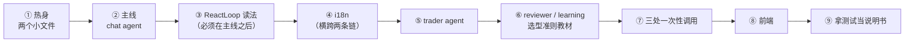

# Agent Harness 阅读指南

**这份文档解决一个问题**：`wiib-agent` 下有一万七千多行 Java（测试另有两万行、92 个测试类；再加两门语言的提示词词表约 2400 行、前端对话模块约 3000 行），从哪儿开始读、按什么顺序读、读到哪一段该停下来先补背景。

它不是 API 文档，也不重复 [architecture.md](./architecture.md) 已经讲过的架构。那份文档回答"这套东西是什么"，这份文档回答"**我该按什么顺序把它读懂**"。

> **行号会漂。** 全文一律按**方法名 / 常量名**定位，需要找的时候 grep 名字。个别标了行号的只表示"大概在文件哪个位置"。

---

## 第 0 章 · 先建立地图（10 分钟，只读不写代码）

先读同目录的 [Agent Harness 架构](./architecture.md)，只需要记住三件事：

1. **装置之间只经 PostgreSQL 咬合**。没有任何一个直接调用另一个——chat 想知道 trader 干了什么，读的是 trader 自己写下的表。
2. **选型只有一条准则**：固定步骤写死成代码，开放决策才交给模型循环。同一条准则也管形态内部——chat 的**编排**是普通 Java 循环（`ChatTurnRunner`），只有**叶子**是 `ReactLoop`。
3. **模型来源两条轨**：面向用户的全部 BYOK（用户自带 key，AES-GCM 加密存库）；平台自己只剩 `newsTranslation` 一个功能位买单（见 `runtime/AiAgentRuntime`）——行为分析已在 2026-08 切到用户自己的 key。

### 六处装置速查

| 装置 | 形态 | 循环 | 触发 | 代码在 |
|---|---|:---:|---|---|
| **trader agent** | ReAct 循环（15 工具） | ✓ | K 线收盘 / 波动警报 / 手动 | `trader/`（现场流与轨迹见 5.7） |
| **chat agent** | 平铺编排 + ReAct 循环叶子 | ✓ 带回环 | 用户提问 | `chat/` |
| **learning agent** | ReAct 循环（1 只读工具） | ✓ | 日线交接第三阶段 | `learning/LearningRunner` |
| **reviewer workflow** | 单次调用，无工具 | ✗ | 日线交接第二阶段 / 点播 | `learning/ReviewRunner` |
| **behavior workflow** | 单次调用，无工具 | ✗ | 对话里的 `analyze_my_behavior` | `behavior/` |
| **replay coach** | 单次流式调用，无工具 | ✗ | 手动复盘点「AI 提示 / AI 评估」 | `controller/ReplayCoachController` |

（还有一处 `analysis/DeepAnalysisService`：Bull∥Bear + Judge 三次调用的**固定编排**，挂在 chat 的 summarizer 上当工具用，不是独立装置。）

### 建议的阅读顺序



**为什么从 chat 开始而不是从 trader**：trader 是业务最重的（要动真账本、有护栏、有调度），chat 是**循环用得最深的**（压缩 + 闸门 + 保险丝 + 中断全在 summarizer 那一个叶子上）。先啃循环、再看业务，比反过来省力——trader 里那些看着奇怪的写法多半在 chat 里也出现过，而且 chat 那边有注释解释过为什么。

**i18n 单开一章插在中间**：它不是"翻译"这么简单，它改了叶子的缓存键、改了旧数据的识别方式（认的时候要遍历全部语言）。不先过一遍，读 trader 的提示词组装会一直卡在"为什么这里要传个 lang"。

---

## 第 1 章 · 热身：两个小文件（20 分钟）

目的是熟悉这个仓库的代码风格和注释密度，别一上来就啃上千行的大文件（最大的三个是 `ReviewMaterialAssembler` 1143 行、`TraderWakeupRunner` 897 行、`ChatTurnRunner` 629 行）。

| 文件 | 行数 | 读它干什么 |
|---|---|---|
| `chat/ChatConcurrencyGate.java` | 56 | 全包最简单的一个类。看两件事：`tryAcquire` 为什么**先占用户位再占全局位**（反过来会让同一用户的第二次请求先拿走一个全局名额再被拒，中间那一瞬别人被无谓挡住）；为什么返回**枚举而不是 boolean**（拒因得由闸门自己给，让调用方去别处二次推断既是重新发明轮子又有竞态） |
| `chat/ToolRunContext.java` | 25 | 会话号怎么到工具方法体：`ChatTurnRunner` 把它传给 `ReactLoop.run`，循环执行工具时放进 Spring AI 的 `ToolContext`，工具声明一个 `ToolContext` 参数就读得到（不进 schema，模型看不见）。闸门拿的是同一个会话号，见第 2 章站点 8 |

读完这两个，你应该能感觉到：**这个仓库的注释讲"为什么"不讲"做了什么"**。看到一段费解的代码，先找它头上那句注释，多半解释了它为什么不能写成更直觉的样子。

---

## 第 2 章 · 主线：一次对话从点击到出字（3~4 小时）

这是整份指南的主体。按下面的顺序读，每一站都是上一站的直接下游。

### 站点表

| # | 站点 | 位置 | 看什么 |
|---|---|---|---|
| 1 | 入口与准入 | `ChatWorkbenchController.chat()` | 四道闸全在建流之前；让位握手 |
| 2 | 配置从哪来 | `llm/LlmEndpointService` | 端点库 CRUD、用途绑定、解析、探测 |
| 3 | 配置怎么变模型 | `ChatModelFactory.modelsFor` / `fingerprint` | 指纹缓存 |
| 4 | 叶子怎么建 | `ChatAgentFactory.leavesFor` / `leafKey` / `build` | 模型与语言在建叶子这一刻绑死 |
| 5 | 一轮的骨架 | `ChatTurnStreamer.Turn.run()` | 心跳、三种结局、读数 |
| 6 | 一轮的编排 | `ChatTurnRunner.run()`（先读类 javadoc 的 ASCII 图） | 路由 / 并行 / 回环，全是普通 Java |
| 7 | 让位与补答 | `ChatYieldCoordinator` | 用户消息插队、专家结果排队 |
| 8 | HITL | `ApprovalGate.intercept` → `ApprovalRegistry` | 三元组授权 |
| 9 | 重新生成 | `ChatTurnRewinder.rewind` | 上下文回退与它的两个陷阱 |

### 站点 1 · 入口与准入

`chat()` 里的顺序是硬的，不是风格问题：

```text
POST /api/ai/workbench/chat
  ├─ 消息非空 / ≤10000 字
  ├─ leavesFor(userId)         端点一条都没有 → 2201 ／ 建不出模型 → 2202
  ├─ concurrencyGate.tryAcquire
  │    └─ USER_BUSY 时先试 awaitYield()：发让位信号 → 等在跑轮退位 → 抢名额
  │                                       握手不成 → 2203 ／ 全局 10 满 → 2204
  ├─ sessionId 绑 "wb-{userId}-" 前缀，防跨用户续聊
  └─ 这之后才 new SseEmitter
```

四道准入全在 `new SseEmitter` **之前**：一旦返回 SseEmitter，响应就是 `text/event-stream`，再报错只能推 error 事件，前端拿不到结构化错误码、没法自动引导用户去配置。

错误码段位：`2201` 没配置 / `2202` 建不出模型 / `2203` 你已有一轮在跑 / `2204` 全局满了 / `2206` 这条回答重新生成不了 / `2208` 会话不欠补答。

> 顺带记一个坑：`ErrorCode` 是 Java 枚举，**不校验 code 重复**。撞号了编译过、测试过，只在运行时错乱。加错误码前先扫一遍已占段位（2200 段是工作台，1600 段是 Crypto）。

三个 SSE 端点（`/chat`、`/deferred`、`/regenerate`）做完各自的准入后都汇进 `streamTurn()`。这个方法里看两样：

- **名额泄漏是这套设计里唯一不可恢复的失败模式**——漏满 10 个，服务对所有人永久拒绝。所以 `release` 收在**提交出去那个 lambda 的 finally**，外面再补一个 catch 兜"任务提交失败"（那种情况 lambda 的 finally 根本不执行）。
- `yieldCoordinator.closeTurn` **必须排在 `release` 之后**：turnDone 是让位等待者抢名额的发令枪，名额还没还就开枪，等待者抢到的必然是 `USER_BUSY`。

### 站点 2~3 · 配置怎么变成模型

`LlmEndpointService` 里有一处值得单看：`create/update` 和 `testConnection` **共用同一份 `toRow` 组装**。不共用就会出现"测通了但存进去的不是它"。同理，连通性探测走的是 `ByokModelBuilder` 的**生产建模路径**，不是另搭一个形似的探针——测什么就得是接下来真跑什么。

顺着 `ByokModelBuilder.build` 往下就是四条协议的分叉（`AiProtocols`）：`openai` 走 Spring AI 的 `OpenAiChatModel`，`responses` / `anthropic` / `gemini` 各是一个自研 `ChatModel`（`llm/` 下三个同名类）。**"能不能服务端搜索"是协议能力与用户勾选的与**——chat-completions 没有标准的服务端搜索，所以 openai 那条永远是 false。这个布尔既进 `ResponsesChatModel` 的构造参数，也决定 summarizer 的新闻条款拼哪版，所以它必须进指纹（见站点 4）。

另外**思考档位不设白名单**：`none/low/medium/high` 只是前端的快捷选项，各家还有 `xhigh`/`minimal` 之类，`normalizeEffort` 只抹平大小写空白、只挡列宽（VARCHAR(16)）。认不认只有上游知道。

`ChatModelFactory` 两个点：

- **缓存键是配置指纹，不是 userId**。用户改配置 → 指纹变 → 自然拿到新模型，**不需要任何显式失效逻辑**。但 userId 必须是指纹的第一个分量，理由见站点 4。
- **建模不在锁里做**。写成 `synchronizedMap(...).computeIfAbsent(k, fn)` 的话，mapping 函数整个执行期间持锁，而这条路在准入同步路径（Tomcat 请求线程）上——任何一个用户首次建模期间，其余所有人的 `/chat` 全堵住。所以是 `get` → 锁外建 → `putIfAbsent`。

### 站点 4 · 叶子

`ChatAgentFactory.leavesFor` 的缓存策略与 `ChatModelFactory` 同款（LRU 32、锁外建）。键是 `leafKey` = **配置指纹 + 语言码**：

- **userId 进指纹不是为了缓存粒度，是数据隔离**：叶子里有按用户烤死的工具（`trader_agent` 读的是"这个人的 trader"），两人共用一份叶子就会看到别人的持仓。隔离要靠键本身，不能指望密文的随机性。
- **语言只加在叶子这一层，不进模型指纹**：系统提示词与工具描述按语言烤进叶子里，语言变则叶子必须重建；但模型实例与语言无关，切语言不该重建 SDK 客户端与连接池。

`build()` 造出四个叶子：

| 叶子 | 模型 | 工具 | 特别之处 |
|---|---|---|---|
| `market_agent` | 轻 | `MarketToolkit` 4 个 | 首轮 `tool_choice=required`——不强制的话模型会用自带内置搜索直接答，数据源就失控了 |
| `news_agent` | 轻 | **不挂 tool** | 靠 `preload` 预取 BlockBeats：无参工具挂成 function tool 模型未必调，预取才 100% 保证数据到位 |
| `trader_agent` | 轻 | `TraderQueryToolkit` 4 个只读 | userId 建叶子时烤死 |
| `summarizer` | 深 | 5 个（深研判 1 + trader 动作 3 + 行为分析 1） | `streaming(true)`，带压缩、HITL 闸门、保险丝三样 |

**同一个 `runModelCallLimit` 管的是"每个 agent 各自的上限"而不是"整轮总量"**：summarizer 和每个带工具的专家各跑各的循环，计数互不相通。一轮对话的模型调用是各家相加，不是 8 次封顶。

### 站点 5 · 一轮的骨架 · `ChatTurnStreamer`

这一层是 2026 年重构出来的，旧指南里的 `ChatWorkbenchController.run()` 已经不存在了。它管的是"一轮在 SSE 通道上的完整过程"：

```text
登记 runRegistry（status 接口 / 拒删会话看它，也是工具推事件的出口）
  → 开心跳（20s 一帧，nginx 默认 proxy_read_timeout 60s，留 3 倍余量）
  → 落 user 行（重新生成轮与补答轮不落）
  → 拼 enriched（时间行 + 提问标记；重新生成靠这两个标记定位本轮提问）
  → turnRunner.run(...)
  → 按结局分流：finishCancelled / finishYielded / finishAnswered
```

三个 finish 方法的差别就是这套设计的全部语义，对照着读：

- `finishCancelled`——半截答案照落库（token 已经烧掉了，屏幕上那段也该留得住），**不欠补答**。
- `finishYielded`——答案欠着，在途批次交协调器排队，`done` 帧带 `deferred=true`。注意 `registerDeferred` 必须在 `runRegistry.finish` 之前：status 是 running/pending 两个口径，先摘运行标记再记账会闪出两者皆假的空窗。
- `finishAnswered`——落库、（重新生成轮）顶掉旧答案、发 done。**旧答案留到新答案确实落库之后才删**。

还有一个 `turnMeta()`：账本被别轮的在途专家写脏时**只报耗时不报 token**——读到的数混着别人的账，宁可不报也不能报错的。

**断连不中止本轮**：通道关了照样跑完并落历史，只是不再往通道里写帧。前端回来靠 status 接口 + 历史回放补。

### 站点 6 · 编排 · `ChatTurnRunner`

先读类 javadoc 顶上的 ASCII 图，再读 `run()`。编排用普通 Java：分支就是 if、并行就是虚拟线程、回环就是 while，用不上图。

三个零件：

- **路由**（`askRouter`）：浅模型调 `route` 工具给出结构化去向，循环只认这个值，**一个字都不解析消息文本**。为什么不让模型输出 JSON 数组再解析——后者的代价实测过：路由指令混在文本里会泄漏给用户、会作为 AssistantMessage 进历史被模型照抄、解析还脆。超时 90s，任何异常降级成 `FINISH`（路由挂了照样作答）。
- **并行**（`dispatchAsync` → `awaitBatch`）：专家跑在虚拟线程上，收齐后**按派发顺序**接进历史——顺序稳定，产出才可复现。专家产出接进上下文的形态是**带出处标注的用户侧消息**，不是裸 AssistantMessage（那样模型会以为是"我自己刚说过的话"，整段输入还以 assistant 结尾，于是倾向于答"没有数据"）。
- **停止**：真正让循环停下来的是**去重**（每轮至少吃掉一个专家名，名字用完必停）；`MAX_DISPATCH_ROUNDS = 3` 兜的是"去重失灵"。现在正好三个专家，这个数没有余量，加专家要一起抬。

出循环前还有五个直通汇总的分支，各自的理由不同，值得逐个看：有未消费的 HITL 授权 / 按钮意图（`ChatIntent`，该做什么已写死，让路由再猜一遍是白烧）/ 中断 / 让位 / 轮次上限。

进汇总前垫的最后一条消息（`summaryTail`）恒为**用户侧**——整段输入以 assistant 结尾，模型只会补一句"没什么可补充的"。这条消息里的**输出语言硬收尾必须排在最后**：用户打的字不翻译，聊天输入随时是另一门语言，而近因权重最高。

`streamSummarizer` 现在只是把 token / 搜索事件从 `ReactLoop.Listener.chunk` 里取出来交给 SSE 出口，逐帧消费在 `ReactLoop` 里（那边有一条硬规矩：在调用线程上普通迭代消费，不用 `forEachAsync`——后者每个 chunk 叠一层栈帧，长回答会 `StackOverflowError`，真跑实证过）。

### 站点 7 · 让位与补答 · `ChatYieldCoordinator`（新增，最该细读的一节）

要解决的问题：用户问了一句，三个专家正在取数（纯等 IO，可能十几秒），这时用户又发了一条——是让他排队等专家，还是让专家给他让路？

答案是一条规则：**用户消息永远插队，专家结果永远排队**。

```text
用户发新消息 → 撞名额 USER_BUSY
  → requestYield(userId)
       在跑轮正处专家等待期？  否 → null，按占线拒，前端回落本地排队
                              是 → 完成 yieldSignal，返回 turnDone
  → 那一轮在 awaitBatch 里被叫醒 → yieldTurn：给原问题垫占位答复、存档 working、
                                   把在途批次原样交回
  → ChatTurnStreamer.finishYielded → registerDeferred 进队，done 带 deferred=true
  → 新消息等 turnDone、抢名额、正常应答
  → 前端在本地空闲时发 POST /deferred → takeDeferred 出队 → 当普通轮跑，
       只是不落 user 行、答案带【补答】标头、专家名预填进去重集合
```

读的时候盯这几处：

- **为什么只有专家等待期可让**：路由和汇总都在烧模型调用，中断只会浪费；专家等待纯粹在等 IO，让出去的只是"接着等"这件事。
- **`cancelled` 为什么既要布尔又要 future**：布尔叫不醒阻塞在 `anyOf` 上的专家等待期。
- **中断压过让位**：两个信号都粘滞、可能同时为真，判反了被停掉的问题会被补答轮跑完。
- **补答轮不做让位握手**：反过来的话，另一个标签页看见欠账发起补答，会把这个标签页正在跑的用户轮挤掉。
- **`takeDeferred` 必须在拿到名额之后调**：名额每用户 1 个，两个标签页同时请求补答，只有一个拿得到名额，也就只有一个取得走这一单。
- **`hasInFlightExperts`**：让位交出去的那批专家**没人取消**（fire-and-forget 的虚拟线程），能跨好几轮继续往同一份账本上记账。所以"这一轮的用量可不可信"要看它。
- 队列是**进程内存级**：单实例部署，重启即丢，代价是让位后重启那个问题没有补答——历史里问题仍在，重问即可。

### 站点 8 · HITL · `ApprovalGate` / `ApprovalRegistry`

先理解约束：`DeepAnalysisToolkit` 的方法体**从来看不到自己被调用时的 sessionId**——工具方法体拿到的只有 `ToolContext` 里的会话号，没有当次 tool_call 的参数。授权若只绑 sessionId，就会是"卡片上写 BTC、模型改口跑 ETH 照样放行"。

修法不是加校验，是**把判断挪到信息完整的那一层**。`ApprovalGate` 实现 `ReactLoop.ToolGate`，循环执行工具前把会话号和整条 `AssistantMessage`（含每个 tool_call 的名字与参数）交给它，所以授权键能做成 `(sessionId, 工具名, 归一化后的标的)`。

两处当前版本的要点：

- **管辖范围只剩深研判一个工具**（`GUARDED_TOOLS`）。trader 那三个工具只弹表单、真正的执行扳机在用户手指上，再批准一次等于让用户确认两遍。
- **不受管辖的工具原样放行**。工具方法体自己的 sessionId 不经闸门：`ChatTurnRunner` 把它传给 `ReactLoop.run`，循环执行工具时放进 `ToolContext`（`ToolRunContext.SESSION_KEY`）。

再看 `discardApprovals` 那段注释：又要弹卡就说明上一条授权已经用不上了，不丢的话它会一直躺到 TTL 结束，而路由见 `hasApproval` 为真就跳过全部专家派发——于是这 10 分钟内该会话每一条新提问都不取数据、直接凭空作答，**且没有任何日志会说明原因**。

### 站点 9 · 重新生成

`ChatTurnRewinder.rewind` 把模型侧上下文回退到"最后一问已在、回答未出"。展示表这里一行不动——旧答案要留到新答案确实落库之后才删。

**它不在 controller 里**：这段跨 `ChatHistoryService` / `ChatContextStore` / `PromptCatalog` 的回退逻辑一行 HTTP 都没有，独立成类才立得起来单测。controller 那边只剩一句 `rewinder.rewind(...).orElseThrow(2206)`——回不去的几种原因在 HTTP 上是同一个码，不分型。

两个陷阱都在私有的 `cutAt`：

1. **光靠轮起始标记定位不住**：历史压缩会把首条用户消息**原样**放回压缩结果队首，那条正是会话第一轮的提问、同样带着标记。所以标记只用来找候选，还要拿它与展示表里那条提问核对。
2. **切在队首且紧跟着摘要就得拒**：同一句常用问法在一个会话里问两遍就会这样，文本对得上但位置是假的，照切会把整段上下文连摘要清空。

两条都交回 `Optional.empty()`，由 controller 一律翻成 `2206` 拒绝，不做半吊子的补偿。另外重新生成轮是 `preemptible=false` 的——它把旧答案的位置腾了出来，被新消息挤掉的话新答案只能以【补答】标头追加到会话末尾，位置错、还再也不能重新生成。

---

## 第 3 章 · ReactLoop 读法（读完回头看站点 4）

叶子的 ReAct 循环是自己写的，就 `llm/ReactLoop` 一个类：调模型 → 有 tool_call 就执行 → 回执接回历史 → 再调模型，直到模型不再要工具。`run` 那几十行就是全部语义——**先读类头注释（新形态的权威描述在那儿），再对着读 `run`**，比读这一章快。下面四条是容易一眼滑过去、写反了又不报错的地方。

### ① 三条顺序约束是源码顺序

`run` 里那几个 if 的先后不是随手排的：

- **轨迹在保险丝外层**：模型给出 tool_call 就记，被保险丝拦下、根本没执行的那批也记——要看的是"模型想调什么"，trader 的动作轨迹是主人回看的依据。
- **保险丝在闸门外层**：到上限直接补占位回执收尾，不再问闸门。反过来会出现"逼近上限时闸门先弹了卡，模型已经没配额把这件事告诉用户"。
- **收尾提示贴本轮回执**：倒数第二次调用（最后一次能执行工具）的回执末尾贴一句预算已尽，闸门合成的那条回执同样要贴——下一次模型调用直接收尾，不撞上限硬切。

写反了代码照跑、什么都不报错，只在特定路径上出错。所以顺序钉在 `ReactLoop.run` 的源码里，不是配置项，也没有"注册顺序"这回事。

### ② 可空参数漏传，编译照过

`gate`（HITL 闸门）、`summarizer`（长对话压缩）、`trace`（工具调用轨迹）三个建造参数都可空：忘了传，循环照转，那一样静默哑掉——不弹卡、不压缩、轨迹空一片。必填的只有 `chat` 与 `limiter`，漏了 `build()` 当场抛。

三根钉子守着，都是**建生产叶子真跑**而不是自己搭一个循环自己塞：

- `SummarizerLeafTest.闸门在生产叶子上拦下未授权的深研判`
- `SummarizerLeafTest.压缩发生且不切断工具调用配对`
- `TraderWakeupLoopTest.dataToolCallsTracedIntoActions`

### ③ 中断

`cancel`（一个 `CompletableFuture<Void>`）直接传进 `run`，两头同时管：

- **掐在途流**：`ResilientChatService.streamingExecute` 用 `takeUntilOther(Mono.fromFuture(cancel, true))` 把整条流水线（含重试与降级）掐断，取消传到 WebClient / SDK 流。`suppressCancel=true` 必须给——缺省会在流正常结束时反向 cancel 这个 future，专家等待期挂在它上面的 `anyOf` 会被误唤醒。
- **循环退出**：两个检查点，模型答完之后不再执行工具、工具回执入历史后不再调模型。两处都是正常退出、把已有历史交出去，不抛异常。拉流时每帧还先看一眼 cancel：掐上游那一刻队列里排着的帧也不再上屏。

被掐断那次调用的 token 未知，`markAbandoned` 让本轮的账退化成只报耗时；账本按轮换新（`UsageTrackingChatModel.TokenLedger`），晚到的入账只会落进旧账本。测试：`ChatCancelTest`、`ResilientChatServiceTest` 的中断两条。

### ④ 系统提示必填

`ResilientChatService.builder().systemPrompt()` 空值 `build()` 当场抛，没有"静默换成框架默认提示"的通道。系统提示是每个 agent 的纪律与格式约定，静默换掉等于整份内容凭空消失，而且不报错。

### 附：其他值得知道的事实

| 事实 | 为什么要知道 |
|---|---|
| `UsageTrackingChatModel.getOptions` 必须原样透传 | 返回自己造的 options 会让 `ResilientChatService` 挂出去的工具列表变成空数组 |
| `options` 必须从 `model.getOptions().mutate()` 派生 | Spring AI 2.0 的 `OpenAiChatModel` 把 `prompt.getOptions()` 直接硬转 `OpenAiChatOptions`，塞个泛型 builder 造的进去当场 ClassCastException。真跑实证：路由这一次调用抛了、被兜成 FINISH，整轮零专家派发 |

---

## 第 4 章 · i18n：三个类改变了很多签名（40 分钟）

| 类 | 管什么 |
|---|---|
| `i18n/PromptCatalog` | **喂给模型**的东西：系统提示词、工具描述，以及 AI 产出后落库、跟 trader 主人语言走的话（决策 error/reasoning、paused_reason）。词表在 `resources/prompts/{zh,en}/*.yml` |
| `i18n/LocalizedToolCallbacks` | `@Tool(description=...)` 是编译期常量换不掉，所以自己拼 ToolCallback：名字与 inputSchema 照旧由注解推导，只把 description 换成 `tool.<工具名>` 那条。它还兼了 `FailureAsResult`：**工具失败包成回执回给模型，不抛出**——`ReactLoop` 执行工具不接异常，抛出去整轮就没了。写工具自己都 catch 了，这层兜的是数据工具（K 线首拉失败会原样抛）和参数解析失败 |
| `i18n/UserLangResolver` | 查用户的 AI 产出语言（lang 列在 sim 的 user 表，走 internal API）。不加缓存——缓存换来的是"刚切完语言还出旧语言" |

三条规矩，读到别的地方会反复撞上：

1. **给模型看的走 `PromptCatalog`，给用户看的走 `MessageCatalog`**。两者语言来源不同：前者跟 trader 主人 / 叶子的语言，后者跟当次请求的界面语言。
2. **读旧数据认全部语言，校验本轮输出只认当前那门**。这条有两面，别用反：
   - 库里的旧数据是写入时那门语言落的，所以 `ChatRowKind.of`、`ConversationSummarizer.isSummary`、`ChatTurnRewinder.cutAt`、`ReviewMaterialAssembler.locateConclusion` 全都逐语言各认一遍。认死一门就会静默失配——补答行冒出"重新生成"按钮、整条时间线被判成"没给等待条件"。
   - 反过来，`ReviewRunner.parse` / `LearningRunner.missingMarks` 校验的是**模型本轮刚交出来的东西**，只认本轮提示词那一门的标记：提示词刚让它用英文标记、它交回中文标记，那就是没照格式走，按格式失守降级才对。两门都认会把真失守悄悄放过。
3. **用户自己写的字不翻译**：`customPrompt`、`ownerNote` 原样注入，前面垫一句"这段是主人亲笔、可能是另一门语言、照意思做但输出语言不变"。

`@ToolParam` 的参数描述**不跟语言走**（嵌在自动推导的 inputSchema 里，换语言要在 schema 层逐字段改写，复杂度不值），全仓统一写英文。

---

## 第 5 章 · trader agent（2.5 小时）

业务最重的一套。循环用法比 chat 简单——一个 `ReactLoop`，没有多专家编排；难在**注入面**。

### 5.1 谁来敲门 · `TraderScheduler`

5m K 线收盘事件是唯一时钟。四个唤醒入口全在这个类里做准入治理：

| 入口 | 方法 | 治理 |
|---|---|---|
| 例行 | `onKlineClosed` → `fireInterval` → `fireTrader` | 对齐 interval 边界 → `WakeWindow` 时段过滤（时段外静默跳过，**不写 SKIPPED**）→ 边界去重 → 每 trader 互斥 → 信号量 10 |
| 波动警报 | `tryAlertWake` | 停工窗口 → 时段 → 冷静期 5min → 预算预检 → 互斥 |
| 手动 | `tryManualWake` | `manualWakeBlockedReason` 预检（面板显示的拒因就是真点下去会拿到的那句）→ 再抢一次互斥 |
| 点播复盘 | `tryOccupy` / `release` | 借同一个 inFlight，两边才不会对同一个 trader 各跑一篇复盘把 memory 互相覆盖 |

**不做兜底补漏**：WS/事件断流丢的 K 线就丢了——陈旧信号唤醒没有意义。

`startDailyHandover` 是本功能唯一的全局同步点，读的时候盯三样：

```text
阶段0 全体例行唤醒**发出**（不等结果）
  →【停工窗口开】挡住全部四个入口  ← 发完就开，不是跑完才开
  → join 等在途交易全部结束（复盘读的才是定格的一天）
阶段1 全体复盘并行
  → 屏障（等全部复盘落库）  ← 没有它，同一轮学习里各人看到的世界就不一样
阶段2 全体学习并行（同侪池不足 2 人整体静默跳过）
  →【停工窗口关，在 finally 里】 ← 关不上全体 trader 就永久停摆了
```

**窗口为什么要在 join 之前开**：晚开的话，5m 档会在阶段 0 等待期间又撞上一次边界醒来、占住 inFlight，那个 trader 的复盘就被 `phase()` 跳过了。代价是窗口把阶段 0 的交易执行也圈了进去，上界从「复盘 600s + 学习 300s」变成「唤醒 600s + 复盘 600s + 学习 300s」。

`phase()` 里 inFlight 抢不到就跳过该 trader 本阶段：硬等会拖住全体，而复盘/学习明天还有机会；这也是屏障不脏读的第二道闸（窗口挡新唤醒，inFlight 挡残留的旧唤醒）。

配套读 `VolatilitySentinel`（探测层，5min 滚动窗口振幅，阈值 180 天历史校准过，类注释里附了重跑校准的 SQL）、`AlertTrigger`、`WakeWindow`（北京时间写死 `Asia/Shanghai`，不跟 systemDefault 漂）。

### 5.2 四层外生停止条件 · `TraderWakeupRunner` 顶部常量

| 常量 | 值 | 管什么 |
|---|---|---|
| `MIN_WAKE_SECONDS` | 30 | 距下一边界不足此数=事件迟到，放弃本轮**不算失败** |
| `MAX_WAKE_SECONDS` | 600 | 单轮时长硬顶 |
| `MAX_MODEL_CALLS` | 12 | ReAct 保险丝 |
| `MAX_CONSECUTIVE_FAILURES` | 5 | 连败自动 PAUSED |
| `BUST_OUT_FLOOR` | 100（BigDecimal） | 权益跌破初始 1% 判出局终局 |

**模型无权突破任何一条**——四层都是外生的，写在代码里，不在提示词里。提示词里的约束模型可以无视，代码里的不行。

`MAX_MODEL_CALLS` 的值要连着常量注释一起读：给到 12 是因为**并不并行差得远**——会并行的模型一轮发 4~9 个 tool_call，两三次就取完数据；不并行的一轮一个，多币多周期求证根本走不完。（注释里写的是「5 币」，那是上限改 12 那会儿的旧币种档，币种上限后来才收到 3。）撞上限本身不算失败，但收束时最后一条若是纯 tool_call、正文为空，这轮就没有收尾的结论块，下一轮的检验旧论点和复盘素材都跟着缺。所以 `ModelCallLimiter` 除了拒，还会在**最后一次能执行工具**时往回执末尾贴一句收尾提示（`llm.callLimit.lastCall`），让模型下一次调用直接给结论。

同一笔账还管着币种上限：`TraderService.MAX_SYMBOLS = 3`（一个币扎实求证约 3 次），在**保存配置**时就挡住，不在 `TradeGuard` 里；前端 `MyTrader.MAX_SYMBOLS` 是同一个数，改要一起改。

`BUST_OUT_FLOOR` 只是常量改了名（原 `LIQUIDATION_FLOOR`，类型也换成了 `BigDecimal`），**状态枚举仍是 `AiTrader.STATUS_LIQUIDATED`**、词表里仍写「爆仓」——别顺手一起改。

唤醒预算 `wakeBudgetSeconds` = `min(下一边界 - 5s - now, 600s)`：**唤醒决不占用下一根 K 线**。

### 5.3 一次唤醒的生命周期

`doWake` 是骨架，读的时候注意两个"单独 try"的理由：

- **动作后刷权益单独 try**：会话成功 = 这轮就是成功，刷新只是锦上添花。sim 抖一下若翻进外层 catch，决策全文会被丢掉、整轮判 ERROR 还计连败——连 5 次自动 PAUSED，可每轮其实都下过单了。
- **`decision.getId() != null` 就直接 return**：决策行已经落库了，异常出在收尾。改写成 ERROR 是错的，而且 MP 自增主键回填后再 insert 必撞主键，异常会直接逃出唤醒回路。

`recordFailure` 里 key 无效**不等连败当场停**：再攒够连败也只是原样重炸几轮，能修的人只有用户自己。

`runAgentSession` 是会话本体：

```text
UsageTrackingChatModel 每轮新建（工厂里的模型实例是跨唤醒缓存的，装饰器不新建会跨轮累加）
  → TradeTools 每轮 new（绑 sim 子账户 / 白名单 / 风险规格 / 本轮截止时刻）
  → 计划对账（rebindPlans → TraderPlanStore.rebind，出 Rebind(live/closed/filled) 三段）
  → 组装系统提示词（promptAssembler.assemble）、观察包（observation）与开场白（routine / alert instruction）
  → ResilientChatService（系统提示 + 15 工具 + 首轮 forceFirstToolChoice=required：不看数据不许决策）
     + ReactLoop（streaming(true)：模型文本逐字推给唤醒现场，见 5.7；ModelCallLimiter 保险丝；ToolCallTraceHook 轨迹）
  → FutureTask 限时执行
  → finally：动作轨迹与用量**无论成败都要落**（超时作废那轮，单和 token 都是真发生的）
```

`mergeActions` 的合并规则：顺序骨架来自轨迹收集器的全量记录（含数据工具），交易工具用 `TradeTools` 的富记录（带结果/拒因）按序替换轻量占位。

`finalReasoning` 往前找**最近一条有正文的**助手消息，而不是死盯最后一条——保险丝收束时末尾是纯 tool_call，死盯就会写出 status=OK 却一个字没有的决策行。

### 5.4 注入面（最该细读的一段）

一次唤醒喂给模型的东西分两块：**系统提示词**（`TraderPromptAssembler.assemble`）和**开场白**（`routineInstruction` / `alertInstruction`）。分工是：system 只放"你是谁、怎么答"——模板 / 复盘笔记 / 学习笔记 / 主人风格指令 / 固定收尾格式 / 输出语言；开场白只放"这轮发生了什么，回答问题"——头部事实 + 观察包（`TraderWakeupRunner.observation`：事件 / 账户 / 上一轮结论 / 轨迹 / 战绩）+ 快照 / 日历 / 休眠提示 + 单问题 + 留言。模型要"重建"的东西（上一轮等的是什么、仓位为什么不见了、现有杠杆几倍）全部由代码算好直接给。

`TraderPromptAssembler` 的类注释里那**七条认知设计**是这套东西的设计文档，逐条对着代码读。特别注意第 ⑦ 条（最近改的）：

> **主人留言不进系统提示词，进唤醒开场白末尾**。system 里的字是"背景规则"，跟纪律同层必被纪律压过；进了 user 消息它才是"本轮要回答的问题之一"。举证责任倒置——执行不需要理由，否决只认两种：撞系统硬规则、引用具体数字的独立判断；**纪律条文不是否决依据**。

`ownerNoteBlock` 与 `consumeOwnerNote` 必须一起读：**注入即消费**，递减紧贴注入写在一起。拆成两处迟早掉进两个坑之一——注了没减（留言每轮重念，模型把阶段性交代当长期规则）、减了没注（主人的话直接蒸发且无人知晓）。递减用条件 SQL，以"库里的正文仍是我注入的这条"为前置：trader 是调度时刻的快照，取到这里之间主人可能已在面板改写。

`closingFormat` 是**系统强制块**，不看平台模板开关：

> 复盘素材、stale 剔段、观望对账全靠结论块里的 `[SYMBOL]` 段切分（`ReviewMaterialAssembler.splitSegments`），格式丢了下游全退化。所以骨架按 trader 真实币种生成——模型照着填，不用自己猜币码。

其余注入块：

| 块 | 来源 | 要点 |
|---|---|---|
| 自上次唤醒以来 | `events` | 素材就是上一步 `Rebind` 的两段：`closed()` 配 sim 已平仓位说结局（止损/止盈/主动平、成交价、盈亏、当时的失效条件），`filled()` 说限价单成交补上了仓位 id；没事件整块缺席 |
| 账户状态 | `accountStateJson` | 持仓带杠杆/标记价/强平价、计划与修订历史（时刻可读）、挂单带已挂时长。一次给足，工具预算才能留给行情求证 |
| 上一轮结论 + 轨迹 | `lastConclusion` / `trajectory` | 两处共吃 `recentWakes` 一次查齐的那份 `List<RecentWake>`（别各查各的）：结论完整回注（最近一条写出结论块的 OK 行，整块不截断）+ 轨迹一行一轮（时刻/状态/权益/工具名或失败原因）。只回注交易类（TRADE/ALERT/MANUAL），REVIEW/LEARN 已走笔记注入。被主人标记忽略的交易在 `RecentWake` 里就已剔掉内容，行头的时刻/状态/权益原样留着——那是唤醒事实，不是教材 |
| 论点战绩 | `PlayStatsAssembler` | 纯代码算，模型只许引用不许自算；stale 过滤在**配对之后** |
| 财经日历 | `EconCalendarAssembler` | 过去 12h + 未来 24h，只给事实不给指令 |
| 复盘笔记 / 学习笔记 | `ai_trader.memory` / `learning_notes` | **并列注入不合并**：来源分开，模型才分得清"自己的教训"与"从别人学的" |
| 休眠提示 | `sleepNotice` | 时段内末次唤醒才有。明说休眠本身不是任何方向动作的理由——"13 小时看不见"既诱导睡前减仓，也诱导赶在休眠前多开一笔 |

### 5.5 动手面

`TradeTools` 7 个交易工具（`get_account` / `open_position` / `close_position` / `set_stop_loss` / `set_take_profit` / `write_plan` / `cancel_order`）**不用逐个读**，挑两三个看形状即可。数据工具 8 个在 `toolkit/`（`klines` / `indicators` / `kline_structure` / `market_snapshot` / `option_iv` / `funding_history` / `orderbook_depth` / `news_search`），加起来正好 15 个。

三个设计点：

- **事实裁定归代码**：`TradeGuard.validateOpen` 越界**拒绝不截断**。平台悄悄把杠杆从 50 改成 20，模型不知道自己被改了，后续所有止损计算全错。拒因用主人的语言给回去，模型可以修正后重试。
- **计划即承诺**：开仓必须给论点标签、数据引用、失效条件，落 `ai_trader_plan`，每次唤醒原样回注。退出只有四条路——止损带走、止盈带走、失效条件触发后主动平、主人留言让离场。计划归档不删，是 reviewer 的原料。
- **调仓不设闸门**：加仓/减仓由模型自己拍板、当场成交，没有人工确认那一跳。中间插一道审批，agent 就退化成建议器；风险由 `TradeGuard` 的硬护栏和自动止损兜，不靠人点头。

`toolkit/IndicatorToolkit` 的类注释里有一句话值得记住：**这里只出中性的原始事实与公开标准指标，不替 trader 做任何形态/结构判读**——用户的交易思路是从提示词灌进来的（缠论、道氏、量价各家都有），代码每多算一层结论就等于替它选了一派。

### 5.6 对外面

`TraderActionService` 是三个动作（留言 / 手动唤醒 / 点播复盘）的**唯一实现**，执行入口只有动作面板这一条 REST。`TraderChatService` 是对话轨读 trader 的**唯一入口**，只查不写。两个类的类注释就是"两条 agent 链解耦纪律"的落地说明。

### 5.7 现场与轨迹（后加的一条链，跟着读一遍）

唤醒过程能逐帧看，这条链只有三个文件，但**职责切得很干净，值得照着学**：

| 文件 | 管什么 | 不认识什么 |
|---|---|---|
| `trader/WakeTrace` | 一次唤醒的过程状态（纯数据）。每个变更方法**返回要外发的帧**，`replay` 按当前状态合成回放帧，`toJson` 是落库形状 | 不认识 SSE、ReactLoop、Spring 容器 |
| `trader/TraderLiveHub` | 订阅者管理、扇出、心跳。按 traderId 订阅，一次唤醒一个 `Run` 句柄，runner 只碰它 | 不认识 ReactLoop |
| `controller/TraderController` | 准入：谁能连 | — |

帧序列：`run_start` → `prompt` → 每次模型调用的 `model_start` / `token…` / `model_end` → `tool_result…` → `run_end`。中途连上按当前状态回放，空闲只有心跳。

读的时候盯这几处：

- **两个时间常量的由来**：心跳 20s（nginx 默认 `proxy_read_timeout` 60s 会掐静默连接，留 3 倍余量）、订阅 30 分钟到点让前端重连。与 chat 那边的 `ChatTurnStreamer` 同款理由，可以对照。
- **准入不在 hub 里，在 controller**：hub 只管"按 traderId 扇出"，谁配连是 controller 判的。
- **两个接口的拒法故意不一样**：`/{id}/live` 对非主人直接抛（前端 `getSse` 见到 JSON 就按接口报错处理）；`/{id}/decisions/{decisionId}/trace` 对非主人**回 `null`，与"这条老决策没有轨迹"同一个形状**——轨迹入口本就藏在主人才见得到的按钮后面，报错反倒把"有这东西"讲了出去。
- **工具回执预览截 2000 字**（`WakeTrace.PREVIEW_CHARS`）：轨迹要落库进 `ai_trader_decision.trace_json`，K 线回执几万字原样存进去没有意义。
- **前端门控必须在父层**：`pages/ArenaDetail.tsx` 里那句注释说得很清楚——`LiveRunCard` 一挂载就建流，卡片内部 `return null` 拦不住。

测试：`TraderLiveHubTest`（扇出与订阅）、`WakeTraceTest`（帧与落库形状）。

---

## 第 6 章 · reviewer 与 learning：什么时候该/不该用 agent（2 小时）

`learning/` 包里住着一对形态相反的东西：reviewer 是单次调用的 workflow，learning 是带工具循环的 ReactLoop。**对比读这两个，就是"选型准则"最好的教材**——素材算得齐的（复盘自己）不给模型循环，需要甄别的（向同侪学）才给。

### reviewer：自己看自己

| 位置 | 看什么 |
|---|---|
| `ReviewMaterialAssembler.assemble` | 纯代码算四块硬事实：战绩表 / 已了结交易配对表 / 决策时间线摘编 / 各币价格路径。素材窗口 =（上次成功 REVIEW 的 wake_time, 本日线边界] |
| `ReviewMaterialAssembler.quietHoldWindow` | 纯观望且各币振幅全 <2% 的窗口**跳过复盘不烧钱**。被拒的开仓尝试也算动过手（宁可多复盘不漏评）；任一币无 K 线不算平静 |
| `ReviewRunner.review` | 一次调用进去出来，无工具无循环，超时 600s |
| `ReviewRunner.parse` | 两段固定格式：【本期复盘】→ REVIEW 决策行公开上时间线；【记忆更新】→ 覆盖 `ai_trader.memory`。**缺分隔符时 REVIEW 行照存、memory 不动**——一次格式失守不污染记忆 |
| `reviewer.system` 词表 | **防自夸三件套**：战绩数字代码注入且只许复述、"先找错误再找亮点"、教训条数上限 |

**为什么不给它工具**：给了它就能自己去查一段对自己有利的行情来自证。素材由代码算齐、模型只负责解读，这是有意的约束。

**滚动继承**值得单独想一想：只回注**上一期**复盘，但要求这一期必须把仍然成立的教训继承进来——因为下一期同样只看得到这一篇。**输入不膨胀的前提，是输出完成了继承。**

### learning：向别人学

| 位置 | 看什么 |
|---|---|
| `PeerInsightService.peers()` | **同侪池一把尺子**：同意学习 + 未暂停 + 在场（手里有仓，或最近一笔了结在 24h 内）。调度门槛计数、排行榜、detail 三处同一口径 |
| `PeerInsightService.leaderboard` / `detail` | 纯代码只读查询，吐拼好的文本块。**每行硬带已了结笔数**是设计红线——样本量不摆出来，模型就会把 1 笔的运气当方法论 |
| `PeerInsightToolkit` | 单工具双模式（无参=排行榜，传 traderId=详情）；每次会话 new 一个绑定"我是谁"（不标出自己那行，模型会把自己的战绩当外人的经验学一遍） |
| `LearningRunner.learn` | ReactLoop 用法与 `TraderWakeupRunner.runAgentSession` 同构；超时 300s、上限 8 次调用 |
| `LearningRunner.missingMarks` | 输出契约校验——缺【不学什么】就是格式失守，ERROR 行留痕、笔记不动 |
| `learning.system` 词表 | **反照抄三件套**：①【不学什么】必填 ②每条带证据与差距数字 ③引用同侪战绩必须带笔数 |

**谁能去学 ≠ 谁能被学**：学习者只要 RUNNING + 勾了开关，自己不必在池里——刚开局没开过仓的新人恰恰最该学。

两者共有的降级安全：**失败不计连败**（没有资金风险，不值得暂停机制）、格式失守时留 ERROR 行但不动笔记、同侪不足整体静默跳过（不写空话也不留 ERROR 行）。

### 顺带：`ReviewMaterialAssembler` 是全包最大的一个类（1143 行）

它现在同时服务四个地方（复盘 / 同侪学习 / 竞技场已了结交易 / 论点战绩统计），所以配对算法只能有一套：`pairAll` + `bestMatch` + `closeMannerKey`。各配一套会自相矛盾。

另外两组方法是"结论块格式"的下游，读完第 5.4 节的 `closingFormat` 再回来看：

- `splitSegments` / `waitsBySymbol`：结论块按 `[SYMBOL]` 切段，观望轮的等待条件按币抽取做对账。
- `staleFiltered` / `staleFilteredToolNames`：主人标记忽略某笔交易后，**新格式剔掉对应的 `[SYMBOL]` 段；错误格式（模型没按币分段）无段可剔，落在 stale 计划生命期内的轮整行剔除**。没人标忽略时错误格式的行原样保留。时间线 / 唤醒回注 / chat 三处共用这一套。

---

## 第 7 章 · 三处一次性调用（1 小时）

这三处的共同点：没有工具、没有循环，一次调用进去出来。**理由都是"模型在查什么上没有决策自由度"**，套 ReAct 循环只是让它来回跑腿——多花钱、多花时间、多一堆失败模式，换不来任何决策质量。

| 装置 | 入口 | 要点 |
|---|---|---|
| **behavior** | `chat/BehaviorToolkit` → `BehaviorAnalysisService` → `BehaviorAnalysisWorkflow` | 并发拉 sim 的 10 个 internal 端点 → 拼一个 prompt → 调**一次** LLM。**准入层必须经过**（缓存 30min / 失败负缓存 / 并发闸门）——模型一轮里连点三次就是连烧三次。模型由调用方传进来，用的是用户 BYOK 的深模型：平台 behavior 功能位已退休 |
| **replay coach** | `controller/ReplayCoachController` + `analysis/ReplayCoachPrompts` | 一次 BYOK 流式调用，SSE 协议与工作台同款。**不进会话历史、不记忆、不排队**，只挡"上一次还没跑完又点"；断连即停（没有落库诉求，用户切走了就别再烧他的 token）。两个硬约束在 `ReplayCoachPrompts`：只依据给定数据（盲测局禁止猜日期）、中性不下单 |
| **deep analysis** | `chat/DeepAnalysisToolkit` → `analysis/DeepAnalysisService` | 严格说是**固定编排**不是单次调用：Bull∥Bear 虚拟线程并行 + Judge 裁决 = 3 次深模型调用，所以它是唯一挂 HITL 闸门的工具。产物落库后由 `analysis/NarrativeVerificationService` 到期（H12）拿真实走势对账——叙事轨也要有战绩 |

behavior 和 replay coach 直接建 `ResilientChatService` 用（不进 `ReactLoop`），系统提示同样是 builder 必填项，漏了 `build()` 当场抛。

---

## 第 8 章 · 前端（1.5 小时）

对话模块约 3000 行，比后端好读得多，但比旧版复杂——让位/补答/排队/中断/重新生成五件事都要在这里落地。

> 行数会漂，下表只给量级，用来排读的先后。

| 顺序 | 文件 | 行数 | 看什么 |
|---|---|---|---|
| 1 | `components/workbench/chatStore.ts` | 747 | **手写的外部 store，不是 zustand**（`subscribe`/`getSnapshot` + `useSyncExternalStore`）。状态与 SSE 消费脱离组件生命周期：切页只是面板卸载，流在这里继续收 |
| 2 | 同上，`settle()` | — | **补答由前端发起**，后端只排队不偷跑。时机只有一条规则：本地没有轮在跑、排队消息也发完了 |
| 3 | 同上，`sendQueue` / `queuedId` | — | 后端不让位（正在出答案）时消息先上屏排队，本轮结束自动真发。`queuedId` 是气泡与队列条目共用的身份——靠下标对应的话，流式插条目/回放重建/重生成砍尾任一处都会错位 |
| 4 | `components/workbench/chatView.ts` | 46 | 过程条目（调度/专家/进度）归并成"工作过程轨"，折叠状态用 `rid` 当键而不是下标（同上，下标会错位） |
| 5 | `components/workbench/ChatPanel.tsx` | 456 | SSE 消费与渲染主体 |
| 6 | `ChatMessages.tsx` / `ChatComposer.tsx` | 343 / 397 | 气泡与输入区（排队态、中断按钮、重新生成入口都在这儿） |
| 7 | `ChatDock.tsx` | 432 | 浮球 + 可拖拽面板。`DRAG_THRESHOLD` / `CLICK_SWALLOW_MS` 两个常量的注释解释了"点了没反应"是怎么来的 |
| 8 | `TraderFormCards.tsx` | 267 | 三张表单卡——模型只弹卡，按下按钮打 REST 的是用户 |
| 9 | `BehaviorReportCard.tsx` | 220 | `analyze_my_behavior` 的渲染出口——行为画像报告在对话里长什么样 |
| 10 | `SessionHistory.tsx` | 104 | 会话列表与切换 |
| 11 | `LlmEndpointForm.tsx` / `LlmEndpointSelect.tsx` | — | trader / 对话 / 复盘教练**共用**的端点表单 |

### 一条值得专门跟一遍的链

```text
后端返 2201/2202
  → api/index.ts 抛带 code 的 ApiError
  → chatStore 的 catch 置 needsConfig
  → ChatDock 的 effect 把配置引导顶出来，并立刻清标记
```

**断任何一环，"没配 key 自动跳配置"就退化成一行红字。** 清标记那步不能省：不清的话用户关掉弹窗会被反复顶开。

trader 那条链的前端另在两处：

- `pages/MyTrader.tsx`（585 行）：trader 配置 + 动作面板 + 提示词预览。预览用的就是后端那份 `closingFormat`，看到的与真喂的一致；`MAX_SYMBOLS` 与后端 `TraderService.MAX_SYMBOLS` 是同一个 3。
- `pages/ArenaDetail.tsx`（427 行）+ `components/arena/`（9 个件，共 762 行）：记分头 → 六格 `.strip` → 左主栏（净值曲线 / 现场 / 决策时间线）‖ 右侧栏（持仓 / 计划 / 两份笔记）。**现场只给主人的门控在这一层**（见 5.7），`LiveRunCard.tsx` + `WakeTraceView.tsx` + `hooks/useTraderLive.ts` 是 5.7 那条链的前端一侧。

---

## 第 9 章 · 拿测试当说明书

这个仓库的测试有不少是**建真叶子跑**的，比读代码快。

| 测试 | 它替你回答什么 |
|---|---|
| `ChatTurnRunnerTest` | 一轮编排的全部分支：路由/派发/去重/轮次上限/汇总/输出语言硬收尾 |
| `ChatWorkbenchAdmissionTest` | 四道准入的顺序，以及名额泄漏那条钉子（要关掉 executor 制造提交失败） |
| `ChatWorkbenchDeferredTest` / `ChatCancelTest` / `ChatRegenerateTest` | 让位补答 / 中断 / 重新生成三条链路 |
| `ChatYieldCoordinatorTest` | 让位握手与队列本身 |
| `SummarizerLeafTest` / `ChatWorkbenchHitlTest` | 闸门、压缩、保险丝在真叶子上真的传上了；后者跑 HITL 端到端 |
| `ExpertCallLimitTest` | 专家的调用上限怎么生效（直接调 `expertLoop` 真跑，验的才是生产建叶子时挂没挂） |
| `AnthropicChatModelTest` / `GeminiChatModelTest` / `ResponsesChatModelTest` | 三条自研协议各自的请求体、流式解析、工具与 tool_choice |
| `ResilientChatServiceTest` | 韧性分层、options 契约、中断掐流与不反向取消信号（用 mock 模型跑，真到 WebClient 那一段只能真跑验，见附录 B） |
| `TraderLiveHubTest` / `WakeTraceTest` | 现场扇出与轨迹帧、落库形状（见 5.7） |
| `TraderPlanStoreTest` | 计划对账 `rebind` 的三段划分 |
| `ReviewMaterialAssemblerTest` | 全包最大那个类的配对算法与 stale 剔段 |
| `TraderWakeupLoopTest` | mock 模型跑通真 ReactLoop 唤醒回路 |
| `TraderSchedulerTest` | 三阶段时序、屏障不漏人、停工窗口挡四入口、异常不卡死窗口 |
| `TraderPromptAssemblerTest` / `WakeInstructionI18nTest` | 注入面成文、收尾标记两处同源 |
| `LearningLoopTest` / `LearningHandoverLoopTest` | 学习单人回路 / 日线交接整链（真调度 + 真 runner + 真查询，3 learner 并发） |
| `PromptI18nTest` / `PromptParityTest` / `AgentMessageParityTest` | 两门语言词表的 key 对齐与占位符校验 |

### 判断一条测试值不值得信

这个仓库反复栽在"测试全绿但功能是坏的"上，几种典型形态：

- **恒真断言**：断 `.contains("模型")`，而兜底文案本身就含"模型"——删掉整条分支照样绿
- **断言点打错层**：在测试里自己 new 一个对象、自己加密、再验尾号——把生产代码改成明文落库照样绿
- **`any()` 吃掉一切**：`when(factory.leavesFor(any()))` 之后，"传给它的是不是本人那份配置"就没人守了
- **mock 遮蔽真跑**：直接调 `intercept` / `compress` 的用例，对"这一样根本没传给 ReactLoop"完全无感

**看到一条测试，先问：把它守的那段生产代码删掉，它会红吗？**

---

## 附录 A · 常用命令

```bash
# 后端全模块（-am 不能省，根 pom 有 skipTests=true）
mvn -o test -pl wiib-agent -am -DskipTests=false -Dsurefire.failIfNoSpecifiedTests=false

# 单个/多个测试类（逗号分隔，不是 +）
mvn -o test -pl wiib-agent -am -DskipTests=false -Dsurefire.failIfNoSpecifiedTests=false \
    -Dtest=SummarizerLeafTest,ChatTurnRunnerTest

# 前端
cd wiib-web && npx tsc -b && npm run build
```

**几个会骗你的坑**：

- `-Dtest=A+B+C` 用 `+` 分隔是错的（surefire 认逗号），配上 `failIfNoSpecifiedTests=false` 就是**静默跑 0 个测试报 BUILD SUCCESS**
- 管道到 `grep`/`head` 会因 SIGPIPE 把失败的构建显示成 BUILD SUCCESS，用 `tail` 或不管道；`-q` 会吞掉汇总行
- `target/surefire-reports` 里有已删探针类的残留报告，手工统计 XML 会多算，**以 maven 汇总行为准**
- 本机跑 Binance 请求会返 **451 地域封锁**，market 专家全程 `available=false`——**本地真跑验不了行情链路**，要上服务器

## 附录 B · 真跑才能验的东西

单测覆盖不到的，需要 `WIIB_REAL_RUN=1` + 真实上游。现有四条真跑测试：`ChatWorkbenchRealRunTest`、`ConversationSummarizerRealRunTest`、`WorkbenchChatContextMapperRealRunTest`、`TraderConclusionFormatRealRunTest`。

它们各自守的、以及仍需手工验的：

- 压缩 / 闸门 / 保险丝在生产叶子上真的传给了 ReactLoop（可空参数漏传不报错，mock 单测已能抓一部分，真跑再兜一层）
- 点停止后上游是否真的断了（openai 协议靠 Spring AI 2.0.1 的 `sink.onDispose(response::close)`，单测里只能验到 Flux 被取消）
- 批准"深研判 BTCUSDT"后诱导模型去查 ETH，应该**重新弹卡**；再问普通行情问题，专家必须照常派发（验残留授权被丢弃）
- 让位链路的真实时序：专家取数期间发第二条消息该插队，出答案期间发该排队
- 收尾格式的 `[SYMBOL]` 分段模型到底填不填得对（`TraderConclusionFormatRealRunTest` 就是为它建的）
- 长对话压缩后重新生成会不会踩到"压缩原样放回的首问"那个陷阱
- 思考档位传给不支持的模型会怎样——**模型支不支持这个参数查不到**（OpenAI 标准 `/v1/models` 只回 id/object/created/owned_by），只能真跑
- 两个用户各用各的 key，互相看不到对方会话
