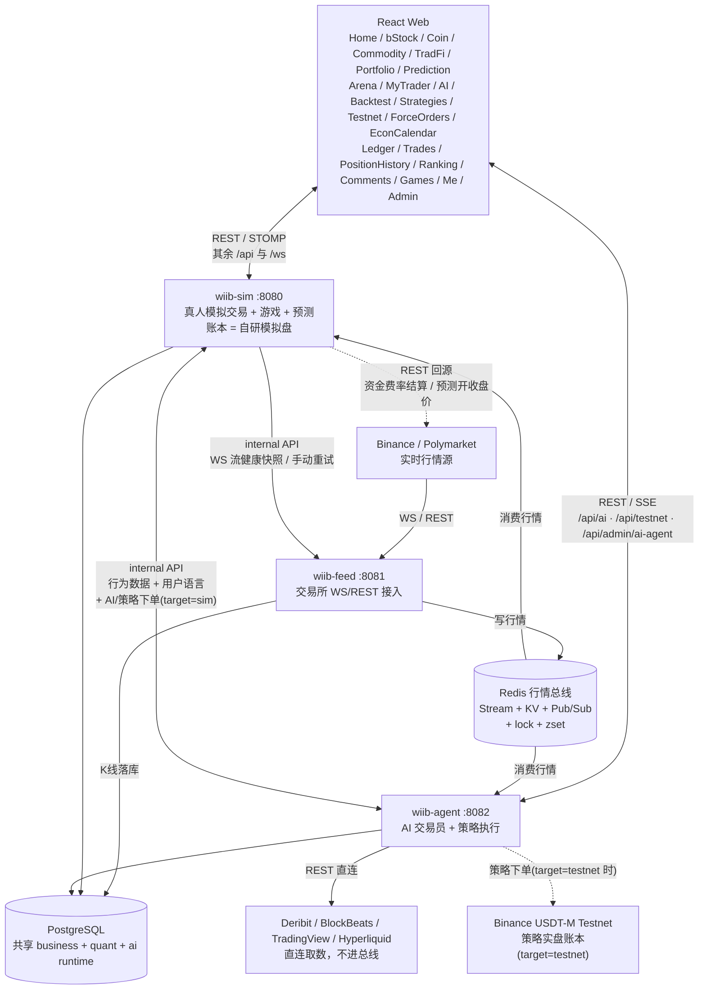

# 系统架构

这份文档从进程与数据流的视角讲整个平台：三个后端进程如何分工、行情从交易所走到前端经过哪些环节、代码目录怎么摆、并发与一致性靠哪些机制兜住。

wiib-agent 里那套 LLM 装置单独成篇，见 [Agent Harness 架构](./agent-harness/architecture.md)。

## 总览



前端不是只连 sim：AI 页、竞技场、交易员、研判工作台、回测复盘教练、testnet 看板走的都是 agent 的 `/api/ai` / `/api/testnet` / `/api/admin/ai-agent`，其余 `/api` 与 `/ws` 才是 sim。开发期由 Vite proxy 分流，线上由反代按同一套前缀分流——两边规则必须同构，否则本地跑通线上 404。

---

## 实时数据链路

### Binance

```text
wiib-feed（上游进程）  交易所 WS → Redis
  -> spot miniTicker        -> Redis 价格 KV(market:price:) + Pub/Sub(feed:price)
  -> futures markPrice@1s   -> Redis mark KV(market:markprice:) + Pub/Sub(feed:price)
  -> futures miniTicker     -> Redis 合约最新价 KV(market:futures-price:) + Pub/Sub(feed:price)
                               ↑ 独立物理连接：Binance 端点拆分后 markPrice 与 miniTicker 不能同连
  -> forceOrder(全市场流)    -> 白名单过滤 -> force_order 表(DB, 天然跨进程)
  -> aggTrade               -> Redis Stream(market:orderflow:<sym>, 读侧聚合)
  -> depth20@100ms          -> Redis KV(market:depth:, DepthStreamCache)
  -> K 线收盘                -> Redis Stream(stream:kline:closed) + crypto 5m 落库
  -> 所有 tick / K 线        -> Redis Pub/Sub(ws:broadcast:*) -> sim WsBroadcastRelay -> STOMP /topic/**
  -> WS 断线                 -> 广播断线帧, 重连后发 gap 事件(空窗区间), sim 拉 1m K 线补触发限价/强平

wiib-sim / wiib-agent（消费进程）  从 Redis 消费 feed 写入的行情
  sim:   撮合/强平 + 预测回合消费 + ws:broadcast:* 中继给前端
  agent: K线收盘驱动 交易员唤醒 / 策略信号 / 叙事对账；另订 feed:price 跑波动哨兵与策略触价单
```

两条 Redis 链路分工不同，别混：**`feed:price` 是撮合/执行侧的价格总线**，不面向前端——三个订阅者，sim 的撮合与强平（价格更新触发现货限价单、永续强平、止损、止盈检查，feed 本身不撮合）、agent 的波动哨兵、策略的触价单；**`ws:broadcast:*` 才是前端拿实时行情的唯一通道**，由 sim 的 `WsBroadcastRelay` 中继成 STOMP（`crypto` / `futures` / `kline` / `prediction` / `stream-health` / `monitor` 六个频道各对一个 `/topic/**`，其中 prediction 来自 Polymarket 那条链、monitor 由 feed 与 agent 各发一份）。多实例部署时前者按进程各自消费，后者靠 Pub/Sub 让每个实例的 WebSocket 都收到。

### Polymarket BTC 预测

```text
Polymarket live-data -> Chainlink BTC 60s TWAP -> /topic/prediction/price（官网当前价：价格线 + 涨跌）
                     -> Chainlink BTC 现货     -> Redis 现货历史（只给预测员）
Polymarket CLOB      -> UP/DOWN bid/ask（首条 book 快照种价，买一 0 / 卖一 1 是空档，删掉）-> /topic/prediction/market
5min window rotation -> 回合事件(lock/create/syncopen/settle)走 Redis Stream 保 FIFO
                     -> sim 锁上轮 -> 取开/收盘价 -> 结算下注
```

开/收盘价由 feed 轮询后写缓存（`syncopen` / `settle` 两个事件），sim 只在缓存没命中时才回源 REST——结算基准要全站一份，各算各的会出现同一回合两个价。

结算规则跟 Polymarket（结算源 Chainlink BTC/USD TWAP-60s 数据流）：开 / 收盘价是这条流在开 / 收盘时刻的值，流在 T 时刻 = 截至 T−3 秒的 60 个整秒现货价均价，所以收盘价实际是收盘前 63~3 秒的均价；收盘不低于开盘判 UP（相等算 UP），否则 DOWN；两个价都从 crypto-price 接口带 `twapEnabled=true&twapLookbackSeconds=60` 取（开盘后 2~3 秒就有，feed 每秒取一次），不带参数回的是边界时刻现价、会判反；取不到价才 VOID 退本金。页面当前价、差值、折线图都用 RTDS `crypto_prices_twap_sixty` 这条流，和官网同源；赔率按钮是各自的卖一 / 买一，空档显示 `--`。

手续费按 Polymarket 吃单费公式（`PredictionFee`）：`fee = 份数 × 0.07 × p × (1 − p)`，买卖都按吃单算。

Jev 预测员（agent `prediction/` 包，平台用自己的 Jev key）：Jev 拍板，代码算数和执行。按局跑：局记在 `jev_prediction_run`，一局一个只有游戏钱包的账户（R1 `jev-prediction`，之后 `jev-prediction-rN`，开局各 100），/admin 关着开关才能重新开局，旧局留档。`JevPredictionRunner` 开盘后每 15 秒（起手 30…270 秒）跑一次：用当前局的账户查本回合注单 → `PredictionStateWriter` 写 state（只有中性事实的词：时段、BTC 相对开盘均价与领先多少个正常波动、末分钟已锁定的那部分、路径与最近一分钟、Chainlink 多久没更新与 Binance 最近 10/30 秒涨跌、最近 60 秒资金与开盘以来强平、谁是热门与两边买一卖一和含费成本、最近 30 秒赔率变动；随机游走估计 `estimate`：两边估计胜率、含费成本比它高或低几美分，估计到 99.5% 以上 / 0.5% 以下写 more than 99% / less than 1%；持仓再加 `position`：拿着什么、现在卖扣费每份能拿多少、比估计多拿还是少拿；价格取 Polymarket 推的 Chainlink 现货、按 Chainlink 时间戳，逐笔与强平直接读 Redis/库）→ 盘口超过 5 秒没更新、Chainlink 超过 5 秒没更新（Polymarket 上游断流，记 STALE_CHAINLINK 不算出错）、持仓没人接盘都不问不动 → `PredictionJudge` 一次请求问空仓的入场题（买 UP / 买 DOWN / 不买）或持仓的离场题（拿着 / 卖掉），两题都明说 estimate 是基线、要 Jev 看盘判断真实胜率比它高还是低；同一请求顺带问 UP 会赢吗、DOWN 会赢吗两道是非题只记分，p_jev 取「UP 会赢」和「1 − DOWN 会赢」的平均 → `PredictionRules` 执行：Jev 选的那一项概率到 0.5 才照做（卖还要比拿着的概率高），每注 5 USDT，代码只拦那边没人卖、钱包付不起一注；要成交的等 1 秒再看盘口，价比 Jev 看到的差不超过 3¢ 就按那时的价成交（reason 记"看到的→实际的"，页面写预计和实际），再差或那边没价记 MISSED；卖掉后同回合还能再买；钱包付不起一注、也没有等结算的注单就自动关开关。数学估计来自 `PredictionModel`：领先 / 剩余时间 / 波动出 Φ(z)，波动取一小时典型值和最近几分钟实际值的较大者，末分钟是收盘前 63~3 秒，进了以后已走过的均价按权重锁定。每次一行落 `jev_prediction_decision`（带局号、Jev 的回答与拍板的选项和概率、盘口年龄、所选那边的数学参考优势），每分钟按行所属那一局的账户回填结果与盈亏；记分三列：数学 p_model、Jev 的 p_jev、市场 p_mkt。feed 收到盘口消息只记内存，每 50ms 一拍：先看要不要换回合，再把有变化的盘口写 Redis、推给页面；每秒把盘口最后更新时刻和 UP 中间价采样进 Redis（供判旧和"最近 30 秒赔率怎么动"），并补推一次当前盘口；按消息自带时间戳，CLOB 盘口落后 3 秒、Chainlink 现货落后 5 秒就换一条连接。下注走 sim 的 `/internal/prediction` 通道。展示在独立页 `/jev`（`pages/JevPrediction.tsx`，组件在 `components/jev/`），按局看、旧局标已归档：左上与预测页同一张行情头卡（`PredictionHero` + `usePredictionMarket`，两页共用），左下 Jev 的交易、记分（总体 + 按检查点的三列 Brier）与校准，右栏每 15 秒一张卡：实际动作、Jev 选了什么和把握、数学参考数、三个上涨概率，点开看每道题的回答条；每个回合默认只露出有动作的卡和最新一张，R1（决定题 + 后劲题）、R2（Jev 报胜率、代码下注）的旧卡照原样显示。题目在页面上用自己的话包装，不放英文原题。

### 资金费率

```text
sim ScheduledTasks  cron 0 0 0,8,16
  -> FundingRateService.refresh()   一次 premiumIndexAll 全量，只留本平台合约标的
  -> Redis KV(market:funding-rate:<SYM>, TTL 9h)
  -> 扣费 rateForSettlement() / 前端查询 query()  都只读缓存
```

**sim 侧只有结算点这一次调官方资金费率接口**，扣费与前端查询一律读缓存，查询链路绝不打 Binance。拉不到就不动缓存，上一轮的值还能用满 TTL；缓存真空了扣费回退配置里的固定费率（0.01%/8h）。这是个硬约束——在查询链路里"顺手"直连一次 Binance，就等于把限频风险接回了用户请求路径上。

（agent 侧的 `funding_history` / `premiumIndex` 取数工具另有一条只读链路会打 Binance，带熔断与 serve-stale，喂模型用，与 sim 的扣费链路无关。）

---

## 项目结构

后端 5 个 Maven module / 3 个独立进程（wiib-common 与 wiib-quant 是库，不单独起），经 Redis 行情总线和共享 PostgreSQL 协作。另有两个不进 reactor 的前端产物：`wiib-web`（主站，Vite 构建）与 `wiib-intro`（介绍站，纯静态零构建）。

```text
whatifibought/                        # Maven 多 module 聚合 reactor
├── pom.xml
├── .env.example                      # 环境配置模板（唯一需手工填值的文件，复制为 .env.local / .env）
├── start-local.ps1 / .bat            # 本地一键启动三服务（bat 为双击入口，转调 ps1）
├── docker-compose.yml                # 三进程编排（无私有值，配置全在 .env）
├── redis-compose.yml                 # Redis 主从 + 哨兵栈（可选）
├── sql/                              # init.sql（37 表）+ bstock.sql（bStock 静态表 + 10 只种子）
│
├── wiib-common/                      # 共享层：被 feed/agent/quant/sim 共同依赖
│   └── market/ broadcast/ cache/ aspect/ mapper/ entity/ dto/ enums/ util/ ...
│                                     # 行情通道 / Depth·OrderFlow 缓存 / BinanceRestClient
│                                     # / KlineHistoryStore / ForceOrder mapper / InternalApiFilter
│
├── wiib-feed/                        # ① 数据流上游进程（:8081）
│   ├── stream/                       # 11 个 StreamHandler（现货 / 合约 markPrice / 合约 miniTicker
│   │                                 #   / 深度 / 成交 / 强平 / crypto·bStock·商品各周期 K 线）
│   │                                 # + GapTracker 断连空窗记录 + MatchPricePublisher
│   └── BinanceWsClient / PolymarketWsClient / KlineStreamCache / monitor
│                                     # / health(内部流健康+重试)
│
├── wiib-agent/                       # ② AI 交易员进程（:8082，AI 下单走 sim 子账户，
│                                     #    策略执行 sim|testnet 可切；量化侧 controller 也由它挂载）
│   │                                 # 纯 LLM harness：六处装置（非 LLM 代码都在 wiib-quant 库里）
│   ├── trader/                       # trader agent：调度/唤醒回路/提示词/交易工具/护栏
│   │                                 # + 计划存取 + 波动哨兵 + 交易员模型工厂
│   │                                 # + 唤醒现场（TraderLiveHub 扇出 / WakeTrace 轨迹，只给主人）
│   ├── learning/                     # reviewer workflow + learning agent：素材组装（硬事实）+ 复盘/学习回路
│   ├── chat/                         # chat agent：router + 子 agent 并行 + summarizer + checkpoint
│   │                                 # + HITL 授权闸门 + 并发闸门
│   ├── behavior/                     # 行为分析 workflow
│   ├── analysis/                     # 深研判（工作台触发）+ 叙事对账 + 手动复盘的 AI 教练提示词
│   ├── toolkit/                      # LLM 工具类（trader / chat 两处共用，取数底座在 quant 的 market/）
│   ├── llm/                          # BYOK 端点库（LlmEndpointService / ByokModelBuilder）
│   │                                 # + 四协议适配（openai 走 Spring AI，responses/anthropic/gemini 自研 ChatModel）
│   │                                 # + ResilientChatService / ToolChoice / CancelSignal
│   │                                 # + 摘要 / 调用限额 / 上游异常归类（给用户看的一句话）
│   ├── runtime/                      # 平台功能位模型分配（只剩 news-translation，Admin 热更）
│   └── controller/ task/ mapper/ monitor/ config/
│                                     # AiAgent/Trader/LlmEndpoint/ReplayCoach 接口 / 快讯采集翻译·叙事对账 / SaToken
│
├── wiib-quant/                       # ③ 量化能力库（非进程，被 wiib-agent 依赖并扫描挂载）
│   ├── market/                       # 行情数据链路：领域事件 / 采集→特征快照 / 取数缓存
│   │                                 # + 指标·结构计算器 + 期权/资金面服务 + 收盘流消费
│   ├── research/                     # 量化研究库：因子/预测/标注/评估/风险指标
│   ├── strategy/                     # FIBO/SQZMOM/TURTLE + 回测引擎
│   │                                 # + 执行层(testnet|sim) + 账户监控
│   ├── whale/                        # Hyperliquid 大户持仓：每日地址池认证 + 10 分钟持仓轮询 + 查询
│   ├── external/                     # 进程外客户端：binance testnet / blockbeats / deribit / hyperliquid
│   │                                 # / sim internal（行为数据 + 合约下单）
│   └── controller/ task/ mapper/     # ResearchEval/Strategy/Testnet/Backtest/Whale 接口 / 日历·K线采集
│
├── wiib-sim/                         # ④ 真人模拟交易进程（:8080，账本=自研模拟盘 DB，对外）
│   ├── ledger/                       # 资金记账切面：@Ledger + LedgerAspect + 行映射
│   └── controller/ service/ mapper/ config/ task/
│                                     # 交易(bStock/crypto/futures) / 游戏 / 预测 / 结算 / WS 网关
│                                     # + 账单·排行·全站成交·仓位历史
│                                     # + BehaviorDataController（internal API 供 agent 调）
│
├── wiib-web/                         # React 前端（「海报数字」设计体系）
│   └── src/                          # App.tsx / pages/ components/ hooks/ stores/ api/ i18n/ lib/ types/
│                                     # index.css 是设计 token 与原子类的唯一出处
│
└── wiib-intro/                       # 项目介绍站 intro.wtfibought.com
                                      # 纯静态 HTML/CSS/JS，无构建无后端无端口，不是 Maven module
```

---

## 并发与一致性

| 机制 | 用途 |
|---|---|
| Virtual Threads | WS 消息处理、量化采集、调度任务、异步广播 |
| Redis 分布式锁 | 订单、仓位、用户、游戏操作互斥 |
| 数据库 CAS | 订单、预测回合、结算状态机 |
| `UPDATE ... RETURNING` | 资金变动与变动后余额同条 SQL 取回，账本不重查、不产生读写间隙 |
| Redis ZSet | 限价单、强平价、止损、止盈触发索引 |
| Redis Pub/Sub | 多实例 WebSocket 广播 |
| Caffeine + Redis | 本地热缓存 + L2 分布式缓存 |
| single-flight | 行情快照组装：N 个会话同时问一个币只真采集一次，其余等同一份结果 |
| 信号量 + 用户集合 | 对话并发闸门（全局 10 轮 + 每用户 1 轮），超限直接拒绝不排队 |
| 熔断 + serve-stale | Binance 收到 429/418 记冷却期，期内不发请求改吐带年龄上限的旧数据（资金费 8h / 标记价 15min / 盘口不兜） |
